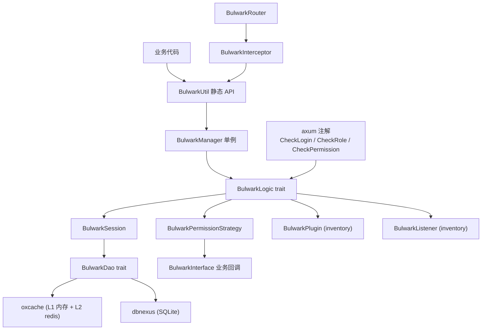

<!-- markdownlint-disable MD041 -->
<p align="center">
  
</p>

<h1 align="center">Bulwark</h1>

<p align="center">
  <b>面向 Rust 生态的一站式身份认证鉴权框架</b><br/>
  <a href="#quick-start">🚀 快速开始</a> •
  <a href="#features">📖 特性</a> •
  <a href="./docs/ARCHITECTURE.md">🏗 架构</a> •
  <a href="./CHANGELOG.md">📝 更新日志</a> •
  <a href="./docs/CONTRIBUTING.md">🤝 贡献</a>
</p>

<p align="center">
  
  
  
  
  
  
</p>

<!-- markdownlint-restore MD041 -->

---

## 📑 目录

- [概述](#-概述)
- [特性](#-特性)
- [架构](#-架构)
- [快速开始](#-quick-start)
  - [前置依赖](#前置依赖)
  - [安装](#安装)
  - [最小示例](#最小示例)
  - [axum 集成示例](#axum-集成示例)
- [配置](#️-配置)
- [特性门控](#-特性门控)
- [API 文档](#-api-文档)
- [贡献](#-贡献)
- [路线图](#-路线图)
- [许可证](#-许可证)
- [致谢](#-致谢)

---

## 🔭 概述

**Bulwark** 是一个面向 Rust 生态的身份认证鉴权框架，
提供基于 Token 的会话管理、RBAC 权限模型、axum Web 框架集成等核心能力。

框架采用**双抽象层 + 全局单例**架构：

- **dbnexus** 数据库抽象层（SQLite / PostgreSQL / MySQL，由 `BulwarkDao` trait 屏蔽后端差异）
- **oxcache** 缓存抽象层（L1 内存 + L2 redis，承载会话与 Token 存储）
- **BulwarkManager** 全局单例，持有 `Arc<dyn BulwarkLogic>`，业务方启动时一次性注入依赖即可使用静态 API

### 适用场景

- **Web 应用认证**：基于 axum/actix/warp 的 Web 服务需要登录认证、权限校验
- **微服务网关**：API 网关层统一鉴权，支持 JWT/OAuth2/API Key 多种协议
- **企业级后台**：RBAC 权限模型 + 会话管理 + 审计日志
- **多端 SSO**：跨子系统单点登录，ticket 模型 + 一次性消费

---

## ✨ 特性

| 特性 | 说明 |
| --- | --- |
| ⚡ **零运行时开销** | 编译期 `inventory::submit!` 工厂注册，无反射、无动态加载 |
| 🔒 **完整鉴权链** | 登录认证 → 权限校验 → 会话管理 → 路由拦截，开箱即用 |
| 📦 **多后端抽象** | `BulwarkDao` + `oxcache` + `dbnexus`，切换存储后端零业务代码改动 |
| 🔧 **可插拔扩展** | trait + Default 实现模式，替换任意组件（DAO / 策略 / 逻辑）无需改业务 |
| 🎯 **Feature 门控** | 40+ 个特性域独立 feature flag，按需编译减小体积 |
| 📊 **高可观测** | `tracing` 日志 + `listener` 事件订阅 + `prometheus` 指标（可选） |
| 🧪 **高覆盖** | 1463+ 个测试通过，95%+ 行覆盖率，clippy 零警告 |
| 🌐 **Web 框架适配** | axum/actix/warp 三框架注解式 extractor（`CheckLogin` / `CheckRole` / `CheckPermission` + 过程宏） |

### 特性域覆盖（0.4.0~0.6.0 协议层与生产能力补齐）

| 特性域 | 状态 | 说明 |
|--------|------|------|
| 登录认证 | ✅ 0.1.0 完成 | 基于 Token 的会话管理 |
| 权限认证 | ✅ 0.1.0 完成 | RBAC 权限模型 |
| Session 会话 | ✅ 0.1.0 完成 | 双模会话生命周期管理（Account + Token） |
| 路由拦截鉴权 | ✅ 0.1.0 完成 | axum Web 框架适配 |
| JWT | ✅ 0.2.0 完成 | JSON Web Token 签发与验证（HS256/HS512 + refresh） |
| OAuth2 | ✅ 0.2.0 完成 | 授权码 / 客户端凭证 / 密码模式 + 0.4.0 RefreshToken |
| 单点登录 (SSO) | ✅ 0.2.0 完成 | ticket 模型单点登录（一次性 60s TTL） |
| 微服务网关鉴权 | ✅ 0.2.0 完成 | API 签名 + nonce 防重放 |
| API 接口鉴权 | ✅ 0.2.0 完成 | API Key 生成 / 校验 / 吊销 / 轮换 |
| 临时凭证 | ✅ 0.2.0 完成 | 短期 token + issue/get/revoke/consume |
| TOTP 动态验证码 | ✅ 0.2.0 完成 | RFC 6238 二次验证 |
| Basic 认证 | ✅ 0.2.0 完成 | HTTP Basic Auth (RFC 7617) |
| Digest 认证 | ✅ 0.2.0 完成 | HTTP Digest Auth (RFC 7616) |
| 插件化扩展 | ✅ 0.2.0 完成 | `BulwarkPlugin` trait + inventory 注册 |
| 事件监听器 | ✅ 0.2.0 完成 / 0.4.2 扩展 | `BulwarkListener` trait + 15 个事件变体（0.4.2 新增 9 个） |
| OIDC（OpenID Connect） | ✅ 0.4.0 完成 | id_token 签发/验证 + discovery + 三重防重放 |
| OAuth2 Scope Handler | ✅ 0.4.0 完成 | `ScopeHandler` trait + `ScopeRegistry` 注册表 |
| SSO Server 独立抽象 | ✅ 0.4.0 完成 | `SsoServer` trait + `CenterIdConverter` + `SsoChannel` |
| AloneCache 多实例隔离 | ✅ 0.4.0 完成 | `AloneCache` 装饰器 + `AloneCacheManager` |
| ParameterQuery 参数化查询 | ✅ 0.4.0 完成 | `ParameterQuery` trait + Builder + async check_permission/check_role |
| LoginId newtype | ✅ 0.4.2 完成 | `LoginId` enum（Numeric/String），公开 API 接受 `impl Into<LoginId>` |
| Repository 层 | ✅ 0.4.2 完成 | 9 个 Repository trait + SqliteRepository（tenant_id 隔离） |
| 密码哈希 | ✅ 0.4.2 完成 | `PasswordHasher` trait + Argon2/Bcrypt 实现 + 自动识别 |
| 密码登录 | ✅ 0.4.2 完成 | `login_with_password` 整合 Repository + PasswordHasher |
| 多账户 login_type | ✅ 0.4.2 完成 | `get_permission_list_with_type` / `get_role_list_with_type` |
| JWT 三模式 | ✅ 0.4.2 完成 | `JwtMode` Stateless/Mixin/Simple |
| API Key namespace | ✅ 0.4.2 完成 | `bulwark:apikey:<namespace>:<key>` 多租户隔离 |
| SSO TOCTOU 修复 | ✅ 0.4.2 完成 | `BulwarkDao::get_and_delete` 原子消费 |
| kickout_by_device | ✅ 0.4.2 完成 | 按设备维度踢出会话 |
| ActixContext 适配器 | ✅ 0.4.2 完成 | actix-web 4 4 件套（ActixContext/Request/Response/Storage） |
| WarpContext 适配器 | ✅ 0.4.2 完成 | warp 0.4 4 件套（WarpContext/Request/Response/Storage） |
| Strategy Registry | ✅ 0.4.2 完成 | 6 个策略 trait + `Strategy` 注册表 + Manager 集成 |
| 过程宏注解 | ✅ 0.4.2 完成 | `#[check_login]`/`#[check_permission]`/`#[check_role]` 属性宏 |
| OAuth 2.1 PKCE | ✅ 0.4.2 完成 | RFC 7636 S256 方法，旧方法标记 deprecated |
| Token Introspection | ✅ 0.4.2 完成 | RFC 7662 远程 token 状态查询 |
| 多租户隔离 | ✅ 0.5.0 完成 | `tenant_id` 字段 + `task_local!` TenantContext + Repository 强制过滤 |
| 社交登录 | ✅ 0.5.0 完成 | 微信扫码 / 支付宝 Provider + SocialBinding 表 |
| 审计日志 | ✅ 0.5.0 完成 | `audit_logs` 表 + 14 个 listener 事件订阅 + 自动脱敏 |
| RefreshToken Rotation | ✅ 0.5.0 完成 | SHA-256 hash chain + parentTokenHash + 重用检测 |
| 安全防护套件 | ✅ 0.5.0 完成 | 5 个 FirewallStrategy + MaxMindDb 生产后端 |
| 角色层级 | ✅ 0.5.0 完成 | `role_hierarchy` 表 + TC 预计算 + 登录时缓存权限并集 |
| 决策溯源 | ✅ 0.5.0 完成 | `Decision{allowed, reason, errors}` + `authorize()` API |
| Keycloak OIDC RP | ✅ 0.5.0 完成 | `KeycloakProvider` discovery + JWKS 验签 |
| PostgreSQL 后端 | ✅ 0.5.0 完成 | `db-postgres` feature + backend-agnostic SQL |
| MySQL 后端 | ✅ 0.5.3 完成 | `db-mysql` feature + testcontainers 集成测试 |
| 账号安全引擎 | ✅ 0.6.0 完成 | `account/` 模块 + Credential SPI + PasswordPolicyEngine + UserLockoutStrategy + AuthenticationFlow DSL |
| remember-me 扩展超时 | ✅ 0.6.0 完成 | `remember_me_enabled` / `remember_me_timeout` 配置 + login 参数 |
| Redis 部署模式 | ✅ 0.6.0 完成 | `RedisDeploymentMode` 枚举（Single/Sentinel/Cluster/MasterSlave） |
| 身份切换 switch_to | ✅ 0.6.0 完成 | `switch_to(login_id)` 会话身份切换 |
| Token 置换 renew_to_equivalent | ✅ 0.6.0 完成 | 等效 Token 置换（保留会话状态） |
| OAuth2 注解 | ✅ 0.6.0 完成 | `Annotation::CheckAccessToken` / `CheckClientToken` |
| 路由分组 group() | ✅ 0.6.0 完成 | `BulwarkRouter::group(prefix, annotation, f)` |
| 会话过期回调 | ✅ 0.6.0 完成 | `SessionExpiryListener` trait + `add_expiry_listener` |
| SAML 2.0 骨架 | ✅ 0.6.0 完成 | `SamlProvider` trait + `DefaultSamlProvider`（quick-xml 解析） |
| OIDC RP 骨架 | ✅ 0.6.0 完成 | `OidcProvider` trait + `DefaultOidcProvider`（discovery + token exchange） |
| Redis pub/sub SsoChannel | ✅ 0.6.0 完成 | `RedisPubSubSsoChannel`（PUBLISH/SUBSCRIBE 跨实例通信） |

---

## 🏗 架构



核心模块说明：

- `bulwark-stp`：核心 API（`BulwarkLogic` trait + `BulwarkUtil` 静态委托 + task_local 上下文）
- `bulwark-session`：双模会话管理（Account-Session + Token-Session）
- `bulwark-strategy`：权限校验策略（`BulwarkPermissionStrategy` trait）
- `bulwark-manager`：全局单例 + inventory 工厂注册
- `bulwark-annotation`：axum extractor 注解系统
- `bulwark-router`：axum Router 包装 + middleware 拦截
- `bulwark-dao`：`BulwarkDao` trait + oxcache / dbnexus 实现

完整架构设计见 [docs/ARCHITECTURE.md](./docs/ARCHITECTURE.md)。

---

## 🚀 Quick Start

### 前置依赖

| 依赖 | 版本 | 说明 |
| --- | --- | --- |
| Rust | >= 1.85 | 工具链（部分 deps 要求 edition2024） |
| cargo | 随 Rust 安装 | 包管理器 |
| libssl-dev | 系统包 | `cargo tarpaulin` 覆盖率工具需要 |
| pkg-config | 系统包 | `cargo tarpaulin` 覆盖率工具需要 |

> 注：运行时无需额外系统依赖，`oxcache` 与 `dbnexus` 均为纯 Rust 实现。

### 安装

在 `Cargo.toml` 中添加依赖：

```toml
[dependencies]
bulwark = { version = "0.7", features = ["web-axum"] }
tokio = { version = "1", features = ["full"] }
```

如需启用全部协议层与安全模块：

```toml
[dependencies]
bulwark = { version = "0.7", features = ["full"] }
```

### 最小示例

完整业务场景：初始化管理器 → 执行登录 → 校验登录状态 → 登出。

```rust
use std::sync::Arc;
use bulwark::prelude::*;
use async_trait::async_trait;

// 1. 业务方实现 BulwarkInterface（提供权限/角色数据）
struct MyInterface;
#[async_trait]
impl BulwarkInterface for MyInterface {
    async fn get_permission_list(&self, _login_id: i64) -> BulwarkResult<Vec<String>> {
        Ok(vec!["user:read".into(), "user:write".into()])
    }
    async fn get_role_list(&self, _login_id: i64) -> BulwarkResult<Vec<String>> {
        Ok(vec!["user".into()])
    }
}

#[tokio::main]
async fn main() -> BulwarkResult<()> {
    // 2. 准备依赖
    let dao: Arc<dyn BulwarkDao> = Arc::new(BulwarkDaoOxcache::new().await?);
    let config = Arc::new(BulwarkConfig::default_config());
    let interface: Arc<dyn BulwarkInterface> = Arc::new(MyInterface);

    // 3. 初始化全局管理器（覆盖式注入 dao / config / interface）
    BulwarkManager::init(dao, config, interface)?;

    // 4. 在 task_local 上下文中执行登录
    let token = bulwark::stp::with_current_token(
        String::new(),
        BulwarkUtil::login(1001),
    ).await?;
    println!("登录成功，token = {}", token);

    // 5. 校验登录状态
    let logged_in = bulwark::stp::with_current_token(
        token.clone(),
        BulwarkUtil::check_login(),
    ).await?;
    assert!(logged_in);

    // 6. 校验权限
    let has_perm = bulwark::stp::with_current_token(
        token.clone(),
        BulwarkUtil::check_permission("user:read"),
    ).await?;
    assert!(has_perm);

    // 7. 登出
    bulwark::stp::with_current_token(
        token.clone(),
        BulwarkUtil::logout(),
    ).await?;

    Ok(())
}
```

**预期输出：**

```text
登录成功，token = a1b2c3d4e5f6...
```

### axum 集成示例

完整 Web 应用示例见 [examples/src/bin/axum_integration.rs](./examples/src/bin/axum_integration.rs)（244 行），包含：

- `BulwarkRouter` 包装 axum Router
- 4 个 `route_protected` 路由（带 `CheckLogin` / `CheckRole<AdminRole>` / `CheckPermission<ReadPerm>` 注解）
- axum middleware 自动从 Authorization header 提取 token 并设置 task_local

> examples 已重组为独立 workspace member（`bulwark-examples` crate），运行方式：
> `cargo run -p bulwark-examples --bin <name> --features full`。0.4.0 新增 5 个 example
> （`oidc_handler` / `scope_handler` / `sso_server` / `alone_cache` / `parameter_query`），
> 完整列表见 [examples/README](./examples/)。

---

## ⚙️ 配置

`BulwarkConfig` 支持三级配置源（优先级从高到低）：

1. **环境变量**：`BULWARK_TIMEOUT` / `BULWARK_ACTIVE_TIMEOUT` / `BULWARK_TOKEN_NAME` 等
2. **toml 配置文件**：`bulwark.toml`（通过 `ConfigLoader::load_from_file` 加载）
3. **代码默认值**：`BulwarkConfig::default_config()`

核心配置项：

| 字段 | 默认值 | 说明 |
| --- | --- | --- |
| `timeout` | `2592000`（30 天） | 会话超时秒数 |
| `active_timeout` | `-1`（不启用） | 活跃超时秒数，-1 表示跟随 `timeout` |
| `is_share` | `true` | 同账号多端共享会话 |
| `is_concurrent` | `true` | 允许同账号并发登录 |
| `token_name` | `bulwark-token` | Cookie / Header 名 |
| `token_style` | `random-64` | Token 风格（`uuid` / `random-64` / `simple` / `jwt`） |
| `throw_on_not_login` | `true` | 未登录时抛异常而非返回 false |

支持通过 `tokio::sync::watch` 实现配置热更新，详见 [docs/CONFIGURATION.md](./docs/CONFIGURATION.md)。

---

## 🎛 特性门控

| 特性 | 默认 | 说明 |
| --- | :---: | --- |
| `backend-embedded` | ✅ | 内嵌后端模式（进程内认证，委托 BulwarkManager，0.7.0 新增） |
| `cache-memory` | ❌ | 内存缓存后端（oxcache 内存层） |
| `cache-redis` | ❌ | Redis 缓存后端（oxcache L2） |
| `db-sqlite` | ❌ | SQLite 数据库后端（dbnexus + auto-migrate） |
| `web-axum` | ❌ | axum Web 框架适配 |
| `web-actix` | ❌ | actix-web Web 框架适配 |
| `web-warp` | ❌ | warp Web 框架适配 |
| `protocol-jwt` | ❌ | JWT 签发与验证 |
| `protocol-oauth2` | ❌ | OAuth2 四种模式（含 RefreshToken） |
| `protocol-sso` | ❌ | SSO 单点登录 ticket |
| `protocol-sign` | ❌ | API 签名 + nonce 防重放 |
| `protocol-apikey` | ❌ | API Key 认证 |
| `protocol-temp` | ❌ | 临时凭证 |
| `protocol-oidc` | ❌ | OIDC id_token 签发/验证 + discovery（0.4.0 新增） |
| `oauth2-scope-handler` | ❌ | OAuth2 ScopeHandler 注册表（0.4.0 新增） |
| `protocol-sso-server` | ❌ | SSO Server 独立抽象 + CenterIdConverter（0.4.0 新增） |
| `alone-cache` | ❌ | AloneCache 多 Redis 实例隔离装饰器（0.4.0 新增） |
| `parameter-query` | ❌ | ParameterQuery 参数化查询 + Builder（0.4.0 新增） |
| `secure-totp` | ❌ | TOTP 动态验证码 (RFC 6238) |
| `secure-sign` | ❌ | HMAC-SHA256/SHA512 工具 |
| `secure-httpbasic` | ❌ | HTTP Basic 认证 (RFC 7617) |
| `secure-httpdigest` | ❌ | HTTP Digest 认证 (RFC 7616) |
| `account-credential-zeroize` | ❌ | 凭证模型 zeroize 扩展（argon2 + bcrypt + zeroize，0.6.0 新增） |
| `listener` | ❌ | 事件监听器（15 个事件变体，0.4.2 扩展） |
| `tracing-log` | ❌ | tracing 日志桥接 |
| `metrics-prometheus` | ❌ | Prometheus 指标 |
| `observability-otlp` | ❌ | OpenTelemetry OTLP 分布式追踪（0.3.0 新增） |
| `grpc` | ❌ | gRPC 鉴权拦截器（tonic::Interceptor，0.3.0 新增） |
| `annotation-macros` | ❌ | `#[check_login]`/`#[check_permission]`/`#[check_role]` 过程宏（0.4.2 新增） |
| `tenant-isolation` | ❌ | 多租户逻辑隔离（0.5.0 新增） |
| `social-wechat` | ❌ | 微信扫码社交登录（0.5.0 新增） |
| `social-alipay` | ❌ | 支付宝授权社交登录（0.5.0 新增） |
| `audit-log` | ❌ | 审计日志持久化（0.5.0 新增） |
| `firewall` | ❌ | 安全防护基础 trait（0.5.0 新增） |
| `firewall-bruteforce` | ❌ | 暴力破解防护策略（0.5.0 新增） |
| `firewall-ratelimit` | ❌ | 限流策略（0.5.0 新增） |
| `firewall-anomalous` | ❌ | 异常登录检测（0.5.0 新增） |
| `firewall-geoip` | ❌ | GeoIP 策略（0.5.0 新增） |
| `firewall-ddos` | ❌ | DDoS 防护策略（0.5.0 新增） |
| `firewall-maxminddb` | ❌ | MaxMindDb 生产后端（0.5.3 新增） |
| `keycloak-oidc` | ❌ | Keycloak OIDC RP 集成（0.5.0 新增） |
| `decision-trace` | ❌ | 决策溯源（0.5.0 新增） |
| `db-postgres` | ❌ | PostgreSQL 后端（0.5.0 新增） |
| `db-mysql` | ❌ | MySQL 后端（0.5.3 新增） |
| `account-credential` | ❌ | 凭证模型 SPI（0.6.0 新增） |
| `account-policy` | ❌ | 密码策略引擎（0.6.0 新增） |
| `account-lockout` | ❌ | 用户锁定策略（0.6.0 新增） |
| `account-authflow` | ❌ | AuthenticationFlow DSL（0.6.0 新增） |
| `secure-confusable` | ❌ | Unicode 同形异义字检测（0.5.1 新增） |
| `full` | ❌ | 聚合所有特性 |
| `production` | ❌ | 生产环境推荐组合 |
| `development` | ❌ | 开发环境组合 |

---

## 📚 API 文档

- **在线文档**：[https://docs.rs/bulwark](https://docs.rs/bulwark)
- **本地生成**：`cargo doc --no-deps --features full --open`
- **示例代码**（独立 workspace member，`cargo run -p bulwark-examples --bin <name> --features full`）：
  - [examples/src/bin/basic_login.rs](./examples/src/bin/basic_login.rs)：完整业务场景（144 行）
  - [examples/src/bin/axum_integration.rs](./examples/src/bin/axum_integration.rs)：完整 Web 应用（244 行）
  - [examples/src/bin/oidc_handler.rs](./examples/src/bin/oidc_handler.rs)：OIDC id_token 签发/验证（0.4.0 新增）
  - [examples/src/bin/scope_handler.rs](./examples/src/bin/scope_handler.rs)：ScopeHandler 注册表（0.4.0 新增）
  - [examples/src/bin/sso_server.rs](./examples/src/bin/sso_server.rs)：SSO Server 独立抽象（0.4.0 新增）
  - [examples/src/bin/alone_cache.rs](./examples/src/bin/alone_cache.rs)：AloneCache 多实例隔离（0.4.0 新增）
  - [examples/src/bin/parameter_query.rs](./examples/src/bin/parameter_query.rs)：ParameterQuery 参数化查询（0.4.0 新增）
  - 完整列表见 [examples/src/lib.rs](./examples/src/lib.rs) 模块声明

---

## 🤝 贡献

欢迎所有形式的贡献！请先阅读 [贡献指南](./docs/CONTRIBUTING.md)。

### 提交 Issue

- 使用 [Issue 模板](https://github.com/Kirky-X/bulwark/issues/new/choose)（Bug Report / Feature Request）
- 描述问题时请提供复现步骤与 Rust 版本

### 提交 PR

1. Fork 本仓库
2. 创建特性分支：`git checkout -b feat/your-feature`
3. 遵循 [Conventional Commits](https://conventionalcommits.org/zh-hans/) 规范提交
4. 确保 `cargo test --features full` + `cargo clippy -- -D warnings` 通过
5. 创建 Pull Request

### 开发规范

- **TDD 工作流**：先写接口 → 写测试 → 实现 → 测试通过 → commit
- **clippy**：零警告（`-D warnings`）
- **文档**：所有 public API 必须有 `///` 文档注释
- **测试串行化**：修改全局 `BulwarkManager` 单例的测试需标注 `#[serial_test::serial]`

### 测试

Bulwark 提供三层测试体系：单元测试（1463+ 个）+ 集成测试 + E2E 测试（API 矩阵 / 性能基线 / 渗透测试）。

```bash
# 单元测试 + 集成测试
cargo test --features full

# E2E 测试（含 API 矩阵 + 渗透测试，不含 #[ignore] 性能测试）
cargo test --test e2e --features "full testing" -- --nocapture

# 性能基线测试（#[ignore] 默认不跑，需显式触发）
cargo test --test e2e --features "full testing" -- --ignored perf_ --test-threads=1 --nocapture

# 一键执行 E2E + 性能 + 渗透 + 生成综合报告
bash scripts/e2e_run.sh
```

E2E 测试覆盖 API 接口矩阵（happy/errors/boundary/authz_boundary）、性能基线（P99<200ms/1000RPS）、渗透测试（7 类攻击 × N payload），所有 HTTP 交互通过 `RecordingClient` 抓包到 `logs/e2e_http.jsonl`，最终由 `scripts/e2e_analyze.py` 聚合生成 `logs/e2e_final_report.md`。详细说明详见 [E2E / 性能 / 渗透测试](./docs/DEVELOPMENT.md#e2e--性能--渗透测试)。

---

## 🗺 路线图

- [x] **v0.1.0**（2026-06-30）核心基础设施：登录认证 + 权限校验 + 双模会话 + axum 集成
- [x] **v0.2.0**（2026-07-01）协议与安全层：JWT / OAuth2 / SSO / Sign / API Key / TOTP / Basic / Digest + 插件系统 + 事件监听器
- [x] **v0.2.1**（2026-07-01）auto-wire 修复 + 协议层边界测试 + examples 工程化重组
- [x] **v0.3.0** 生态完善与可观测：OpenTelemetry OTLP + gRPC 拦截器 + i18n + metrics-prometheus
- [x] **v0.4.0**（2026-07-02）0.2.0 协议层遗留 gap 补齐：OIDC / ScopeHandler / SsoServer / AloneCache / ParameterQuery（gap #4 注解系统延后至 0.5.0+）
- [x] **v0.4.2**（2026-07-05）gap closure：dao 扩展 / strategy-registry / jwt-modes / oauth-2-1 / token-introspection / apikey-namespace / sso-toctou / password-login / 注解宏
- [x] **v0.5.0**（2026-07-06）生产刚需版：多租户 / 社交登录 / 审计日志 / Token Rotation / 安全防护 / 角色层级 / 决策溯源 / Keycloak OIDC RP / PostgreSQL
- [x] **v0.5.2**（2026-07-08）架构重构：BulwarkLogic trait 拆分为 6 个子 trait + LoginId 迁移到 String
- [x] **v0.5.3**（2026-07-09）功能补全：oxcache 升级 / stp 完整拆分 / MySQL 后端 / Firewall MaxMindDb
- [x] **v0.6.0**（2026-07-09）账号安全引擎：account/ 模块 + Credential SPI + PasswordPolicyEngine + AuthenticationFlow DSL + remember-me / Redis 部署模式 / switch_to / SAML 2.0 / OIDC RP / Redis pub/sub SsoChannel
- [x] **v0.7.0**（2026-07-13）微服务架构 + ABAC/Cedar + OAuth2 Server：backend-remote / Auth Server / ABAC 引擎 / OAuth2 Server 4 端点 + 架构加固 + 依赖优化
- [ ] **v1.0.0** 稳定版：API 冻结 + 性能基准 + 生产案例

完整规划见 [docs/ROADMAP.md](./docs/ROADMAP.md)。

---

## 📄 许可证

本项目基于 [Apache-2.0](./LICENSE) 许可证开源。

为何选择 Apache-2.0 而非 MIT：Apache-2.0 包含专利授权条款，更适合企业级框架使用。

---

## 🙏 致谢

- [Sa-Token](https://github.com/dromara/sa-token)：Java 生态的认证鉴权框架，为本项目早期领域建模提供参考
- [axum](https://github.com/tokio-rs/axum)：tokio 团队出品的 Rust Web 框架
- [oxcache](https://github.com/Kirky-X/oxcache)：Rust 多级缓存库（L1 内存 + L2 redis）
- [dbnexus](https://github.com/Kirky-X/dbnexus)：Rust 数据库抽象层（SQLite / PostgreSQL / MySQL）
- [inventory](https://github.com/dtolnay/inventory)：David Tolnay 的编译期插件注册库

---

<p align="center">
  Built with ❤️ by <a href="https://github.com/Kirky-X">Kirky.X</a>
</p>
