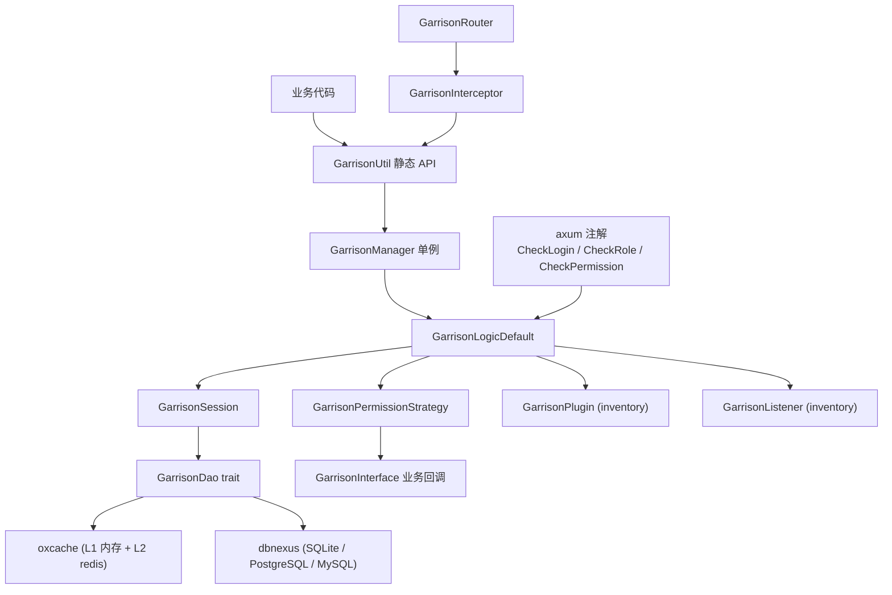

<!-- markdownlint-disable MD041 -->
<div align="center">


[](https://github.com/Kirky-X/garrison/actions/workflows/ci.yml) [](https://crates.io/crates/garrison) [](https://docs.rs/garrison) [](https://crates.io/crates/garrison) [](LICENSE) [](https://www.rust-lang.org/) [](https://github.com/Kirky-X/garrison)

**中文** | [English](README_EN.md)

<b>面向 Rust 生态的一站式身份认证鉴权框架</b>

[✨ 功能特性](#-功能特性) • [🚀 快速开始](#-快速开始) • [📚 文档](#-文档) • [💻 示例](#-示例) • [🤝 参与贡献](#-参与贡献)

</div>

---

## 📋 目录

<details open>
<summary>📑 目录</summary>

- [✨ 功能特性](#-功能特性)
- [🚀 快速开始](#-快速开始)
- [🎨 特性标志](#-特性标志)
- [📚 文档](#-文档)
- [💻 示例](#-示例)
- [🏗️ 架构](#️-架构)
- [🧪 测试](#-测试)
- [📊 性能](#-性能)
- [🔒 安全](#-安全)
- [🗺️ 开发路线图](#️-开发路线图)
- [🤝 参与贡献](#-参与贡献)
- [📋 更新日志](#-更新日志)
- [📄 许可证](#-许可证)
- [🙏 致谢](#-致谢)
- [📞 联系与支持](#-联系与支持)
- [⭐ Star 历史](#-star-历史)

</details>

---

## ✨ 功能特性

<table style="width:100%; border-collapse: collapse">
<tr>
<td width="50%" style="vertical-align:top; padding: 12px">⚡ <b>零运行时开销</b><br><span style="color:#64748B">编译期 <code>inventory::submit!</code> 工厂注册，无反射、无动态加载</span></td>
<td width="50%" style="vertical-align:top; padding: 12px">🔒 <b>完整鉴权链</b><br><span style="color:#64748B">登录认证 → 权限校验 → 会话管理 → 路由拦截，开箱即用</span></td>
</tr>
<tr>
<td width="50%" style="vertical-align:top; padding: 12px">📦 <b>多后端抽象</b><br><span style="color:#64748B"><code>GarrisonDao</code> + <code>oxcache</code> + <code>dbnexus</code>，切换存储后端零业务代码改动</span></td>
<td width="50%" style="vertical-align:top; padding: 12px">🔧 <b>可插拔扩展</b><br><span style="color:#64748B">trait + Default 实现模式，替换任意组件（DAO / 策略 / 逻辑）无需改业务</span></td>
</tr>
<tr>
<td width="50%" style="vertical-align:top; padding: 12px">🎯 <b>Feature 门控</b><br><span style="color:#64748B">100+ 个特性 flag，按需编译减小体积</span></td>
<td width="50%" style="vertical-align:top; padding: 12px">📊 <b>高可观测</b><br><span style="color:#64748B"><code>tracing</code> 日志 + <code>listener</code> 事件订阅 + <code>prometheus</code> 指标（可选）</span></td>
</tr>
<tr>
<td width="50%" style="vertical-align:top; padding: 12px">🧪 <b>高覆盖</b><br><span style="color:#64748B">3967+ 个测试通过（3899 lib + 68 E2E），95%+ 行覆盖率，clippy 零警告</span></td>
<td width="50%" style="vertical-align:top; padding: 12px">🌐 <b>Web 框架适配</b><br><span style="color:#64748B">axum/actix/warp 三框架注解式 extractor + 过程宏</span></td>
</tr>
</table>

除上述核心能力外，其余能力也均以独立特性标志提供、按需编译。

### 🧩 特性域覆盖

当前已交付的特性域全貌如下，逐项 flag 定义对应 `Cargo.toml` 的 `[features]`，见 [🎨 特性标志](#-特性标志)：

| 分类 | 特性域 |
|------|--------|
| 核心引擎 | 登录认证 · RBAC 权限认证 · 双模会话（Account + Token）· 路由拦截（axum / actix / warp）· WAF / CORS / CSRF 中间件 |
| 认证协议 | JWT（三种模式 + refresh）· OAuth2 四种模式 · OIDC（discovery + 三重防重放）· Keycloak OIDC RP · SAML 2.0 · SSO（ticket / SsoServer 抽象 / Redis pub/sub 跨实例）· API Key · 临时凭证 · API 签名防重放 · TOTP · Basic / Digest · OAuth 2.1 PKCE · Token Introspection · RefreshToken 轮换 |
| 授权与决策 | 角色层级（TC 预计算）· OAuth2 Scope Handler · OAuth2 Server · ABAC（Cedar DSL）· 决策溯源（`Decision` + `authorize()`） |
| 账号与凭证 | 账号安全引擎（Credential SPI + 密码策略 + 认证流 DSL）· 密码哈希（Argon2 / Bcrypt）· 邮箱验证 · 社交登录（微信 / 支付宝）· 邀请码注册 |
| 防护与审计 | 防火墙套件（暴力破解 / 限流 / 异常 / GeoIP / DDoS）· 多租户隔离 · 审计日志 · 安全工具集（脱敏 / XSS 防护 / 常量时间比较） |
| 存储与扩展 | SQLite / PostgreSQL / MySQL 后端 · Repository 层 · AloneCache 多实例隔离 · ParameterQuery 参数化查询 · 插件化扩展 · 事件监听器 · 过程宏注解 |
| 微服务与生产化 | 远程后端（backend-remote）· 独立认证服务器（auth-server）· gRPC 拦截器 · 配置加密 / 热更新 · i18n 国际化 · 可观测性（tracing / Prometheus / OTLP） |

---

## 🚀 快速开始

### 📦 安装

在 `Cargo.toml` 中添加依赖（`development` 聚合 = 内存缓存 DAO + SQLite + axum 适配）：

```toml
[dependencies]
garrison = { version = "0.9.0-rc.1", features = ["development"] }
async-trait = "0.1"
tokio = { version = "1", features = ["full"] }
```

> 预发布版本需显式写完整版本号，`"0.9"` 无法匹配 prerelease。如需启用全部协议层与安全模块：`features = ["full"]`。

| 预设 | 安装方式 | 适用场景 |
|------|----------|----------|
| 开发 | `features = ["development"]` | 内存缓存 + SQLite + axum，快速验证 |
| 生产 | `features = ["production"]` | 生产环境推荐组合 |
| 完整 | `features = ["full"]` | 全部能力 |

### 💡 最小示例

完整业务场景：初始化管理器 → 执行登录 → 校验登录状态 → 登出。

```rust
use std::sync::Arc;
use garrison::prelude::*;
use async_trait::async_trait;

// 1. 业务方实现 GarrisonInterface（提供权限/角色数据）
struct MyInterface;
#[async_trait]
impl GarrisonInterface for MyInterface {
    async fn get_permission_list(&self, _login_id: &str) -> GarrisonResult<Vec<String>> {
        Ok(vec!["user:read".into(), "user:write".into()])
    }
    async fn get_role_list(&self, _login_id: &str) -> GarrisonResult<Vec<String>> {
        Ok(vec!["user".into()])
    }
}

#[tokio::main]
async fn main() -> GarrisonResult<()> {
    // 2. 准备依赖
    let dao: Arc<dyn GarrisonDao> = Arc::new(GarrisonDaoOxcache::new().await?);
    let config = Arc::new(GarrisonConfig::default_config());
    let interface: Arc<dyn GarrisonInterface> = Arc::new(MyInterface);

    // 3. 初始化全局管理器
    GarrisonManager::builder()
        .dao(dao).config(config).interface(interface)
        .build().await?;

    // 4. 在 task_local 上下文中执行登录
    let token = garrison::stp::with_current_token(
        String::new(), GarrisonUtil::login("1001", &LoginParams::default()),
    ).await?;
    println!("登录成功，token = {}", &token[..8.min(token.len())]);

    // 5. 校验登录状态
    garrison::stp::with_current_token(token.clone(), GarrisonUtil::check_login()).await?;

    // 6. 校验权限
    garrison::stp::with_current_token(
        token.clone(), GarrisonUtil::check_permission("user:read"),
    ).await?;

    // 7. 登出
    garrison::stp::with_current_token(token.clone(), GarrisonUtil::logout()).await?;
    Ok(())
}
```

> 本示例已由 [examples/tests/readme_quickstart.rs](./examples/tests/readme_quickstart.rs) 持续验证（随 CI 运行）。

### 🧭 核心概念

- **双抽象层**：`dbnexus` 数据库抽象层（SQLite / PostgreSQL / MySQL）+ `oxcache` 缓存抽象层（L1 内存 + L2 redis），由 `GarrisonDao` trait 统一屏蔽后端差异。
- **全局单例**：`GarrisonManager` 持有 `Arc<GarrisonLogicDefault>`（实现 6 个子 trait），业务方启动时一次性注入依赖即可使用静态 API。
- **双模会话**：Account-Session（账号级长生命周期）+ Token-Session（登录临时数据），由 `is_share` / `is_concurrent` 控制多端策略。
- **特性门控**：全部可选能力均为独立 feature，编译产物只包含启用的部分。

---

## 🎨 特性标志

### 📋 功能矩阵

下表逐项对应 `Cargo.toml` 的 `[features]` 定义，`default = ["backend-embedded"]`。

| 特性 | 默认 | 引入版本 | 说明 |
|------|:----:|:--------:|------|
| `backend-embedded` | ✅ | 0.7.0 | 内嵌后端模式（进程内认证，委托 GarrisonManager） |
| `backend-remote` | ❌ | 0.7.0 | 远程后端适配器（通过 HTTP 调用远程 Auth Server） |
| `backend-kit` | ❌ | 0.7.0 | trait-kit typestate DI 构建 |
| `auth-server` | ❌ | 0.7.0 | 独立认证服务器（sdforge 声明式路由 + TLS） |
| `abac` | ❌ | 0.7.0 | 基于 Cedar DSL 的属性访问控制引擎 |
| `oauth2-server` | ❌ | 0.7.0 | 完整 OAuth2 Server 4 端点 |
| `cache-memory` | ❌ | 0.1.0 | 内存缓存后端（oxcache 内存层） |
| `cache-redis` | ❌ | 0.1.0 | Redis 缓存后端（oxcache L2） |
| `db-sqlite` | ❌ | 0.1.0 | SQLite 数据库后端 |
| `db-postgres` | ❌ | 0.5.0 | PostgreSQL 后端 |
| `db-mysql` | ❌ | 0.5.3 | MySQL 后端 |
| `web-axum` | ❌ | 0.1.0 | axum Web 框架适配 |
| `web-actix` | ❌ | 0.4.2 | actix-web Web 框架适配 |
| `web-warp` | ❌ | 0.4.2 | warp Web 框架适配 |
| `web-waf` / `web-cors` / `web-csrf` | ❌ | 0.6.4 | WAF / CORS / CSRF 中间件 |
| `protocol-jwt` | ❌ | 0.2.0 | JWT 签发与验证（HS256/HS512 + refresh） |
| `protocol-oauth2` | ❌ | 0.2.0 | OAuth2 四种模式 |
| `protocol-sso` / `protocol-sso-server` | ❌ | 0.2.0 / 0.4.0 | SSO ticket / SSO Server 抽象 |
| `protocol-sign` | ❌ | 0.2.0 | API 签名 + nonce 防重放 |
| `protocol-apikey` | ❌ | 0.2.0 | API Key 认证 |
| `protocol-temp` | ❌ | 0.2.0 | 临时凭证 |
| `protocol-oidc` | ❌ | 0.4.0 | OIDC id_token 签发/验证 + discovery |
| `protocol-httpbasic` / `protocol-httpdigest` | ❌ | 0.2.0 | HTTP Basic / Digest 认证 |
| `protocol-saml` | ❌ | 0.5.0 | SAML 2.0 骨架 |
| `protocol-zeroize` | ❌ | 0.4.2 | 协议层密钥零化 |
| `secure-totp` | ❌ | 0.2.0 | TOTP 动态验证码 (RFC 6238) |
| `secure-sign` | ❌ | 0.2.0 | HMAC-SHA256/SHA512 工具 |
| `secure-confusable` / `secure-masking` / `secure-xss` / `secure-sanitize` | ❌ | 0.5.1~0.6.2 | 安全工具集 |
| `secure-simple-token` / `secure-ct-eq` | ❌ | 0.7.1 / 0.8.0 | 签名 / 常量时间比较 |
| `account-credential` / `account-policy` / `account-lockout` / `account-authflow` | ❌ | 0.6.0 | 账号安全引擎 |
| `firewall` / `firewall-*` | ❌ | 0.5.0~0.6.4 | 安全防护套件（暴力破解/限流/异常/GeoIP/DDoS/WAF） |
| `listener` | ❌ | 0.2.0 | 事件监听器（15 个事件变体） |
| `tracing-log` / `metrics-prometheus` / `otlp` | ❌ | 0.1.0~0.3.0 | 可观测性 |
| `annotation-macros` | ❌ | 0.4.2 | 10 个属性宏 |
| `tenant-isolation` | ❌ | 0.5.0 | 多租户逻辑隔离 |
| `social-wechat` / `social-alipay` | ❌ | 0.5.0 | 社交登录 |
| `core-advanced` / `session-extra` | ❌ | 0.9.0 | 核心增强 / 会话增强合并 |
| `email-verification` / `email-verification-smtp` | ❌ | 0.9.0 | 邮箱验证码 |
| `config-*` | ❌ | 0.8.0 | 配置文件加密/校验/热更新/插值/动态/开关（confers 透传） |
| `i18n` / `i18n-icu` | ❌ | 0.3.0 | 国际化 |
| `full` / `production` / `development` | ❌ | — | 聚合特性 |

> **v0.9.0 Feature 改名映射**：
>
> | 旧名称 (≤0.8.x) | 新名称 (≥0.9.0) | 说明 |
> |-----------------|-----------------|------|
> | `secure-saml` | `protocol-saml` | SAML 2.0 签名验证 |
> | `secure-httpbasic` | `protocol-httpbasic` | HTTP Basic 认证 |
> | `secure-httpdigest` | `protocol-httpdigest` | HTTP Digest 认证 |
> | `observability-otlp` | `otlp` | OpenTelemetry OTLP |
> | `decision-trace` / `permission-registry` / `safe-defaults` | `core-advanced` | 核心增强合并 |
> | `dynamic-active-timeout` / `login-token-map-persistence` / `anonymous-session` / `session-search` | `session-extra` | 会话增强合并 |

---

## 📚 文档

| 文档 | 说明 |
|------|------|
| [🏗️ 架构文档](docs/ARCHITECTURE.md) | 设计原则、模块划分与数据流 |
| [⚙️ 配置指南](docs/CONFIGURATION.md) | 三级配置源、完整配置项与热更新 |
| [🤝 贡献指南](docs/CONTRIBUTING.md) | 如何参与项目开发 |
| [📋 更新日志](docs/CHANGELOG.md) | 每个版本的变更记录 |
| [🛠️ 开发规范](docs/DEVELOPMENT.md) | TDD 工作流、代码规范与调试技巧 |
| [🚀 部署指南](docs/DEPLOYMENT.md) | 生产部署注意事项 |
| [🔒 安全文档](docs/SECURITY.md) | 安全策略、漏洞报告流程 |
| [🗺️ 路线图](docs/ROADMAP.md) | 版本演进规划 |
| [❓ FAQ](docs/FAQ.md) | 常见问题解答 |
| [🔧 问题排查](docs/TROUBLESHOOTING.md) | 常见问题与解决方案 |
| [🧪 E2E 测试](docs/E2E_TESTING.md) | 特性组合测试套件 |
| [📦 在线 API 文档](https://docs.rs/garrison) | docs.rs 自动生成的最新文档 |
| [📦 crates.io](https://crates.io/crates/garrison) | 发布页面 |

---

## 💻 示例

全部示例位于 [`examples/`](examples/) 目录，作为独立 workspace member（`garrison-examples` crate）。

| 示例 | 文件 | 描述 |
|------|------|------|
| basic_login | `examples/src/bin/basic_login.rs` | 完整业务场景（167 行） |
| axum_integration | `examples/src/bin/axum_integration.rs` | 完整 Web 应用（253 行） |
| oidc_handler | `examples/src/bin/oidc_handler.rs` | OIDC id_token 签发/验证 |
| scope_handler | `examples/src/bin/scope_handler.rs` | ScopeHandler 注册表 |
| sso_server | `examples/src/bin/sso_server.rs` | SSO Server 独立抽象 |
| alone_cache | `examples/src/bin/alone_cache.rs` | AloneCache 多实例隔离 |
| parameter_query | `examples/src/bin/parameter_query.rs` | ParameterQuery 参数化查询 |

```bash
# 运行单个示例
cargo run -p garrison-examples --bin basic_login --features full

# 验证全部示例可编译
cargo build -p garrison-examples --features full
```

---

## 🏗️ 架构

Garrison 采用**双抽象层 + 全局单例**架构：`src/` 下的公开模块（`stp`、`session`、`strategy`、`manager`、`annotation`、`router`、`dao`）做转发动机，真正实现由 `GarrisonDao` trait 屏蔽存储后端差异（`dbnexus` SQLite / PostgreSQL / MySQL + `oxcache` L1 内存 / L2 redis）。可选能力（`protocol-*`、`secure-*`、`firewall-*`、`account-*`、`web-*` 等）按 feature 独立门控。核心数据通路为：业务代码 → `GarrisonUtil` 静态 API → `GarrisonManager` 单例 → `GarrisonLogicDefault`（6 个子 trait）→ `GarrisonDao` / `GarrisonPermissionStrategy` → 存储后端。


```mermaid
graph TD
    User["业务代码"] --> Util["GarrisonUtil 静态 API"]
    Util --> Manager["GarrisonManager 单例"]
    Manager --> Logic["GarrisonLogicDefault"]
    Logic --> Session["GarrisonSession"]
    Logic --> Strategy["GarrisonPermissionStrategy"]
    Session --> Dao["GarrisonDao trait"]
    Strategy --> Interface["GarrisonInterface 业务回调"]
    Dao --> Oxcache["oxcache (L1 内存 + L2 redis)"]
    Dao --> Dbnexus["dbnexus (SQLite / PostgreSQL / MySQL)"]
    Logic --> Plugin["GarrisonPlugin (inventory)"]
    Logic --> Listener["GarrisonListener (inventory)"]
    Annotation["axum 注解<br/>CheckLogin / CheckRole / CheckPermission"] --> Logic
    Router["GarrisonRouter"] --> Interceptor["GarrisonInterceptor"]
    Interceptor --> Util
```

> 完整的模块划分与数据流说明见 [🏗️ 架构文档](docs/ARCHITECTURE.md)。

---

## 🧪 测试

### 🎯 测试策略

| 层级 | 位置 | 说明 |
|------|------|------|
| 单元测试 | `src/` 内联 `#[cfg(test)]` 模块 | 覆盖各特性门控下的核心逻辑 |
| 集成测试 | `examples/tests/` | 68+ 个示例级集成测试 |
| 端到端测试 | `tests/acceptance/` | API 矩阵 / 性能基线 / 渗透测试 |
| 基准测试 | `benches/` | Criterion 基准 |
| 文档测试 | 公开 API rustdoc 示例 | 随 `cargo test` 执行 |

### ▶️ 运行命令

```bash
# 单元测试 + 集成测试
cargo test --features full

# E2E 测试（含 API 矩阵 + 渗透测试）
cargo test --test e2e --features "full testing" -- --nocapture

# 性能基线测试
cargo test --test e2e --features "full testing" -- --ignored perf_ --test-threads=1 --nocapture

# 一键执行 E2E + 性能 + 渗透 + 综合报告
bash scripts/e2e_run.sh
```

### 📊 测试规模

| 类别 | 数量 |
|------|------|
| 单元测试（`src/` 内联） | 3899+ |
| E2E 测试（`tests/`） | 68+ |
| 行覆盖率 | 95%+ |

---

## 📊 性能

> E2E 测试套件包含性能基线（P99 < 200ms / 1000RPS），所有 HTTP 交互通过 `RecordingClient` 抓包到 `logs/e2e_http.jsonl`，由 `scripts/e2e_analyze.py` 聚合生成报告。

性能设计要点：`GarrisonManager` 全局单例基于 `arc_swap::ArcSwapOption` 无锁读取；`oxcache` L1 内存层 per-entry TTL 精细化过期；三层缓存 TTL 随机抖动防缓存雪崩；全部可选能力特性门控以控制编译时间与二进制体积。

---

## 🔒 安全

### 🛡️ 安全设计

Garrison 的安全设计围绕身份认证全生命周期防护展开：Argon2id / Bcrypt 密码哈希 + 慢哈希移出 async executor、Token 常量时间比较（`secure-ct-eq`，CWE-208 防御）、API Key 安全存储（CWE-916 修复）、IP 维度限速（CWE-307）、多租户 IDOR 防护、JWT 黑名单写失败重试 + 告警、外网登录端点 fail-closed、事件载荷 token 统一掩码（CWE-532）。逐项机制的代码级细节见 [🏗️ 架构文档](docs/ARCHITECTURE.md)，安全配置最佳实践与漏洞处理流程见 [🔒 安全文档](docs/SECURITY.md)。

### ⛓️ 供应链与门禁

- `cargo deny check`：漏洞、许可证、禁用依赖校验（`deny.toml`）。
- `cargo audit`：RustSec 安全公告扫描。
- pre-commit 私钥扫描（gitleaks）。

### 🚨 报告安全漏洞

请勿通过公开 issue 报告安全漏洞。请使用 GitHub [Security Advisories](https://github.com/Kirky-X/garrison/security/advisories/new) 私密披露通道或发送邮件至 <Kirky-X@outlook.com>。项目承诺 48 小时内确认、7 天内给出初步评估。完整政策见 [SECURITY.md](docs/SECURITY.md)。

---

## 🗺️ 开发路线图

<table style="width:100%; border-collapse: collapse">
<tr><th style="text-align:center">状态</th><th style="text-align:left">方向</th><th style="text-align:left">条目</th></tr>
<tr><td align="center">✅</td><td>核心引擎</td><td>登录认证 + 权限校验 + 双模会话 + axum/actix/warp 适配</td></tr>
<tr><td align="center">✅</td><td>协议层</td><td>JWT / OAuth2 / SSO / OIDC / SAML 2.0 / API Key / TOTP / Basic / Digest / Sign</td></tr>
<tr><td align="center">✅</td><td>安全与防护</td><td>账号安全引擎 / 安全防护套件 / 防火墙 / 多租户 / 审计日志</td></tr>
<tr><td align="center">✅</td><td>微服务架构</td><td>backend-remote / Auth Server / ABAC / OAuth2 Server / gRPC</td></tr>
<tr><td align="center">✅</td><td>可观测性</td><td>tracing / metrics-prometheus / OTLP / i18n</td></tr>
<tr><td align="center">📋</td><td>v1.0.0 稳定版</td><td>API 冻结 + 性能基准 + 生产案例</td></tr>
</table>

完整规划见 [docs/ROADMAP.md](./docs/ROADMAP.md)。

---

## 🤝 参与贡献

详细的贡献流程与代码规范请参阅 [🤝 贡献指南](docs/CONTRIBUTING.md)。

### 🛠️ 开发环境

| 项 | 要求 |
|----|------|
| 工具链 | Rust 1.85+（`rust-toolchain.toml` 锁定） |
| 格式与 Lint | `cargo fmt --all -- --check`、`cargo clippy --all-targets --all-features -- -D warnings` |
| 提交信息 | Conventional Commits（`feat`、`fix`、`docs` 等） |

### 💖 贡献方式

<table style="width:100%; border-collapse: collapse">
<tr>
<td width="33%" align="center" style="padding: 16px">

### 🐛 报告 Bug

发现问题？<br>
<a href="https://github.com/Kirky-X/garrison/issues/new">创建 Issue</a>

</td>
<td width="33%" align="center" style="padding: 16px">

### 💡 功能建议

有好想法？<br>
<a href="https://github.com/Kirky-X/garrison/discussions">开始讨论</a>

</td>
<td width="33%" align="center" style="padding: 16px">

### 🔧 提交 PR

想贡献代码？<br>
<a href="https://github.com/Kirky-X/garrison/pulls">Fork 并提交 PR</a>

</td>
</tr>
</table>

---

## 📋 更新日志

完整版本历史见 [📋 更新日志](docs/CHANGELOG.md)（遵循 [Keep a Changelog](https://keepachangelog.com/en/1.0.0/) 格式，语义化版本）。

| 版本 | 日期 | 要点 |
|------|------|------|
| 0.9.0-rc.2 | 2026-08-26 | fail-closed 安全加固（check_api_key / check_abac）；自研库 rc.4 升级 |
| 0.9.0-rc.1 | 2026-08-25 | 验收测试体系 + DAO 原子契约收严 + gRPC async 鉴权层 |
| 0.8.1 | 2026-07-25 | 文档一致性修复 + 依赖版本同步 |
| 0.8.0 | 2026-07-24 | 安全加固 + 发布前审查修复（CWE-916 / CWE-307 / IDOR / ct-eq 等） |

---

## 📄 许可证

本项目基于 [Apache-2.0](LICENSE) 许可证开源。

为何选择 Apache-2.0 而非 MIT：Apache-2.0 包含专利授权条款，更适合企业级框架使用。

---

## 🙏 致谢

### 🌟 核心依赖

Garrison 站在以下优秀开源项目的肩膀上：

| 依赖 | 用途 |
|------|------|
| [axum](https://github.com/tokio-rs/axum) | tokio 团队出品的 Rust Web 框架 |
| [oxcache](https://github.com/Kirky-X/oxcache) | Rust 多级缓存库（L1 内存 + L2 redis） |
| [dbnexus](https://github.com/Kirky-X/dbnexus) | Rust 数据库抽象层（SQLite / PostgreSQL / MySQL） |
| [inventory](https://github.com/dtolnay/inventory) | David Tolnay 的编译期插件注册库 |
| [confers](https://github.com/Kirky-X/confers) | Rust 配置管理库（零样板代码） |
| [sdforge](https://github.com/Kirky-X/sdforge) | 声明式 Web 框架 |
| [trait-kit](https://github.com/Kirky-X/trait-kit) | trait 工具集 |

### 💝 特别感谢

- [Sa-Token](https://github.com/dromara/sa-token)：Java 生态的认证鉴权框架，为本项目早期领域建模提供参考
- 感谢 Rust 社区与所有 [贡献者](https://github.com/Kirky-X/garrison/graphs/contributors)

---

## 📞 联系与支持

<table style="width:100%; max-width: 600px">
<tr>
<td align="center" width="33%">
<a href="https://github.com/Kirky-X/garrison/issues"><b style="color:#991B1B">Issues</b></a><br>
<span style="color:#64748B">报告问题和 Bug</span>
</td>
<td align="center" width="33%">
<a href="https://github.com/Kirky-X/garrison/discussions"><b style="color:#1E40AF">讨论区</b></a><br>
<span style="color:#64748B">提问和分享想法</span>
</td>
<td align="center" width="33%">
<a href="https://github.com/Kirky-X/garrison"><b style="color:#1E293B">GitHub</b></a><br>
<span style="color:#64748B">查看源代码</span>
</td>
</tr>
</table>

---

## ⭐ Star 历史

[](https://star-history.com/#Kirky-X/garrison&Date)

如果这个项目对您有帮助，请考虑给它一个 ⭐️！

<b>由 Kirky.X 构建</b>

---

<sub>© 2026 Kirky.X. 保留所有权利。</sub>
