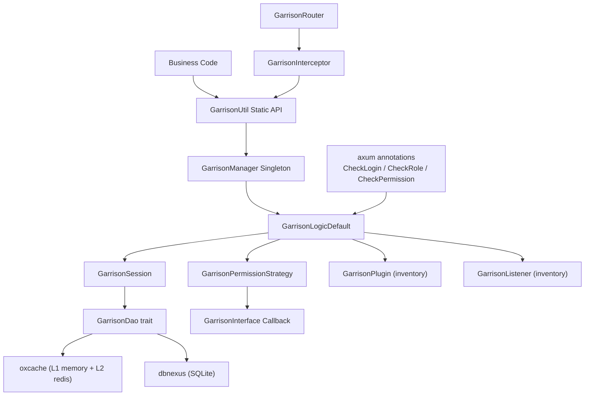

<!-- markdownlint-disable MD041 -->
<p align="center">
  
</p>

<p align="center">
  [](./README.md)
</p>

<p align="center">
  <b>One-stop authentication & authorization framework for the Rust ecosystem</b><br/>
  <a href="#quick-start">🚀 Quick Start</a> •
  <a href="#features">📖 Features</a> •
  <a href="./docs/ARCHITECTURE.md">🏗 Architecture</a> •
  <a href="./CHANGELOG.md">📝 Changelog</a> •
  <a href="./docs/CONTRIBUTING.md">🤝 Contributing</a>
</p>

<p align="center">
  
  
  
  
  
  
</p>

<!-- markdownlint-restore MD041 -->

---

## 📑 Table of Contents

- [Overview](#-overview)
- [Features](#-features)
- [Architecture](#-architecture)
- [Quick Start](#-quick-start)
  - [Prerequisites](#prerequisites)
  - [Installation](#installation)
  - [Minimal Example](#minimal-example)
  - [axum Integration Example](#axum-integration-example)
- [Configuration](#️-configuration)
- [Feature Flags](#-feature-flags)
- [API Docs](#-api-docs)
- [Contributing](#-contributing)
- [Roadmap](#-roadmap)
- [License](#-license)
- [Acknowledgments](#-acknowledgments)

---

## 🔭 Overview

**Garrison** is a Rust-native authentication and authorization framework,
providing Token-based session management, RBAC permission model, axum Web framework
integration, and more.

The framework uses a **dual-abstraction-layer + global singleton** architecture:

- **dbnexus** database abstraction layer (SQLite / PostgreSQL / MySQL, backend differences
  masked by the `GarrisonDao` trait)
- **oxcache** cache abstraction layer (L1 in-memory + L2 redis, for session & Token storage)
- **GarrisonManager** global singleton holding `Arc<GarrisonLogicDefault>` (which implements
  6 sub-traits: `GarrisonCore` / `SessionLogic` / `PermissionLogic` / `TokenLogic` /
  `MfaLogic` / `PasswordLogic`). Business code injects dependencies once at startup and
  uses static APIs thereafter.

### Use Cases

- **Web App Authentication**: axum/actix/warp-based web services needing login and
  permission checks
- **Microservice Gateway**: unified auth at the API gateway layer, supporting
  JWT/OAuth2/API Key
- **Enterprise Admin Panels**: RBAC permission model + session management + audit logs
- **Multi-System SSO**: cross-subsystem single sign-on with ticket model and one-time
  consumption

---

## ✨ Features

| Feature | Description |
| --- | --- |
| ⚡ **Zero Runtime Overhead** | Compile-time `inventory::submit!` factory registration — no reflection, no dynamic loading |
| 🔒 **Full Auth Chain** | Login → Permission Check → Session Management → Route Interception, out of the box |
| 📦 **Multi-Backend Abstraction** | `GarrisonDao` + `oxcache` + `dbnexus` — switch storage backends with zero business code changes |
| 🔧 **Pluggable Extensions** | trait + Default pattern — replace any component (DAO / Strategy / Logic) without touching business code |
| 🎯 **Feature Gating** | 40+ feature domains with independent flags — compile only what you need |
| 📊 **High Observability** | `tracing` logging + `listener` event subscriptions + `prometheus` metrics (optional) |
| 🧪 **High Coverage** | 3852+ tests passing (3787 lib + 65 E2E), 95%+ line coverage, clippy zero warnings |
| 🌐 **Web Framework Adapters** | axum/actix/warp annotation-style extractors (`CheckLogin` / `CheckRole` / `CheckPermission` + proc macros) |

### Feature Domain Coverage (v0.4.0–v0.6.0 Protocol Layer & Production Capabilities)

| Domain | Status | Description |
|--------|--------|-------------|
| Login Auth | ✅ v0.1.0 | Token-based session management |
| Permission Auth | ✅ v0.1.0 | RBAC permission model |
| Session Management | ✅ v0.1.0 | Dual-mode session lifecycle (Account + Token) |
| Route Interception | ✅ v0.1.0 | axum Web framework adapter |
| JWT | ✅ v0.2.0 | JSON Web Token issuance & validation (HS256/HS512 + refresh) |
| OAuth2 | ✅ v0.2.0 | Auth code / Client credentials / Password + v0.4.0 RefreshToken |
| SSO | ✅ v0.2.0 | Ticket-based single sign-on (one-time, 60s TTL) |
| Microservice Gateway | ✅ v0.2.0 | API signing + nonce anti-replay |
| API Key Auth | ✅ v0.2.0 | API Key generation / verification / revocation / rotation |
| Temporary Credentials | ✅ v0.2.0 | Short-lived token + issue/get/revoke/consume |
| TOTP | ✅ v0.2.0 | RFC 6238 two-factor auth |
| Basic Auth | ✅ v0.2.0 | HTTP Basic Auth (RFC 7617) |
| Digest Auth | ✅ v0.2.0 | HTTP Digest Auth (RFC 7616) |
| Plugin System | ✅ v0.2.0 | `GarrisonPlugin` trait + inventory registration |
| Event Listeners | ✅ v0.2.0 / v0.4.2 extended | `GarrisonListener` trait + 15 event variants (9 added in v0.4.2) |
| OIDC | ✅ v0.4.0 | id_token issuance/validation + discovery + triple anti-replay |
| OAuth2 Scope Handler | ✅ v0.4.0 | `ScopeHandler` trait + `ScopeRegistry` |
| SSO Server Abstraction | ✅ v0.4.0 | `SsoServer` trait + `CenterIdConverter` + `SsoChannel` |
| AloneCache Multi-Instance | ✅ v0.4.0 | `AloneCache` decorator + `AloneCacheManager` |
| ParameterQuery | ✅ v0.4.0 | `ParameterQuery` trait + Builder + async check_permission/check_role |
| ~~LoginId newtype~~ | ❌ v0.5.2 removed | ~~`LoginId` enum (Numeric/String)~~ Full stack migrated to `String`/`&str` |
| Repository Layer | ✅ v0.4.2 | 9 Repository traits + SqliteRepository (tenant_id isolation) |
| Password Hashing | ✅ v0.4.2 | `PasswordHasher` trait + Argon2/Bcrypt + auto-detection |
| Password Login | ✅ v0.4.2 | `login_with_password` integrating Repository + PasswordHasher |
| Multi-Account login_type | ✅ v0.4.2 | `get_permission_list_with_type` / `get_role_list_with_type` |
| JWT Three Modes | ✅ v0.4.2 | `JwtMode` Stateless/Mixin/Simple |
| API Key namespace | ✅ v0.4.2 | `garrison:apikey:<namespace>:<key>` multi-tenant isolation |
| SSO TOCTOU Fix | ✅ v0.4.2 | `GarrisonDao::get_and_delete` atomic consumption |
| kickout_by_device | ✅ v0.4.2 | Per-device session kickout |
| ActixContext Adapter | ✅ v0.4.2 | actix-web 4 4-piece set (ActixContext/Request/Response/Storage) |
| WarpContext Adapter | ✅ v0.4.2 | warp 0.4 4-piece set (WarpContext/Request/Response/Storage) |
| Strategy Registry | ✅ v0.4.2 | 6 strategy traits + `Strategy` registry + Manager integration |
| Proc Macro Annotations | ✅ v0.4.2 | 10 attribute macros: `#[check_login]` / `#[check_permission]` / `#[check_role]` / `#[check_access_token]` / `#[check_client_token]` / `#[check_temp_token]` / `#[check_api_key]` / `#[check_mfa]` / `#[check_abac]` / `#[check_disable]` |
| OAuth 2.1 PKCE | ✅ v0.4.2 | RFC 7636 S256 method, legacy methods deprecated |
| Token Introspection | ✅ v0.4.2 | RFC 7662 remote token status query |
| Multi-Tenant Isolation | ✅ v0.5.0 | `tenant_id` field + `task_local!` TenantContext + Repository mandatory filtering |
| Social Login | ✅ v0.5.0 | WeChat QR / Alipay Provider + SocialBinding table |
| Audit Logging | ✅ v0.5.0 | `audit_logs` table + 14 listener event subscriptions + auto-masking |
| RefreshToken Rotation | ✅ v0.5.0 | SHA-256 hash chain + parentTokenHash + reuse detection |
| Security Suite | ✅ v0.5.0 | 5 FirewallStrategy + MaxMindDb production backend |
| Role Hierarchy | ✅ v0.5.0 | `role_hierarchy` table + TC precomputation + permission union cached at login |
| Decision Tracing | ✅ v0.5.0 | `Decision{allowed, reason, errors}` + `authorize()` API |
| Keycloak OIDC RP | ✅ v0.5.0 | `KeycloakProvider` discovery + JWKS verification |
| PostgreSQL Backend | ✅ v0.5.0 | `db-postgres` feature + backend-agnostic SQL |
| MySQL Backend | ✅ v0.5.3 | `db-mysql` feature + testcontainers integration tests |
| Account Security Engine | ✅ v0.6.0 | `account/` module + Credential SPI + PasswordPolicyEngine + UserLockoutStrategy + AuthenticationFlow DSL |
| remember-me Extended Timeout | ✅ v0.6.1 | `remember_me_enabled` / `remember_me_timeout` config + login parameter |
| Redis Deployment Mode | ✅ v0.6.1 | `RedisDeploymentMode` enum (Single/Sentinel/Cluster/MasterSlave) |
| Identity Switch (switch_to) | ✅ v0.6.1 | `switch_to(login_id)` session identity switching |
| Token Renew (renew_to_equivalent) | ✅ v0.6.1 | Equivalent token renewal (preserves session state) |
| OAuth2 Annotations | ✅ v0.6.1 | `Annotation::CheckAccessToken` / `CheckClientToken` |
| Route Grouping group() | ✅ v0.6.1 | `GarrisonRouter::group(prefix, annotation, f)` |
| Session Expiry Callback | ✅ v0.6.1 | `SessionExpiryListener` trait + `add_expiry_listener` |
| SAML 2.0 Skeleton | ✅ v0.6.1 | `SamlProvider` trait + `DefaultSamlProvider` (quick-xml parsing) |
| OIDC RP Skeleton | ✅ v0.6.1 | `OidcProvider` trait + `DefaultOidcProvider` (discovery + token exchange) |
| Redis pub/sub SsoChannel | ✅ v0.6.1 | `RedisPubSubSsoChannel` (PUBLISH/SUBSCRIBE cross-instance communication) |

---

## 🏗 Architecture



Core modules:

- `stp/`: Core API (6 sub-traits: `GarrisonCore` / `SessionLogic` / `PermissionLogic` /
  `TokenLogic` / `MfaLogic` / `PasswordLogic` + `GarrisonUtil` static delegation +
  task_local context)
- `garrison-session`: Dual-mode session management (Account-Session + Token-Session)
- `garrison-strategy`: Permission check strategies (`GarrisonPermissionStrategy` trait)
- `garrison-manager`: Global singleton + inventory factory registration
- `garrison-annotation`: axum extractor annotation system
- `garrison-router`: axum Router wrapper + middleware interception
- `garrison-dao`: `GarrisonDao` trait + oxcache / dbnexus implementations

Full architecture design at [docs/ARCHITECTURE.md](./docs/ARCHITECTURE.md).

---

## 🚀 Quick Start

### Prerequisites

| Dependency | Version | Description |
| --- | --- | --- |
| Rust | >= 1.85 | Toolchain (some deps require edition2024) |
| cargo | Ships with Rust | Package manager |
| libssl-dev | System package | Required for `cargo tarpaulin` coverage tool |
| pkg-config | System package | Required for `cargo tarpaulin` coverage tool |

> Note: No additional runtime system dependencies — `oxcache` and `dbnexus` are pure Rust.

### Installation

Add the following to your `Cargo.toml`:

```toml
[dependencies]
garrison = { version = "0.7", features = ["web-axum"] }
tokio = { version = "1", features = ["full"] }
```

To enable all protocol and security modules:

```toml
[dependencies]
garrison = { version = "0.7", features = ["full"] }
```

### Minimal Example

Complete business flow: initialize manager → log in → verify login state → log out.

```rust
use std::sync::Arc;
use garrison::prelude::*;
use async_trait::async_trait;

// 1. Implement GarrisonInterface (provides permission/role data)
struct MyInterface;
#[async_trait]
impl GarrisonInterface for MyInterface {
    async fn get_permission_list(&self, _login_id: i64) -> GarrisonResult<Vec<String>> {
        Ok(vec!["user:read".into(), "user:write".into()])
    }
    async fn get_role_list(&self, _login_id: i64) -> GarrisonResult<Vec<String>> {
        Ok(vec!["user".into()])
    }
}

#[tokio::main]
async fn main() -> GarrisonResult<()> {
    // 2. Prepare dependencies
    let dao: Arc<dyn GarrisonDao> = Arc::new(GarrisonDaoOxcache::new().await?);
    let config = Arc::new(GarrisonConfig::default_config());
    let interface: Arc<dyn GarrisonInterface> = Arc::new(MyInterface);

    // 3. Initialize global manager (injects dao / config / interface)
    GarrisonManager::init(dao, config, interface)?;

    // 4. Execute login in task_local context
    let token = garrison::stp::with_current_token(
        String::new(),
        GarrisonUtil::login("1001", &LoginParams::default()),
    ).await?;
    println!("Login successful, token = {}", token);

    // 5. Verify login state
    let logged_in = garrison::stp::with_current_token(
        token.clone(),
        GarrisonUtil::check_login(),
    ).await?;
    assert!(logged_in);

    // 6. Verify permission
    let has_perm = garrison::stp::with_current_token(
        token.clone(),
        GarrisonUtil::check_permission("user:read"),
    ).await?;
    assert!(has_perm);

    // 7. Log out
    garrison::stp::with_current_token(
        token.clone(),
        GarrisonUtil::logout(),
    ).await?;

    Ok(())
}
```

**Expected output:**

```text
Login successful, token = a1b2c3d4e5f6...
```

### axum Integration Example

A complete web application example is at
[examples/src/bin/axum_integration.rs](./examples/src/bin/axum_integration.rs) (253 lines),
covering:

- `GarrisonRouter` wrapping axum Router
- 4 `route_protected` routes (with `CheckLogin` / `CheckRole<AdminRole>` /
  `CheckPermission<ReadPerm>` annotations)
- axum middleware that automatically extracts tokens from the Authorization header and
  sets task_local context

> Examples are organized as a standalone workspace member (`garrison-examples` crate).
> Run with:
> `cargo run -p garrison-examples --bin <name> --features full`. v0.4.0 added 5 new
> examples (`oidc_handler` / `scope_handler` / `sso_server` / `alone_cache` /
> `parameter_query`). Full list at [examples/README](./examples/).

---

## ⚙️ Configuration

`GarrisonConfig` supports three configuration sources (priority descending):

1. **Environment variables**: `GARRISON_TIMEOUT` / `GARRISON_ACTIVE_TIMEOUT` /
   `GARRISON_TOKEN_NAME`, etc.
2. **toml config file**: `garrison.toml` (loaded via `GarrisonConfig::load(Some(path))`)
3. **Code defaults**: `GarrisonConfig::default_config()`

Core configuration fields:

| Field | Default | Description |
| --- | --- | --- |
| `timeout` | `2592000` (30 days) | Session timeout in seconds |
| `active_timeout` | `-1` (disabled) | Active timeout in seconds, -1 follows `timeout` |
| `is_share` | `false` | Share session across multiple devices for the same account |
| `is_concurrent` | `true` | Allow concurrent logins for the same account |
| `token_name` | `garrison_token` | Cookie / Header name |
| `token_style` | `random_64` | Token style (`uuid` / `random_64` / `simple` / `jwt`) |
| `throw_on_not_login` | `true` | Throw exception on not-logged-in instead of returning false |

Hot-reload is supported via `tokio::sync::watch`. See [docs/CONFIGURATION.md](./docs/CONFIGURATION.md).

---

## 🎛 Feature Flags

| Feature | Default | Since | Description |
| --- | :---: | :---: | --- |
| `backend-embedded` | ✅ | 0.7.0 | Embedded backend mode (in-process auth, delegates to GarrisonManager) |
| `backend-remote` | ❌ | 0.7.0 | Remote backend adapter (auth via HTTP to remote Auth Server) |
| `backend-kit` | ❌ | 0.7.0 | trait-kit typestate DI construction |
| `auth-server` | ❌ | 0.7.0 | Standalone auth server (sdforge declarative routing + TLS) |
| `abac` | ❌ | 0.7.0 | Cedar DSL-based attribute-based access control engine |
| `oauth2-server` | ❌ | 0.7.0 | Full OAuth2 Server 4 endpoints (authorize/token/revoke/introspect) |
| `cache-memory` | ❌ | 0.1.0 | In-memory cache backend (oxcache L1) |
| `cache-redis` | ❌ | 0.1.0 | Redis cache backend (oxcache L2) |
| `db-sqlite` | ❌ | 0.1.0 | SQLite database backend (dbnexus + auto-migrate) |
| `db-postgres` | ❌ | 0.5.0 | PostgreSQL backend |
| `db-mysql` | ❌ | 0.5.3 | MySQL backend |
| `web-axum` | ❌ | 0.1.0 | axum Web framework adapter |
| `web-actix` | ❌ | 0.4.2 | actix-web framework adapter |
| `web-warp` | ❌ | 0.4.2 | warp framework adapter |
| `web-waf` | ❌ | 0.6.4 | WAF-level web firewall middleware |
| `web-cors` | ❌ | 0.6.4 | CORS middleware |
| `web-csrf` | ❌ | 0.6.4 | CSRF protection middleware |
| `protocol-jwt` | ❌ | 0.2.0 | JWT issuance & validation (HS256/HS512 + refresh) |
| `protocol-oauth2` | ❌ | 0.2.0 | OAuth2 four modes (incl. RefreshToken) |
| `protocol-sso` | ❌ | 0.2.0 | SSO single sign-on ticket |
| `protocol-sign` | ❌ | 0.2.0 | API signing + nonce anti-replay |
| `protocol-apikey` | ❌ | 0.2.0 | API Key auth |
| `protocol-temp` | ❌ | 0.2.0 | Temporary credentials |
| `protocol-oidc` | ❌ | 0.4.0 | OIDC id_token issuance/validation + discovery |
| `protocol-zeroize` | ❌ | 0.4.2 | Protocol-layer key zeroization (zero secret fields on Drop) |
| `oauth2-scope-handler` | ❌ | 0.4.0 | OAuth2 ScopeHandler registry |
| `protocol-sso-server` | ❌ | 0.4.0 | SSO Server abstraction + CenterIdConverter |
| `secure-saml` | ❌ | 0.5.0 | SAML 2.0 skeleton (rsa signature verification) |
| `alone-cache` | ❌ | 0.4.0 | AloneCache multi-Redis instance isolation decorator |
| `parameter-query` | ❌ | 0.4.0 | ParameterQuery + Builder |
| `secure-totp` | ❌ | 0.2.0 | TOTP (RFC 6238) |
| `secure-sign` | ❌ | 0.2.0 | HMAC-SHA256/SHA512 utilities |
| `secure-httpbasic` | ❌ | 0.2.0 | HTTP Basic Auth (RFC 7617) |
| `secure-httpdigest` | ❌ | 0.2.0 | HTTP Digest Auth (RFC 7616) |
| `secure-confusable` | ❌ | 0.5.1 | Unicode confusable character detection |
| `secure-masking` | ❌ | 0.6.2 | Sensitive data masking (regex real masking) |
| `secure-xss` | ❌ | 0.6.2 | XSS protection |
| `secure-sanitize` | ❌ | 0.6.2 | General input sanitization |
| `secure-simple-token` | ❌ | 0.7.1 | SimpleTokenStyle HMAC-SHA256 signing |
| `sms-rate-limit` | ❌ | 0.6.2 | SMS verification code rate limiting |
| `account-credential` | ❌ | 0.6.0 | Credential model SPI (Argon2/Bcrypt) |
| `account-credential-zeroize` | ❌ | 0.6.0 | Credential model zeroize extension |
| `account-policy` | ❌ | 0.6.0 | Password policy engine |
| `account-lockout` | ❌ | 0.6.0 | User lockout strategy |
| `account-authflow` | ❌ | 0.6.0 | AuthenticationFlow DSL |
| `listener` | ❌ | 0.2.0 | Event listeners (15 event variants, extended in v0.4.2) |
| `tracing-log` | ❌ | 0.1.0 | tracing log bridge |
| `metrics-prometheus` | ❌ | 0.3.0 | Prometheus metrics |
| `observability-otlp` | ❌ | 0.3.0 | OpenTelemetry OTLP distributed tracing |
| `audit-inklog` | ❌ | 0.7.0 | inklog structured audit logging |
| `grpc` | ❌ | 0.3.0 | gRPC auth interceptor (tonic::Interceptor) |
| `annotation-macros` | ❌ | 0.4.2 | 10 attribute macros: `#[check_login]` / `#[check_permission]` / `#[check_role]` / `#[check_access_token]` / `#[check_client_token]` / `#[check_temp_token]` / `#[check_api_key]` / `#[check_mfa]` / `#[check_abac]` / `#[check_disable]` |
| `tenant-isolation` | ❌ | 0.5.0 | Multi-tenant logical isolation |
| `social-wechat` | ❌ | 0.5.0 | WeChat QR social login |
| `social-alipay` | ❌ | 0.5.0 | Alipay social login |
| `audit-log` | ❌ | 0.5.0 | Audit log persistence |
| `firewall` | ❌ | 0.5.0 | Security protection base trait |
| `firewall-bruteforce` | ❌ | 0.5.0 | Brute-force protection strategy |
| `firewall-ratelimit` | ❌ | 0.5.0 | Rate limiting strategy |
| `rate-limit-redis` | ❌ | 0.6.4 | Redis rate limiting backend |
| `firewall-anomalous` | ❌ | 0.5.0 | Anomalous login detection |
| `firewall-geoip` | ❌ | 0.5.0 | GeoIP strategy |
| `firewall-ddos` | ❌ | 0.5.0 | DDoS protection strategy |
| `firewall-waf` | ❌ | 0.6.4 | WAF-level firewall |
| `firewall-maxminddb` | ❌ | 0.5.3 | MaxMindDb production backend |
| `anomalous-detector-dual` | ❌ | 0.6.2 | Dual-engine anomalous login detection |
| `keycloak-oidc` | ❌ | 0.5.0 | Keycloak OIDC RP integration |
| `decision-trace` | ❌ | 0.4.2 | Decision tracing |
| `authorize-api` | ❌ | 0.5.1 | Request-object-based authorization API |
| `manager-explicit` | ❌ | 0.5.1 | Explicit Manager API |
| `permission-registry` | ❌ | 0.5.1 | Permission registry |
| `safe-defaults` | ❌ | 0.6.7 | Forbid-first semantics (safe-defaults) |
| `security-alert` | ❌ | 0.6.5 | Security alert system |
| `device-binding` | ❌ | 0.6.5 | Device binding |
| `safe-auth` | ❌ | 0.6.5 | Second-factor auth transient flag |
| `dynamic-active-timeout` | ❌ | 0.6.2 | Dynamic active timeout |
| `three-tier-cache` | ❌ | 0.6.7 | Three-tier cache architecture |
| `login-token-map-persistence` | ❌ | 0.6.6 | login_token_map persistence |
| `anonymous-session` | ❌ | 0.6.6 | Anonymous session |
| `session-search` | ❌ | 0.6.6 | Session search |
| `tls` | ❌ | 0.7.0 | HTTPS/TLS termination (axum-server rustls) |
| `miette` | ❌ | 0.5.1 | Rich error reporting with miette |
| `i18n` | ❌ | 0.3.0 | Internationalization base layer (fluent-rs) |
| `i18n-icu` | ❌ | 0.3.0 | ICU4X enhancement (plural + date + number localization) |
| `full` | ❌ | — | Aggregate all features |
| `production` | ❌ | — | Recommended production combination |
| `development` | ❌ | — | Development combination |

---

## 📚 API Docs

- **Online docs**: [https://docs.rs/garrison](https://docs.rs/garrison)
- **Generate locally**: `cargo doc --no-deps --features full --open`
- **Example code** (standalone workspace member, run with
  `cargo run -p garrison-examples --bin <name> --features full`):
  - [examples/src/bin/basic_login.rs](./examples/src/bin/basic_login.rs): Full business
    flow (167 lines)
  - [examples/src/bin/axum_integration.rs](./examples/src/bin/axum_integration.rs):
    Complete web app (253 lines)
  - [examples/src/bin/oidc_handler.rs](./examples/src/bin/oidc_handler.rs): OIDC
    id_token issuance/validation (added in v0.4.0)
  - [examples/src/bin/scope_handler.rs](./examples/src/bin/scope_handler.rs):
    ScopeHandler registry (added in v0.4.0)
  - [examples/src/bin/sso_server.rs](./examples/src/bin/sso_server.rs): SSO Server
    abstraction (added in v0.4.0)
  - [examples/src/bin/alone_cache.rs](./examples/src/bin/alone_cache.rs): AloneCache
    multi-instance isolation (added in v0.4.0)
  - [examples/src/bin/parameter_query.rs](./examples/src/bin/parameter_query.rs):
    ParameterQuery (added in v0.4.0)
  - Full list at [examples/src/lib.rs](./examples/src/lib.rs) module declarations

---

## 🤝 Contributing

All forms of contribution are welcome! Please read the
[Contributing Guide](./docs/CONTRIBUTING.md) first.

### Filing Issues

- Use the
  [Issue templates](https://github.com/Kirky-X/garrison/issues/new/choose)
  (Bug Report / Feature Request)
- Include reproduction steps and Rust version when describing bugs

### Submitting PRs

1. Fork this repository
2. Create a feature branch: `git checkout -b feat/your-feature`
3. Follow [Conventional Commits](https://www.conventionalcommits.org/) specification
4. Ensure `cargo test --features full` + `cargo clippy -- -D warnings` pass
5. Create a Pull Request

### Development Guidelines

- **TDD workflow**: interface → test → implementation → green → commit
- **clippy**: zero warnings (`-D warnings`)
- **Documentation**: all public APIs must have `///` doc comments
- **Test serialization**: tests that modify the global `GarrisonManager` singleton must
  be annotated with `#[serial_test::serial]`

### Testing

Garrison provides a three-tier testing system: unit tests (3787+ lib) + E2E tests
(65+, covering API matrix / performance baselines / penetration testing) + doc-tests.

```bash
# Unit + integration tests
cargo test --features full

# E2E tests (API matrix + penetration, excludes #[ignore] performance tests)
cargo test --test e2e --features "full testing" -- --nocapture

# Performance baselines (skipped by default via #[ignore])
cargo test --test e2e --features "full testing" -- --ignored perf_ --test-threads=1 --nocapture

# One-shot: E2E + perf + penetration + combined report
bash scripts/e2e_run.sh
```

The E2E test suite covers API interface matrices (happy/errors/boundary/authz_boundary),
performance baselines (P99<200ms/1000RPS), and penetration testing
(7 attack categories × N payloads). All HTTP interactions are captured to
`logs/e2e_http.jsonl` via `RecordingClient` and aggregated into
`logs/e2e_final_report.md` by `scripts/e2e_analyze.py`. See
[E2E / Performance / Penetration Testing](./docs/DEVELOPMENT.md#e2e--性能--渗透测试).

---

## 🗺 Roadmap

- [x] **v0.1.0** (2026-06-30) Core infrastructure: login auth + permission check +
  dual-mode session + axum integration
- [x] **v0.2.0** (2026-07-01) Protocol & security layer: JWT / OAuth2 / SSO / Sign /
  API Key / TOTP / Basic / Digest + plugin system + event listeners
- [x] **v0.2.1** (2026-07-01) auto-wire fix + protocol boundary tests + examples
  engineering reorganization
- [x] **v0.3.0** Ecosystem & observability: OpenTelemetry OTLP + gRPC interceptor +
  i18n + metrics-prometheus
- [x] **v0.4.0** (2026-07-02) v0.2.0 protocol layer gap closure: OIDC / ScopeHandler /
  SsoServer / AloneCache / ParameterQuery
- [x] **v0.4.2** (2026-07-05) Gap closure: dao extension / strategy-registry /
  jwt-modes / oauth-2-1 / token-introspection / apikey-namespace / sso-toctou /
  password-login / annotation macros
- [x] **v0.5.0** (2026-07-06) Production essentials: multi-tenant / social login /
  audit log / Token Rotation / security suite / role hierarchy / decision tracing /
  Keycloak OIDC RP / PostgreSQL
- [x] **v0.5.2** (2026-07-08) Architecture refactor: `GarrisonLogic` trait split into
  6 sub-traits + LoginId migration to String
- [x] **v0.5.3** (2026-07-09) Feature completion: oxcache upgrade / stp full split /
  MySQL backend / Firewall MaxMindDb
- [x] **v0.6.0** (2026-07-09) Account security engine: `account/` module + Credential
  SPI + PasswordPolicyEngine + AuthenticationFlow DSL + remember-me / Redis deployment /
  switch_to / SAML 2.0 / OIDC RP / Redis pub/sub SsoChannel
- [x] **v0.7.0** (2026-07-17) Microservice architecture + ABAC/Cedar + OAuth2 Server:
  backend-remote / Auth Server / ABAC engine / OAuth2 Server 4 endpoints
- [x] **v0.7.1** (2026-07-21) Security fixes + architecture hardening: 21 security
  fixes (secure-simple-token, SimpleTokenStyle anti-forgery, OIDC aud array
  compatibility, switch_to account session cleanup, corrupt-JSON resilience, etc.)
- [x] **v0.7.2** (2026-07-21) Cross-platform fixes + security hardening: Windows confers path validation fix + gitleaks integration + GarrisonConfig::load 7 security protections
- [x] **v0.7.3** (2026-07-22) Macro expansion + version sync: new `#[check_disable]` macro + garrison-macros version synced to 0.7.3 + documentation consistency fixes
- [ ] **v1.0.0** Stable release: API freeze + performance benchmarks + production
  case studies

Full roadmap at [docs/ROADMAP.md](./docs/ROADMAP.md).

---

## 📄 License

This project is licensed under [Apache-2.0](./LICENSE).

Why Apache-2.0 instead of MIT: Apache-2.0 includes patent grant provisions, making it
more suitable for enterprise-grade frameworks.

---

## 🙏 Acknowledgments

- [Sa-Token](https://github.com/dromara/sa-token): Java ecosystem auth framework, whose
  domain modeling informed Garrison's early design
- [axum](https://github.com/tokio-rs/axum): tokio team's Rust web framework
- [oxcache](https://github.com/Kirky-X/oxcache): Rust multi-level cache library
  (L1 memory + L2 redis)
- [dbnexus](https://github.com/Kirky-X/dbnexus): Rust database abstraction layer
  (SQLite / PostgreSQL / MySQL)
- [inventory](https://github.com/dtolnay/inventory): David Tolnay's compile-time plugin
  registration library

---

<p align="center">
  Built with ❤️ by <a href="https://github.com/Kirky-X">Kirky.X</a>
</p>
