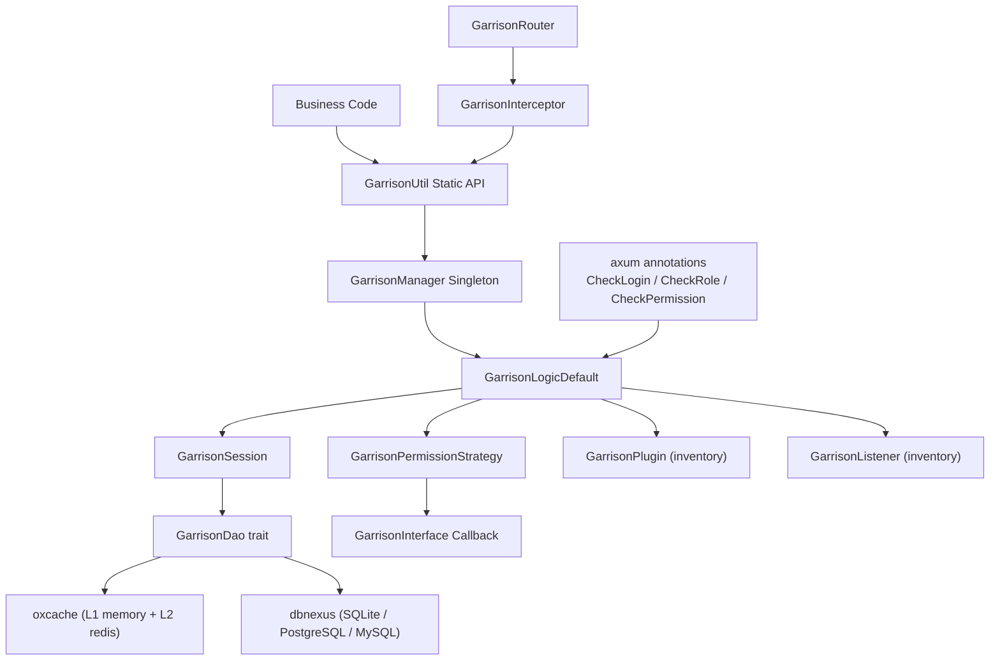

<!-- markdownlint-disable MD041 -->
<div align="center">


[](https://github.com/Kirky-X/garrison/actions/workflows/ci.yml) [](https://crates.io/crates/garrison) [](https://docs.rs/garrison) [](https://crates.io/crates/garrison) [](LICENSE) [](https://www.rust-lang.org/) [](https://github.com/Kirky-X/garrison)

[中文](README.md) | **English**

<b>One-stop authentication &amp; authorization framework for the Rust ecosystem</b>

[✨ Features](#-features) • [🚀 Quick Start](#-quick-start) • [📚 Documentation](#-documentation) • [💻 Examples](#-examples) • [🤝 Contributing](#-contributing)

</div>

---

## 📋 Table of Contents

<details open>
<summary>📑 Contents</summary>

- [✨ Features](#-features)
- [🚀 Quick Start](#-quick-start)
- [🎨 Feature Flags](#-feature-flags)
- [📚 Documentation](#-documentation)
- [💻 Examples](#-examples)
- [🏗️ Architecture](#️-architecture)
- [🧪 Testing](#-testing)
- [📊 Performance](#-performance)
- [🔒 Security](#-security)
- [🗺️ Roadmap](#️-roadmap)
- [🤝 Contributing](#-contributing)
- [📋 Changelog](#-changelog)
- [📄 License](#-license)
- [🙏 Acknowledgments](#-acknowledgments)
- [📞 Contact & Support](#-contact--support)
- [⭐ Star History](#-star-history)

</details>

---

## ✨ Features

<table style="width:100%; border-collapse: collapse">
<tr>
<td width="50%" style="vertical-align:top; padding: 12px">⚡ <b>Zero Runtime Overhead</b><br><span style="color:#64748B">Compile-time <code>inventory::submit!</code> factory registration — no reflection, no dynamic loading</span></td>
<td width="50%" style="vertical-align:top; padding: 12px">🔒 <b>Full Auth Chain</b><br><span style="color:#64748B">Login → Permission Check → Session Management → Route Interception, out of the box</span></td>
</tr>
<tr>
<td width="50%" style="vertical-align:top; padding: 12px">📦 <b>Multi-Backend Abstraction</b><br><span style="color:#64748B"><code>GarrisonDao</code> + <code>oxcache</code> + <code>dbnexus</code> — switch storage backends with zero business code changes</span></td>
<td width="50%" style="vertical-align:top; padding: 12px">🔧 <b>Pluggable Extensions</b><br><span style="color:#64748B">trait + Default pattern — replace any component (DAO / Strategy / Logic) without touching business code</span></td>
</tr>
<tr>
<td width="50%" style="vertical-align:top; padding: 12px">🎯 <b>Feature Gating</b><br><span style="color:#64748B">100+ feature flags — compile only what you need</span></td>
<td width="50%" style="vertical-align:top; padding: 12px">📊 <b>High Observability</b><br><span style="color:#64748B"><code>tracing</code> logging + <code>listener</code> event subscriptions + <code>prometheus</code> metrics (optional)</span></td>
</tr>
<tr>
<td width="50%" style="vertical-align:top; padding: 12px">🧪 <b>High Coverage</b><br><span style="color:#64748B">3967+ tests passing (3899 lib + 68 E2E), 95%+ line coverage, clippy zero warnings</span></td>
<td width="50%" style="vertical-align:top; padding: 12px">🌐 <b>Web Framework Adapters</b><br><span style="color:#64748B">axum/actix/warp annotation-style extractors + proc macros</span></td>
</tr>
</table>

Beyond the core capabilities above, everything else ships as independent, opt-in feature flags.

### 🧩 Feature Domain Coverage

The complete set of delivered feature domains; per-flag definitions mirror the `[features]` section of `Cargo.toml`, see [🎨 Feature Flags](#-feature-flags):

| Category | Feature Domains |
|----------|-----------------|
| Core Engine | Login auth · RBAC permissions · Dual-mode sessions (Account + Token) · Route interception (axum / actix / warp) · WAF / CORS / CSRF middleware |
| Auth Protocols | JWT (three modes + refresh) · OAuth2 four modes · OIDC (discovery + triple anti-replay) · Keycloak OIDC RP · SAML 2.0 · SSO (ticket / SsoServer abstraction / Redis pub/sub across instances) · API Key · Temporary credentials · API signing anti-replay · TOTP · Basic / Digest · OAuth 2.1 PKCE · Token Introspection · RefreshToken rotation |
| Authorization & Decision | Role hierarchy (TC precomputation) · OAuth2 Scope Handler · OAuth2 Server · ABAC (Cedar DSL) · Decision tracing (`Decision` + `authorize()`) |
| Account & Credentials | Account security engine (Credential SPI + password policy + auth flow DSL) · Password hashing (Argon2 / Bcrypt) · Email verification · Social login (WeChat / Alipay) · Invitation codes |
| Protection & Audit | Firewall suite (brute-force / rate-limit / anomalous / GeoIP / DDoS) · Multi-tenant isolation · Audit logging · Security toolkit (masking / XSS protection / constant-time comparison) |
| Storage & Extension | SQLite / PostgreSQL / MySQL backends · Repository layer · AloneCache multi-instance isolation · ParameterQuery · Plugin system · Event listeners · Proc-macro annotations |
| Microservices & Production | Remote backend (backend-remote) · Standalone auth server · gRPC interceptor · Config encryption / hot-reload · i18n · Observability (tracing / Prometheus / OTLP) |

---

## 🚀 Quick Start

### 📦 Installation

Add the following to your `Cargo.toml` (`development` preset = in-memory cache DAO + SQLite + axum adapter):

```toml
[dependencies]
garrison = { version = "0.9.0-rc.1", features = ["development"] }
async-trait = "0.1"
tokio = { version = "1", features = ["full"] }
```

> Pre-release versions require the full version number; `"0.9"` will not match prerelease. To enable all protocol and security modules: `features = ["full"]`.

| Preset | Installation | Use Case |
|--------|-------------|----------|
| Development | `features = ["development"]` | In-memory cache + SQLite + axum, quick validation |
| Production | `features = ["production"]` | Recommended production combination |
| Full | `features = ["full"]` | All capabilities |

### 💡 Minimal Example

Complete business flow: initialize manager → log in → verify login state → log out.

```rust
use std::sync::Arc;
use garrison::prelude::*;
use async_trait::async_trait;

// 1. Implement GarrisonInterface (provides permission/role data)
struct MyInterface;
#[async_trait]
impl GarrisonInterface for MyInterface {
    async fn get_permission_list(&self, _login_id: &str) -> GarrisonResult<Vec<String>> {
        Ok(vec!["user:read".into(), "user:write".into()])
    }
    async fn get_role_list(&self, _login_id: &str) -> GarrisonResult<Vec<String>> {
        Ok(vec!["user".into()])
    }
}

#[tokio::main]
async fn main() -> GarrisonResult<()> {
    // 2. Prepare dependencies
    let dao: Arc<dyn GarrisonDao> = Arc::new(GarrisonDaoOxcache::new().await?);
    let config = Arc::new(GarrisonConfig::default_config());
    let interface: Arc<dyn GarrisonInterface> = Arc::new(MyInterface);

    // 3. Initialize global manager
    GarrisonManager::builder()
        .dao(dao).config(config).interface(interface)
        .build().await?;

    // 4. Execute login in task_local context
    let token = garrison::stp::with_current_token(
        String::new(), GarrisonUtil::login("1001", &LoginParams::default()),
    ).await?;
    println!("Login successful, token = {}", &token[..8.min(token.len())]);

    // 5. Verify login state
    garrison::stp::with_current_token(token.clone(), GarrisonUtil::check_login()).await?;

    // 6. Verify permission
    garrison::stp::with_current_token(
        token.clone(), GarrisonUtil::check_permission("user:read"),
    ).await?;

    // 7. Log out
    garrison::stp::with_current_token(token.clone(), GarrisonUtil::logout()).await?;
    Ok(())
}
```

> This example is continuously validated by [examples/tests/readme_quickstart.rs](./examples/tests/readme_quickstart.rs) (runs with CI).

### 🧭 Core Concepts

- **Dual Abstraction Layer**: `dbnexus` database abstraction (SQLite / PostgreSQL / MySQL) + `oxcache` cache abstraction (L1 in-memory + L2 redis), unified behind the `GarrisonDao` trait.
- **Global Singleton**: `GarrisonManager` holds `Arc<GarrisonLogicDefault>` (implementing 6 sub-traits); business code injects dependencies once at startup and uses static APIs thereafter.
- **Dual-Mode Sessions**: Account-Session (long-lived, account-level data) + Token-Session (per-login temporary data), controlled by `is_share` / `is_concurrent` config.
- **Feature Gating**: every optional capability is an independent feature; compiled artifacts only include what you enable.

---

## 🎨 Feature Flags

### 📋 Feature Matrix

The table below mirrors the `[features]` section of `Cargo.toml`, where `default = ["backend-embedded"]`.

| Feature | Default | Since | Description |
|---------|:-------:|:-----:|-------------|
| `backend-embedded` | ✅ | 0.7.0 | Embedded backend mode (in-process auth, delegates to GarrisonManager) |
| `backend-remote` | ❌ | 0.7.0 | Remote backend adapter (auth via HTTP to remote Auth Server) |
| `backend-kit` | ❌ | 0.7.0 | trait-kit typestate DI construction |
| `auth-server` | ❌ | 0.7.0 | Standalone auth server (sdforge declarative routing + TLS) |
| `abac` | ❌ | 0.7.0 | Cedar DSL-based attribute-based access control engine |
| `oauth2-server` | ❌ | 0.7.0 | Full OAuth2 Server 4 endpoints |
| `cache-memory` | ❌ | 0.1.0 | In-memory cache backend (oxcache L1) |
| `cache-redis` | ❌ | 0.1.0 | Redis cache backend (oxcache L2) |
| `db-sqlite` | ❌ | 0.1.0 | SQLite database backend |
| `db-postgres` | ❌ | 0.5.0 | PostgreSQL backend |
| `db-mysql` | ❌ | 0.5.3 | MySQL backend |
| `web-axum` | ❌ | 0.1.0 | axum Web framework adapter |
| `web-actix` | ❌ | 0.4.2 | actix-web framework adapter |
| `web-warp` | ❌ | 0.4.2 | warp framework adapter |
| `web-waf` / `web-cors` / `web-csrf` | ❌ | 0.6.4 | WAF / CORS / CSRF middleware |
| `protocol-jwt` | ❌ | 0.2.0 | JWT issuance & validation (HS256/HS512 + refresh) |
| `protocol-oauth2` | ❌ | 0.2.0 | OAuth2 four modes |
| `protocol-sso` / `protocol-sso-server` | ❌ | 0.2.0 / 0.4.0 | SSO ticket / SSO Server abstraction |
| `protocol-sign` | ❌ | 0.2.0 | API signing + nonce anti-replay |
| `protocol-apikey` | ❌ | 0.2.0 | API Key auth |
| `protocol-temp` | ❌ | 0.2.0 | Temporary credentials |
| `protocol-oidc` | ❌ | 0.4.0 | OIDC id_token issuance/validation + discovery |
| `protocol-httpbasic` / `protocol-httpdigest` | ❌ | 0.2.0 | HTTP Basic / Digest auth |
| `protocol-saml` | ❌ | 0.5.0 | SAML 2.0 skeleton |
| `protocol-zeroize` | ❌ | 0.4.2 | Protocol-layer key zeroization |
| `secure-totp` | ❌ | 0.2.0 | TOTP (RFC 6238) |
| `secure-sign` | ❌ | 0.2.0 | HMAC-SHA256/SHA512 utilities |
| `secure-confusable` / `secure-masking` / `secure-xss` / `secure-sanitize` | ❌ | 0.5.1~0.6.2 | Security toolset |
| `secure-simple-token` / `secure-ct-eq` | ❌ | 0.7.1 / 0.8.0 | Signing / constant-time comparison |
| `account-credential` / `account-policy` / `account-lockout` / `account-authflow` | ❌ | 0.6.0 | Account security engine |
| `firewall` / `firewall-*` | ❌ | 0.5.0~0.6.4 | Security suite (brute-force / rate-limit / anomalous / GeoIP / DDoS / WAF) |
| `listener` | ❌ | 0.2.0 | Event listeners (15 event variants) |
| `tracing-log` / `metrics-prometheus` / `otlp` | ❌ | 0.1.0~0.3.0 | Observability |
| `annotation-macros` | ❌ | 0.4.2 | 10 attribute macros |
| `tenant-isolation` | ❌ | 0.5.0 | Multi-tenant logical isolation |
| `social-wechat` / `social-alipay` | ❌ | 0.5.0 | Social login |
| `core-advanced` / `session-extra` | ❌ | 0.9.0 | Core enhancements / Session enhancements merged |
| `email-verification` / `email-verification-smtp` | ❌ | 0.9.0 | Email verification codes |
| `config-*` | ❌ | 0.8.0 | Config file encryption/validation/hot-reload/interpolation/dynamic/toggle (confers passthrough) |
| `i18n` / `i18n-icu` | ❌ | 0.3.0 | Internationalization |
| `full` / `production` / `development` | ❌ | — | Aggregate features |

> **v0.9.0 Feature Rename Mapping**:
>
> | Old Name (≤0.8.x) | New Name (≥0.9.0) | Description |
> |-------------------|--------------------|-------------|
> | `secure-saml` | `protocol-saml` | SAML 2.0 signature verification |
> | `secure-httpbasic` | `protocol-httpbasic` | HTTP Basic auth |
> | `secure-httpdigest` | `protocol-httpdigest` | HTTP Digest auth |
> | `observability-otlp` | `otlp` | OpenTelemetry OTLP |
> | `decision-trace` / `permission-registry` / `safe-defaults` | `core-advanced` | Core enhancements merged |
> | `dynamic-active-timeout` / `login-token-map-persistence` / `anonymous-session` / `session-search` | `session-extra` | Session enhancements merged |

---

## 📚 Documentation

| Document | Description |
|----------|-------------|
| [🏗️ Architecture](docs/ARCHITECTURE.md) | Design principles, module layout, and data flow |
| [⚙️ Configuration](docs/CONFIGURATION.md) | Three-tier config sources, full field reference, and hot-reload |
| [🤝 Contributing](docs/CONTRIBUTING.md) | How to participate in project development |
| [📋 Changelog](docs/CHANGELOG.md) | Change records for every release |
| [🛠️ Development](docs/DEVELOPMENT.md) | TDD workflow, code standards, and debugging tips |
| [🚀 Deployment](docs/DEPLOYMENT.md) | Production deployment notes |
| [🔒 Security](docs/SECURITY.md) | Security policy and vulnerability reporting process |
| [🗺️ Roadmap](docs/ROADMAP.md) | Version evolution plan |
| [❓ FAQ](docs/FAQ.md) | Frequently asked questions |
| [🔧 Troubleshooting](docs/TROUBLESHOOTING.md) | Common issues and solutions |
| [🧪 E2E Testing](docs/E2E_TESTING.md) | Feature combination test suite |
| [📦 Online API Docs](https://docs.rs/garrison) | Latest documentation auto-generated on docs.rs |
| [📦 crates.io](https://crates.io/crates/garrison) | Release page |

---

## 💻 Examples

All examples live in the [`examples/`](examples/) directory as a standalone workspace member (`garrison-examples` crate).

| Example | File | Description |
|---------|------|-------------|
| basic_login | `examples/src/bin/basic_login.rs` | Full business flow (167 lines) |
| axum_integration | `examples/src/bin/axum_integration.rs` | Complete web app (253 lines) |
| oidc_handler | `examples/src/bin/oidc_handler.rs` | OIDC id_token issuance/validation |
| scope_handler | `examples/src/bin/scope_handler.rs` | ScopeHandler registry |
| sso_server | `examples/src/bin/sso_server.rs` | SSO Server abstraction |
| alone_cache | `examples/src/bin/alone_cache.rs` | AloneCache multi-instance isolation |
| parameter_query | `examples/src/bin/parameter_query.rs` | ParameterQuery parameterized query |

```bash
# Run a single example
cargo run -p garrison-examples --bin basic_login --features full

# Verify all examples compile
cargo build -p garrison-examples --features full
```

---

## 🏗️ Architecture

Garrison follows a **dual-abstraction-layer + global singleton** architecture: the public modules under `src/` (`stp`, `session`, `strategy`, `manager`, `annotation`, `router`, `dao`) re-export, while the real implementation is behind the `GarrisonDao` trait masking storage backend differences (`dbnexus` SQLite / PostgreSQL / MySQL + `oxcache` L1 in-memory / L2 redis). Optional capabilities (`protocol-*`, `secure-*`, `firewall-*`, `account-*`, `web-*`, etc.) are gated behind independent features. The core data path runs: business code → `GarrisonUtil` static API → `GarrisonManager` singleton → `GarrisonLogicDefault` (6 sub-traits) → `GarrisonDao` / `GarrisonPermissionStrategy` → storage backend.


```mermaid
graph TD
    User["Business Code"] --> Util["GarrisonUtil Static API"]
    Util --> Manager["GarrisonManager Singleton"]
    Manager --> Logic["GarrisonLogicDefault"]
    Logic --> Session["GarrisonSession"]
    Logic --> Strategy["GarrisonPermissionStrategy"]
    Session --> Dao["GarrisonDao trait"]
    Strategy --> Interface["GarrisonInterface Callback"]
    Dao --> Oxcache["oxcache (L1 memory + L2 redis)"]
    Dao --> Dbnexus["dbnexus (SQLite / PostgreSQL / MySQL)"]
    Logic --> Plugin["GarrisonPlugin (inventory)"]
    Logic --> Listener["GarrisonListener (inventory)"]
    Annotation["axum annotations<br/>CheckLogin / CheckRole / CheckPermission"] --> Logic
    Router["GarrisonRouter"] --> Interceptor["GarrisonInterceptor"]
    Interceptor --> Util
```

> For the full module breakdown and data flow, see the [🏗️ Architecture doc](docs/ARCHITECTURE.md).

---

## 🧪 Testing

### 🎯 Test Strategy

| Layer | Location | Description |
|-------|----------|-------------|
| Unit tests | Inline `#[cfg(test)]` modules in `src/` | Cover core logic under each feature gate |
| Integration tests | `examples/tests/` | 68+ example-level integration tests |
| End-to-end tests | `tests/acceptance/` | API matrix / performance baselines / penetration testing |
| Benchmarks | `benches/` | Criterion benchmarks |
| Doc tests | rustdoc examples on public APIs | Run with `cargo test` |

### ▶️ Commands

```bash
# Unit + integration tests
cargo test --features full

# E2E tests (API matrix + penetration)
cargo test --test e2e --features "full testing" -- --nocapture

# Performance baselines
cargo test --test e2e --features "full testing" -- --ignored perf_ --test-threads=1 --nocapture

# One-shot: E2E + perf + penetration + combined report
bash scripts/e2e_run.sh
```

### 📊 Test Scale

| Category | Count |
|----------|-------|
| Unit tests (inline in `src/`) | 3899+ |
| E2E tests (`tests/`) | 68+ |
| Line coverage | 95%+ |

---

## 📊 Performance

> The E2E test suite includes performance baselines (P99 < 200ms / 1000RPS). All HTTP interactions are captured to `logs/e2e_http.jsonl` via `RecordingClient` and aggregated into reports by `scripts/e2e_analyze.py`.

Performance design highlights: `GarrisonManager` singleton uses `arc_swap::ArcSwapOption` for lock-free reads; `oxcache` L1 in-memory layer with per-entry TTL for fine-grained expiration; three-tier cache TTL random jitter to prevent cache stampede; all optional capabilities are feature-gated to control compile time and binary size.

---

## 🔒 Security

### 🛡️ Security Design

Garrison's security design centers on protecting the full identity lifecycle: Argon2id / Bcrypt password hashing with slow hash offloaded from the async executor, constant-time token comparison (`secure-ct-eq`, CWE-208 defense), API Key secure storage (CWE-916 fix), IP-dimension rate limiting (CWE-307), multi-tenant IDOR protection, JWT blacklist write-failure retry + alerting, external login endpoint fail-closed, and unified token masking in event payloads (CWE-532). Mechanism-level details live in the [Architecture doc](docs/ARCHITECTURE.md); security best practices and the vulnerability handling process are covered by the [Security doc](docs/SECURITY.md).

### ⛓️ Supply Chain and Gates

- `cargo deny check`: vulnerability, license, and banned dependency checks (`deny.toml`).
- `cargo audit`: RustSec advisory scanning.
- Pre-commit private key scanning (gitleaks).

### 🚨 Reporting Security Issues

Please do not report security vulnerabilities through public issues. Use the GitHub [Security Advisories](https://github.com/Kirky-X/garrison/security/advisories/new) private disclosure channel or email <Kirky-X@outlook.com>. The project commits to acknowledging reports within 48 hours and providing an initial assessment within 7 days. See the full policy in [SECURITY.md](docs/SECURITY.md).

---

## 🗺️ Roadmap

<table style="width:100%; border-collapse: collapse">
<tr><th style="text-align:center">Status</th><th style="text-align:left">Area</th><th style="text-align:left">Items</th></tr>
<tr><td align="center">✅</td><td>Core engine</td><td>Login auth + permission check + dual-mode session + axum/actix/warp adapters</td></tr>
<tr><td align="center">✅</td><td>Protocol layer</td><td>JWT / OAuth2 / SSO / OIDC / SAML 2.0 / API Key / TOTP / Basic / Digest / Sign</td></tr>
<tr><td align="center">✅</td><td>Security and protection</td><td>Account security engine / firewall suite / multi-tenant / audit logging</td></tr>
<tr><td align="center">✅</td><td>Microservice architecture</td><td>backend-remote / Auth Server / ABAC / OAuth2 Server / gRPC</td></tr>
<tr><td align="center">✅</td><td>Observability</td><td>tracing / metrics-prometheus / OTLP / i18n</td></tr>
<tr><td align="center">📋</td><td>v1.0.0 Stable</td><td>API freeze + performance benchmarks + production case studies</td></tr>
</table>

Full roadmap at [docs/ROADMAP.md](./docs/ROADMAP.md).

---

## 🤝 Contributing

For the detailed contribution workflow and code standards, see the [🤝 Contributing Guide](docs/CONTRIBUTING.md).

### 🛠️ Development Environment

| Item | Requirement |
|------|-------------|
| Toolchain | Rust 1.85+ (pinned in `rust-toolchain.toml`) |
| Format and lint | `cargo fmt --all -- --check`, `cargo clippy --all-targets --all-features -- -D warnings` |
| Commit messages | Conventional Commits (`feat`, `fix`, `docs`, etc.) |

### 💖 Ways to Contribute

<table style="width:100%; border-collapse: collapse">
<tr>
<td width="33%" align="center" style="padding: 16px">

### 🐛 Report Bugs

Found an issue?<br>
<a href="https://github.com/Kirky-X/garrison/issues/new">Create Issue</a>

</td>
<td width="33%" align="center" style="padding: 16px">

### 💡 Feature Suggestions

Have a great idea?<br>
<a href="https://github.com/Kirky-X/garrison/discussions">Start Discussion</a>

</td>
<td width="33%" align="center" style="padding: 16px">

### 🔧 Submit PR

Want to contribute code?<br>
<a href="https://github.com/Kirky-X/garrison/pulls">Fork & PR</a>

</td>
</tr>
</table>

---

## 📋 Changelog

For the full version history, see the [📋 Changelog](docs/CHANGELOG.md) (following the [Keep a Changelog](https://keepachangelog.com/en/1.0.0/) format and semantic versioning).

| Version | Date | Highlights |
|---------|------|------------|
| 0.9.0-rc.2 | 2026-08-26 | Fail-closed security hardening (check_api_key / check_abac); self-hosted crate rc.4 upgrade |
| 0.9.0-rc.1 | 2026-08-25 | Acceptance test system + DAO atomic contract + gRPC async auth layer |
| 0.8.1 | 2026-07-25 | Documentation consistency + dependency version alignment |
| 0.8.0 | 2026-07-24 | Security hardening + pre-release audit fixes (CWE-916 / CWE-307 / IDOR / ct-eq, etc.) |

---

## 📄 License

This project is licensed under [Apache-2.0](LICENSE).

Why Apache-2.0 instead of MIT: Apache-2.0 includes patent grant provisions, making it more suitable for enterprise-grade frameworks.

---

## 🙏 Acknowledgments

### 🌟 Core Dependencies

Garrison stands on the shoulders of these excellent open source projects:

| Dependency | Purpose |
|------------|---------|
| [axum](https://github.com/tokio-rs/axum) | tokio team's Rust web framework |
| [oxcache](https://github.com/Kirky-X/oxcache) | Rust multi-level cache library (L1 memory + L2 redis) |
| [dbnexus](https://github.com/Kirky-X/dbnexus) | Rust database abstraction layer (SQLite / PostgreSQL / MySQL) |
| [inventory](https://github.com/dtolnay/inventory) | David Tolnay's compile-time plugin registration library |
| [confers](https://github.com/Kirky-X/confers) | Rust configuration management library (zero boilerplate) |
| [sdforge](https://github.com/Kirky-X/sdforge) | Declarative web framework |
| [trait-kit](https://github.com/Kirky-X/trait-kit) | Trait utility toolkit |

### 💝 Special Thanks

- [Sa-Token](https://github.com/dromara/sa-token): Java ecosystem auth framework, whose domain modeling informed Garrison's early design
- Thanks to the Rust community and all [contributors](https://github.com/Kirky-X/garrison/graphs/contributors)

---

## 📞 Contact & Support

<table style="width:100%; max-width: 600px">
<tr>
<td align="center" width="33%">
<a href="https://github.com/Kirky-X/garrison/issues"><b style="color:#991B1B">Issues</b></a><br>
<span style="color:#64748B">Report bugs & issues</span>
</td>
<td align="center" width="33%">
<a href="https://github.com/Kirky-X/garrison/discussions"><b style="color:#1E40AF">Discussions</b></a><br>
<span style="color:#64748B">Ask questions & share ideas</span>
</td>
<td align="center" width="33%">
<a href="https://github.com/Kirky-X/garrison"><b style="color:#1E293B">GitHub</b></a><br>
<span style="color:#64748B">View source code</span>
</td>
</tr>
</table>

---

## ⭐ Star History

[](https://star-history.com/#Kirky-X/garrison&Date)

If you find this project useful, please consider giving it a ⭐️!

<b>Built by Kirky.X</b>

---

<sub>© 2026 Kirky.X. All rights reserved.</sub>
