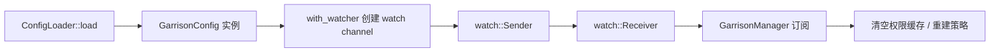

# Garrison 配置指南

> Garrison 配置由 `GarrisonConfig` 统一管理，支持三级配置源合并与 `tokio::sync::watch` 热更新能力。
>
> - 适用版本：0.7.0（核心配置 + JWT / 签名 / SSO / remember-me / Redis 部署模式 / 多租户 / 账号安全引擎 / 微服务架构 / ABAC / OAuth2 Server 等扩展配置）
> - 配置类型：`GarrisonConfig`，实现 `serde::Serialize / Deserialize`
> 架构设计详见 [architecture.md](./ARCHITECTURE.md)；部署配置详见 [deployment.md](./DEPLOYMENT.md)。

---

## 一、配置源优先级

Garrison 配置按以下优先级合并（**高优先级覆盖低优先级**）：

```text
环境变量 (GARRISON_*)  >  toml 文件 (garrison.toml)  >  代码默认值 (GarrisonConfig::default_config())
```

| 优先级 | 来源 | 说明 |
|--------|------|------|
| 高 | 环境变量 | 以 `GARRISON_` 前缀 + 字段名大写下划线形式，例如 `GARRISON_TIMEOUT`、`GARRISON_JWT_SECRET` |
| 中 | toml 文件 | 通过 `GarrisonConfig::load(Some(path))` 加载 toml 文件（基于 confers 0.4.1，内部通过 `TomlContentSource` 注入以支持 Windows 绝对路径） |
| 低 | 代码默认值 | `GarrisonConfig::default_config()` 内联的默认值 |

> 三源合并在 `GarrisonConfig::load()` 阶段完成：先加载 toml（`None` 时使用代码默认值），再由环境变量覆盖，最后 `validate()` 校验。

---

## 二、完整配置项表

### 2.1 核心配置（0.1.0）

| 字段名 | 类型 | 默认值 | 环境变量 | 说明 |
|--------|------|--------|----------|------|
| `timeout` | `i64` | `2592000` | `GARRISON_TIMEOUT` | 会话超时秒数（默认 30 天，必须 > 0） |
| `active_timeout` | `i64` | `-1` | `GARRISON_ACTIVE_TIMEOUT` | 活跃超时秒数，`-1` 表示不启用（跟随整体会话超时） |
| `is_share` | `bool` | `false` | `GARRISON_IS_SHARE` | 同账号多端是否共享会话 |
| `is_concurrent` | `bool` | `true` | `GARRISON_IS_CONCURRENT` | 是否允许并发登录 |
| `token_name` | `String` | `"garrison_token"` | `GARRISON_TOKEN_NAME` | Cookie / Header 中的 token 字段名 |
| `token_style` | `String` | `"uuid"` | `GARRISON_TOKEN_STYLE` | Token 风格，可选 `uuid` / `random_64` / `simple` / `jwt` |
| `is_read_cookie` | `bool` | `true` | `GARRISON_IS_READ_COOKIE` | 是否从 Cookie 读取 Token |
| `is_read_header` | `bool` | `true` | `GARRISON_IS_READ_HEADER` | 是否从 Header 读取 Token |
| `is_write_header` | `bool` | `true` | `GARRISON_IS_WRITE_HEADER` | 是否在登录后写入 Header |
| `throw_on_not_login` | `bool` | `true` | `GARRISON_THROW_ON_NOT_LOGIN` | 未登录时是否抛出异常（`false` 时返回 `false`） |
| `cookie_secure` | `bool` | `true` | `GARRISON_COOKIE_SECURE` | Cookie 是否标记 `Secure`（仅 HTTPS 传输） |
| `cookie_same_site` | `String` | `"Lax"` | `GARRISON_COOKIE_SAME_SITE` | Cookie 的 `SameSite` 策略（`Lax` / `Strict` / `None`） |
| `is_read_body` | `bool` | `false` | `GARRISON_IS_READ_BODY` | 是否从请求体读取 Token |
| `is_write_cookie` | `bool` | `false` | `GARRISON_IS_WRITE_COOKIE` | 是否在续签后将新 Token 写入 Cookie |
| `frontend_separation` | `bool` | `false` | `GARRISON_FRONTEND_SEPARATION` | 是否启用前后端分离模式 |
| `session_hover_timeout` | `i64` | `-1` | `GARRISON_SESSION_HOVER_TIMEOUT` | 会话悬停超时秒数（-1 不启用） |
| `auto_renewal_threshold` | `i64` | `-1` | `GARRISON_AUTO_RENEWAL_THRESHOLD` | 自动续签阈值百分比（-1 不启用，0-100） |
| `token_map_cleanup_interval_secs` | `i64` | `300` | `GARRISON_TOKEN_MAP_CLEANUP_INTERVAL_SECS` | token map 清理间隔秒数 |
| `max_login_count` | `u32` | `0` | `GARRISON_MAX_LOGIN_COUNT` | 最大登录数量（0 不限制） |
| `device_binding_mode` | `String` | `"disabled"` | `GARRISON_DEVICE_BINDING_MODE` | 设备绑定模式（`strict` / `loose` / `disabled`） |
| `replaced_login_exit_mode` | `String` | `"old_device"` | `GARRISON_REPLACED_LOGIN_EXIT_MODE` | 顶人下线策略 |
| `overflow_logout_mode` | `String` | `"logout"` | `GARRISON_OVERFLOW_LOGOUT_MODE` | 溢出处理策略 |
| `audit_mask_mode` | `String` | `"partial"` | `GARRISON_AUDIT_MASK_MODE` | 审计日志脱敏模式 |

### 2.2 扩展配置（0.2.0 新增）

| 字段名 | 类型 | 默认值 | 环境变量 | 说明 |
|--------|------|--------|----------|------|
| `jwt_algorithm` | `String` | `"HS256"` | `GARRISON_JWT_ALGORITHM` | JWT 签名算法，可选 `HS256` / `HS512` 等 |
| `jwt_secret` | `String` | `""` | `GARRISON_JWT_SECRET` | JWT 签名密钥（启用 `protocol-jwt` 时必填） |
| `sign_window_seconds` | `i64` | `300` | `GARRISON_SIGN_WINDOW_SECONDS` | API 签名时间窗口（秒），防重放 |
| `sso_ticket_ttl_seconds` | `u64` | `60` | `GARRISON_SSO_TICKET_TTL_SECONDS` | SSO ticket 有效期（秒） |

### 2.3 remember-me 配置（0.6.0 新增）

| 字段名 | 类型 | 默认值 | 环境变量 | 说明 |
|--------|------|--------|----------|------|
| `remember_me_enabled` | `bool` | `false` | `GARRISON_REMEMBER_ME_ENABLED` | 是否启用 remember-me 扩展会话超时 |
| `remember_me_timeout` | `i64` | `7776000`（90 天） | `GARRISON_REMEMBER_ME_TIMEOUT` | remember-me 会话超时秒数（必须 > `timeout`） |

### 2.4 多租户隔离配置（0.5.0 新增）

| 字段名 | 类型 | 默认值 | 环境变量 | 说明 |
|--------|------|--------|----------|------|
| `tenant_isolation.enabled` | `bool` | `false` | `GARRISON_TENANT_ISOLATION__ENABLED` | 是否启用多租户隔离 |
| `tenant_isolation.resolver` | `String` | `"header"` | `GARRISON_TENANT_ISOLATION__RESOLVER` | 租户解析器类型（`header` / `subdomain` / `claim`） |

> 启用后需配合 `tenant-isolation` Cargo feature + `tenant_resolution_middleware` 才能生效。

---

## 三、配置文件示例

### 3.1 `garrison.toml`

在项目根目录创建 `garrison.toml`：

```toml
# Garrison 配置文件
# 详见 docs/CONFIGURATION.md

# === 会话策略 ===
timeout = 2592000            # 会话超时 30 天
active_timeout = -1          # -1 表示跟随 timeout
is_share = true              # 同账号多端共享会话
is_concurrent = true         # 允许并发登录

# === Token 策略 ===
token_name = "garrison_token"
token_style = "uuid"         # 可选: uuid / random_64 / simple / jwt
is_read_cookie = true
is_read_header = true
is_write_header = true

# === 异常行为 ===
throw_on_not_login = true

# === Cookie 策略 ===
cookie_secure = true
cookie_same_site = "Lax"

# === 0.2.0 扩展（不启用 protocol-* 时可省略）===
# jwt_algorithm = "HS256"
# sign_window_seconds = 300
# sso_ticket_ttl_seconds = 60

# === 0.6.0 remember-me 扩展会话超时 ===
# remember_me_enabled = false
# remember_me_timeout = 7776000  # 90 天

# === 0.5.0 多租户隔离 ===
# [tenant_isolation]
# enabled = false
# resolver = "header"
```

### 3.2 环境变量完整列表

通过 `.env` 或容器环境注入（生产环境建议使用容器/编排平台的环境注入）：

```env
# === 会话策略 ===
GARRISON_TIMEOUT=2592000
GARRISON_ACTIVE_TIMEOUT=-1
GARRISON_IS_SHARE=true
GARRISON_IS_CONCURRENT=true

# === Token 策略 ===
GARRISON_TOKEN_NAME=garrison_token
GARRISON_TOKEN_STYLE=uuid
GARRISON_IS_READ_COOKIE=true
GARRISON_IS_READ_HEADER=true
GARRISON_IS_WRITE_HEADER=true
GARRISON_IS_READ_BODY=false
GARRISON_IS_WRITE_COOKIE=false
GARRISON_THROW_ON_NOT_LOGIN=true

# === 前后端分离 ===
GARRISON_FRONTEND_SEPARATION=false

# === Cookie 策略 ===
GARRISON_COOKIE_SECURE=true
GARRISON_COOKIE_SAME_SITE=Lax

# === 0.2.0 扩展 ===
GARRISON_JWT_SECRET=change-me-in-production
GARRISON_JWT_ALGORITHM=HS256
GARRISON_SIGN_WINDOW_SECONDS=300
GARRISON_SSO_TICKET_TTL_SECONDS=60

# === 0.6.0 remember-me ===
GARRISON_REMEMBER_ME_ENABLED=false
GARRISON_REMEMBER_ME_TIMEOUT=7776000

# === 会话管理 ===
GARRISON_SESSION_HOVER_TIMEOUT=-1
GARRISON_AUTO_RENEWAL_THRESHOLD=-1
GARRISON_TOKEN_MAP_CLEANUP_INTERVAL_SECS=300
GARRISON_MAX_LOGIN_COUNT=0
GARRISON_DEVICE_BINDING_MODE=disabled

# === 多租户隔离 ===
GARRISON_TENANT_ISOLATION__ENABLED=false
GARRISON_TENANT_ISOLATION__RESOLVER=header

# === 数据库与缓存 ===
GARRISON_DB_URL=sqlite://garrison.db?mode=rwc
GARRISON_REDIS_URL=redis://127.0.0.1:6379/0

# === 日志 ===
RUST_LOG=garrison=info
```

> 加载顺序提示：`.env` 文件由应用自行选择 `dotenvy` 之类的 crate 加载，Garrison 只读取进程环境变量；`garrison.toml` 与环境变量同时存在时，环境变量优先。

---

## 四、热更新机制

Garrison 通过 `tokio::sync::watch` 通道广播配置变更，订阅方收到通知后响应：

### 4.1 工作流程



### 4.2 使用示例

```rust
use garrison::config::GarrisonConfig;

// 创建带 watcher 的配置实例
let config = GarrisonConfig::default_config();

// 订阅配置变更
let mut rx = config.watch().expect("default_config 应有 watcher");

// 闭包式修改配置并广播（自动校验）
config.update(|c| {
    c.timeout = 3600;
}).unwrap();

// 订阅方接收新配置
let new_config = rx.borrow_and_update();
assert_eq!(new_config.timeout, 3600);
```

### 4.3 热更新语义

| 行为 | 是否影响已存在会话 |
|------|---------------------|
| 修改 `timeout` / `active_timeout` | 否，仅影响后续创建的会话 |
| 修改 `token_style` | 否，已签发 token 不受影响 |
| 修改 `is_share` / `is_concurrent` | 否，仅影响后续登录 |
| 修改 `jwt_algorithm` | 否，已签发 JWT 验签按旧密钥失效后才切换 |

> `update()` 闭包修改后的配置会自动通过 `validate()` 校验，非法值将被拒绝且不广播（no-op）。

---

## 五、配置校验规则

`GarrisonConfig::validate()` 会执行字段校验，非法值抛出 `GarrisonError::Config`：

| 字段 | 校验规则 | 错误信息示例 |
|------|----------|--------------|
| `timeout` | 必须 > 0 | `timeout must be positive` |
| `token_style` | 必须在 `["uuid", "random_64", "simple", "jwt"]` 内 | `unknown token_style: invalid` |
| `token_style=jwt` | `jwt_secret` 不能为空 | `jwt_secret must not be empty when token_style is jwt` |
| `cookie_same_site` | 必须在 `["Lax", "Strict", "None"]` 内 | `unknown cookie_same_site: invalid` |
| `is_share=true` | 要求 `is_concurrent=true` | `is_share requires is_concurrent to be true` |
| `remember_me_timeout` | `remember_me_enabled=true` 时必须 > `timeout`；`remember_me_enabled=false` 时必须 > 0 | `remember_me_timeout (X) must be greater than timeout (Y) when remember_me_enabled is true` |
| `auto_renewal_threshold` | 必须为 `-1` 或 `0..=100` | `auto_renewal_threshold must be -1 or 0..=100` |
| `device_binding_mode` | 必须在 `["strict", "loose", "disabled"]` 内 | `unknown device_binding_mode: invalid` |

> 环境变量覆盖后也会触发 `validate()`，非法值（如 `GARRISON_TIMEOUT=not-a-number`）会被拒绝并返回 `GarrisonError::Config`。

### 5.1 Redis 部署模式配置（0.6.0 新增）

`RedisDeploymentMode` 枚举覆盖生产环境常见 Redis 拓扑，通过 `RedisConfig` 聚合结构配置：

| 模式 | 字段 | 说明 |
|------|------|------|
| `Single` | `url: String` | 单节点模式（默认 `redis://127.0.0.1:6379`） |
| `Sentinel` | `master_name: String`, `urls: Vec<String>` | 哨兵模式：通过 Sentinel 集群自动故障转移 |
| `Cluster` | `urls: Vec<String>` | 集群模式：Redis Cluster 分片存储（至少 3 个 master 节点） |
| `MasterSlave` | `master_url: String`, `slave_urls: Vec<String>` | 主从模式：1 master + N slaves，读分离需客户端支持 |

`RedisConfig` 完整字段：`mode`（部署模式）/ `password`（认证密码）/ `db`（数据库编号 0-15）/ `connection_timeout_secs`（默认 5）/ `pool_size`（默认 10）。

---

## 六、各 Feature 的配置说明

Garrison 通过 feature flag 在编译期裁剪，不同 feature 下需要的配置项不同：

| Feature | 默认 | 关联配置项 |
|---------|------|------------|
| `cache-memory` | 关 | 无（使用 oxcache 内存缓存） |
| `cache-redis` | 关 | 需配置 `GARRISON_REDIS_URL` |
| `db-sqlite` | 关 | 由 dbnexus 管理 SQLite 路径（`GARRISON_DB_URL`） |
| `web-axum` | 关 | 启用 axum extractor / router |
| `protocol-jwt` | 关 | `jwt_algorithm`（`GARRISON_JWT_SECRET` 必填） |
| `protocol-oauth2` | 关 | 需配套 oauth2 client 配置 |
| `protocol-sso` | 关 | `sso_ticket_ttl_seconds` |
| `protocol-sign` | 关 | `sign_window_seconds` |
| `protocol-apikey` | 关 | 由 ApiKey dao 管理 |
| `protocol-temp` | 关 | 临时 token TTL 由调用方指定 |
| `secure-totp` | 关 | TOTP secret 由用户绑定关系存储 |
| `secure-sign` | 关 | 复用 `sign_window_seconds` |
| `secure-httpbasic` | 关 | 凭据由调用方提供 |
| `secure-httpdigest` | 关 | nonce / opaque 由内部生成 |

### 6.1 启用 JWT + Redis 的组合示例

```toml
[dependencies]
garrison = {
    version = "0.6",
    features = [
        "cache-memory",
        "cache-redis",
        "db-sqlite",
        "web-axum",
        "protocol-jwt",
    ],
}
```

并配套 `garrison.toml`：

```toml
jwt_algorithm = "HS256"
```

与 `.env`：

```env
GARRISON_JWT_SECRET=your-256-bit-secret
GARRISON_REDIS_URL=redis://127.0.0.1:6379/0
```

---

## 七、参考

- 架构设计：[architecture.md](./ARCHITECTURE.md)
- 部署配置：[deployment.md](./DEPLOYMENT.md)
- 开发规范：[development.md](./DEVELOPMENT.md)
- 配置规范：`specmark/specs/config-system/spec.md`
