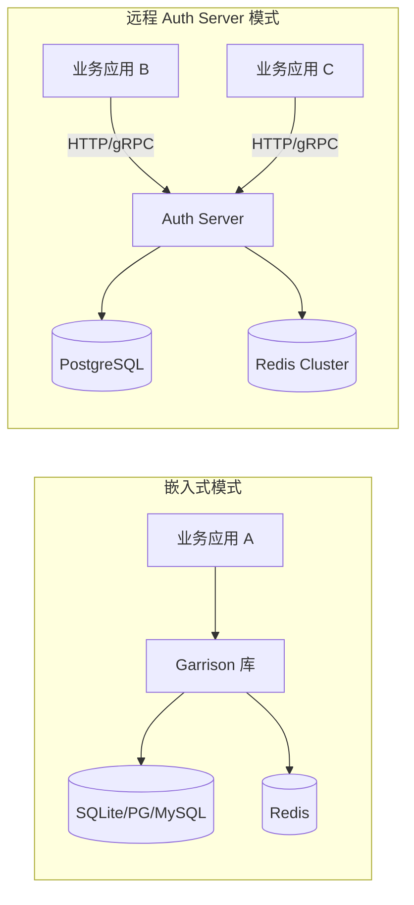

# 🚀 Garrison 部署指南

本文档描述 Garrison 在生产环境中的部署注意事项，涵盖部署架构、环境配置、数据库初始化、缓存配置、TLS 终止与生产检查清单。

> 架构设计详见 [🏗️ 架构文档](./ARCHITECTURE.md)；配置项说明详见 [⚙️ 配置指南](./CONFIGURATION.md)；安全策略详见 [🔒 安全文档](./SECURITY.md)。

## 📋 目录

<details open>
<summary>📑 目录（点击展开）</summary>

- [部署架构概述](#-部署架构概述)
- [环境变量配置](#-环境变量配置)
- [数据库初始化](#-数据库初始化)
- [缓存配置](#-缓存配置)
- [TLS / HTTPS 终止](#-tls--https-终止)
- [Panic 策略与任务隔离](#-panic-策略与任务隔离)
- [依赖锁定](#-依赖锁定)
- [生产环境检查清单](#-生产环境检查清单)
- [Docker 部署](#-docker-部署)

</details>

---

## 🏗️ 部署架构概述

Garrison 支持两种部署模式：

| 模式 | 说明 | 适用场景 |
|------|------|----------|
| **嵌入式（Embedded）** | Garrison 作为库嵌入业务进程，`backend-embedded` feature | 单体应用、中小规模部署 |
| **远程 Auth Server** | 独立认证服务器，业务通过 HTTP/gRPC 调用，`backend-remote` + `auth-server` feature | 微服务架构、多系统共享认证中心 |



---

## ⚙️ 环境变量配置

生产环境**必须**配置以下环境变量：

| 变量 | 说明 | 示例 |
|------|------|------|
| `GARRISON_TOKEN_NAME` | Token Cookie/Header 名 | `garrison_token` |
| `GARRISON_TIMEOUT` | 会话超时（秒） | `2592000`（30 天） |
| `GARRISON_ACTIVE_TIMEOUT` | 活跃超时（秒，-1 跟随 timeout） | `-1` |
| `GARRISON_IS_SHARE` | 多端共享会话 | `false` |
| `GARRISON_IS_CONCURRENT` | 允许并发登录 | `true` |
| `GARRISON_JWT_SECRET` | JWT 签名密钥（jwt 模式必改） | **随机 32+ 字节** |
| `GARRISON_REDIS_URL` | Redis 连接地址 | `redis://127.0.0.1:6379` |

> ⚠️ **JWT 密钥**：生产环境必须替换默认 `jwt_secret`，建议使用 `openssl rand -hex 32` 生成随机密钥。弱密钥将被 `GarrisonConfig::validate()` 拒绝。

完整配置项表见 [⚙️ 配置指南](./CONFIGURATION.md)。

---

## 🗄️ 数据库初始化

### 自动迁移

Garrison 支持启动时自动执行 SQL 迁移（需启用对应 `db-*` feature）：

```rust
// 内嵌迁移 SQL（embedded-migrations feature）
// 编译时通过 include_dir! 打包 migrations/ 目录
```

### 手动迁移

生产环境建议使用手动迁移以精确控制：

```bash
# SQLite
sqlite3 garrison.db < migrations/sqlite/core/001_init.sql
sqlite3 garrison.db < migrations/sqlite/core/002_role_hierarchy.sql

# PostgreSQL
psql -U garrison -d garrison -f migrations/postgres/core/001_init.sql

# MySQL
mysql -u garrison -p garrison < migrations/mysql/core/001_init.sql
```

迁移文件位于 `migrations/{backend}/core/` 目录，按编号顺序执行。

---

## 💾 缓存配置

### Redis 部署模式

Garrison 支持 4 种 Redis 部署模式（`RedisDeploymentMode` 枚举）：

| 模式 | 说明 | 配置 |
|------|------|------|
| `Single` | 单节点 | `redis://host:port` |
| `Sentinel` | 哨兵模式 | 配置 sentinel 地址 + master 名 |
| `Cluster` | 集群模式 | 多个节点地址 |
| `MasterSlave` | 主从模式 | 主节点 + 从节点地址 |

### 三层缓存架构

启用 `three-tier-cache` feature 后，Garrison 使用 L1（进程内存）→ L2（Redis）→ L3（数据库）三级缓存。TTL 写入自动引入 ±10% 随机抖动以防止缓存雪崩。

---

## 🔐 TLS / HTTPS 终止

启用 `tls` feature 后，Garrison Auth Server 支持 HTTPS/TLS 终止（基于 `axum-server` + `rustls`）：

```toml
[dependencies]
garrison = { version = "0.9.0-rc.1", features = ["tls", "auth-server"] }
```

```rust
// TLS 配置通过 axum-server 的 RustlsConfig 加载
// 支持 PEM 证书 + PKCS8 私钥
```

> 生产环境建议在反向代理（Nginx / Envoy）层终止 TLS，Auth Server 仅监听内部网络。

---

## ⚠️ Panic 策略与任务隔离

`Cargo.toml` 的 `[profile.release]` 设置了 `panic = "unwind"`（v0.9.0-rc.1 起从 `abort` 恢复）。其语义：

- 进程遇到 `panic` 会展开栈，`catch_unwind` 可隔离单个任务 panic。
- `src/channel.rs` 与 `src/stp/context.rs` 中的 `catch_unwind` 实现"隔离单个任务 panic、避免污染全局状态"语义，在 `unwind` 模式下正常工作。
- listener 广播 / SSO channel 中单个 listener panic 不会终止整个认证节点。

### 生产环境建议

- 配合进程级 supervisor（systemd `Restart=on-failure` / k8s `restartPolicy: Always`）保证异常退出后自动拉起。
- 仅在不可恢复场景下才主动 `panic`；可恢复错误应走 `Result`/`GarrisonResult`。

---

## 🔒 依赖锁定

本仓库提交 `Cargo.lock`，CI 使用 `--locked` 构建以保证依赖树可重现。修改依赖后请重新 `cargo generate-lockfile` 并提交更新后的 `Cargo.lock`。

---

## ✅ 生产环境检查清单

部署前请逐项确认：

| 检查项 | 必须 | 说明 |
|--------|:----:|------|
| JWT 密钥已替换为随机强密钥 | ✅ | `GARRISON_JWT_SECRET` ≥ 32 字节 |
| Redis 连接已配置 | ✅ | 生产环境不建议仅用内存缓存 |
| 数据库已初始化 | ✅ | 迁移 SQL 已执行或 auto-migrate 已启用 |
| `is_share` / `is_concurrent` 已按业务需求设置 | ✅ | 默认 `false` / `true` |
| TLS 已启用（或反向代理终止） | ✅ | 禁止明文传输 token |
| `cargo audit` 无告警 | ✅ | CI 自动检查 |
| `cargo deny check` 通过 | ✅ | 许可证与依赖安全 |
| 日志级别设为 `info` 或 `warn` | ⚠️ | 避免 `debug`/`trace` 输出敏感信息 |
| 环境变量中的敏感值使用密钥管理 | ⚠️ | 建议使用 Vault / K8s Secret |

---

## 🐳 Docker 部署

> 完整的 Docker Compose 示例请参考仓库根目录的 `docker-compose.e2e.yml`。

基本部署示例：

```yaml
version: "3.8"
services:
  auth-server:
    image: garrison-auth:latest
    environment:
      - GARRISON_JWT_SECRET=${JWT_SECRET}
      - GARRISON_REDIS_URL=redis://redis:6379
      - GARRISON_TIMEOUT=2592000
    depends_on:
      - redis
      - postgres
    ports:
      - "8080:8080"

  redis:
    image: redis:7-alpine
    volumes:
      - redis-data:/data

  postgres:
    image: postgres:16-alpine
    environment:
      POSTGRES_DB: garrison
      POSTGRES_USER: garrison
      POSTGRES_PASSWORD: ${DB_PASSWORD}
    volumes:
      - pg-data:/var/lib/postgresql/data

volumes:
  redis-data:
  pg-data:
```

---

## 📚 相关文档

| 文档 | 说明 |
|------|------|
| [🏗️ 架构文档](./ARCHITECTURE.md) | 设计原则与模块划分 |
| [⚙️ 配置指南](./CONFIGURATION.md) | 完整配置项参考 |
| [🔒 安全文档](./SECURITY.md) | 安全策略与漏洞报告 |
| [🛠️ 开发规范](./DEVELOPMENT.md) | 开发与调试指南 |
| [🔧 问题排查](./TROUBLESHOOTING.md) | 常见问题与解决方案 |
