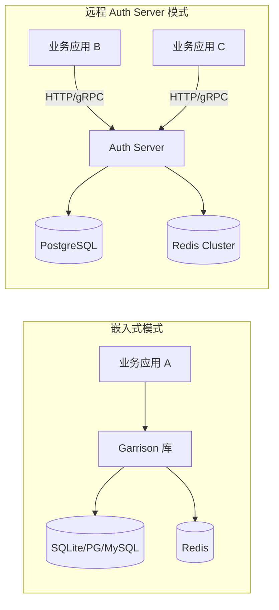

# 🚀 Garrison 部署指南

本文档描述 Garrison 在生产环境中的部署注意事项，涵盖部署架构、环境配置、数据库初始化、缓存配置、TLS 终止与生产检查清单。

> 架构设计详见 [🏗️ 架构文档](./ARCHITECTURE.md)；配置项说明详见 [⚙️ 配置指南](./CONFIGURATION.md)；安全策略详见 [🔒 安全文档](./SECURITY.md)。

## 📋 目录

- [部署架构概述](#️-部署架构概述)
- [环境变量配置](#️-环境变量配置)
- [数据库初始化](#️-数据库初始化)
- [缓存配置](#-缓存配置)
- [TLS / HTTPS 终止](#-tls--https-终止)
- [Panic 策略与任务隔离](#️-panic-策略与任务隔离)
- [依赖锁定](#-依赖锁定)
- [生产环境检查清单](#-生产环境检查清单)
- [Docker 部署](#-docker-部署)

---

## 🏗️ 部署架构概述

Garrison 支持两种部署模式：

| 模式 | 说明 | 适用场景 |
|------|------|----------|
| **嵌入式（Embedded）** | Garrison 作为库嵌入业务进程，`backend-embedded` feature | 单体应用、中小规模部署 |
| **远程 Auth Server** | 独立认证服务器，业务通过 HTTP/gRPC 调用，`backend-remote` + `auth-server` feature | 微服务架构、多系统共享认证中心 |


```mermaid
flowchart LR
    subgraph Embedded["嵌入式模式"]
        APP1["业务应用 A"] --> G1["Garrison 库"]
        G1 --> DB1[(SQLite/PG/MySQL)]
        G1 --> Cache1[(Redis)]
    end

    subgraph Remote["远程 Auth Server 模式"]
        APP2["业务应用 B"] -->|HTTP/gRPC| AUTH["Auth Server"]
        APP3["业务应用 C"] -->|HTTP/gRPC| AUTH
        AUTH --> DB2[(PostgreSQL)]
        AUTH --> Cache2[(Redis Cluster)]
    end
```

---

## ⚙️ 环境变量配置

生产环境**必须**配置以下环境变量：

| 变量 | 说明 | 示例 |
|------|------|------|
| `GARRISON_TOKEN_NAME` | Token Cookie/Header 名 | `garrison_token` |
| `GARRISON_TIMEOUT` | 会话超时（秒） | `2592000`（30 天） |
| `GARRISON_ACTIVE_TIMEOUT` | 活跃超时（秒，-1 跟随 timeout） | `-1` |
| `GARRISON_IS_SHARE` | 多端共享会话 | `false` |
| `GARRISON_IS_CONCURRENT` | 允许并发登录 | `true` |
| `GARRISON_JWT_SECRET` | JWT 签名密钥（jwt 模式必改） | **随机 32+ 字节** |
| `GARRISON_REDIS_URL` | Redis 连接地址 | `redis://127.0.0.1:6379` |

> ⚠️ **JWT 密钥**：生产环境必须替换默认 `jwt_secret`，建议使用 `openssl rand -hex 32` 生成随机密钥。弱密钥将被 `GarrisonConfig::validate()` 拒绝。

完整配置项表见 [⚙️ 配置指南](./CONFIGURATION.md)。

---

## 🗄️ 数据库初始化

### 自动迁移

Garrison 支持启动时自动执行 SQL 迁移（需启用对应 `db-*` feature）：

```rust
// 内嵌迁移 SQL（embedded-migrations feature）
// 编译时通过 include_dir! 打包 migrations/ 目录
```

### 手动迁移

生产环境建议使用手动迁移以精确控制：

```bash
# SQLite
sqlite3 garrison.db < migrations/sqlite/core/001_init.sql
sqlite3 garrison.db < migrations/sqlite/core/002_role_hierarchy.sql

# PostgreSQL
psql -U garrison -d garrison -f migrations/postgres/core/001_init.sql

# MySQL
mysql -u garrison -p garrison < migrations/mysql/core/001_init.sql
```

迁移文件位于 `migrations/{backend}/core/` 目录，按编号顺序执行。

---

## 💾 缓存配置

### Redis 部署模式

Garrison 支持 4 种 Redis 部署模式（`RedisDeploymentMode` 枚举）：

| 模式 | 说明 | 配置 |
|------|------|------|
| `Single` | 单节点 | `redis://host:port` |
| `Sentinel` | 哨兵模式 | 配置 sentinel 地址 + master 名 |
| `Cluster` | 集群模式 | 多个节点地址 |
| `MasterSlave` | 主从模式 | 主节点 + 从节点地址 |

### 三层缓存架构

启用 `three-tier-cache` feature 后，Garrison 使用 L1（进程内存）→ L2（Redis）→ L3（数据库）三级缓存。TTL 写入自动引入 ±10% 随机抖动以防止缓存雪崩。

---

## 🔐 TLS / HTTPS 终止

启用 `tls` feature 后，Garrison Auth Server 支持 HTTPS/TLS 终止（基于 `axum-server` + `rustls`）：

```toml
[dependencies]
garrison = { version = "0.9.0-rc.2", features = ["tls", "auth-server"] }
```

```rust
// TLS 配置通过 axum-server 的 RustlsConfig 加载
// 支持 PEM 证书 + PKCS8 私钥
```

> 生产环境建议在反向代理（Nginx / Envoy）层终止 TLS，Auth Server 仅监听内部网络。

---

## ⚠️ Panic 策略与任务隔离

`Cargo.toml` 的 `[profile.release]` 设置了 `panic = "unwind"`（v0.9.0-rc.1 起从 `abort` 恢复）。其语义：

- 进程遇到 `panic` 会展开栈，`catch_unwind` 可隔离单个任务 panic。
- `src/stp/context.rs`、`src/listener/mod.rs`、`src/listener/manager_impl.rs`、`src/plugin/manager_impl.rs`、`src/health/registry.rs` 中的 `catch_unwind` 实现"隔离单个任务 panic、避免污染全局状态"语义，在 `unwind` 模式下正常工作。
- listener 广播 / SSO channel 中单个 listener panic 不会终止整个认证节点。

### 生产环境建议

- 配合进程级 supervisor（systemd `Restart=on-failure` / k8s `restartPolicy: Always`）保证异常退出后自动拉起。
- 仅在不可恢复场景下才主动 `panic`；可恢复错误应走 `Result`/`GarrisonResult`。

---

## 🔒 依赖锁定

本仓库提交 `Cargo.lock`，CI 使用 `--locked` 构建以保证依赖树可重现。修改依赖后请重新 `cargo generate-lockfile` 并提交更新后的 `Cargo.lock`。

---

## ✅ 生产环境检查清单

部署前请逐项确认：

| 检查项 | 必须 | 说明 |
|--------|:----:|------|
| JWT 密钥已替换为随机强密钥 | ✅ | `GARRISON_JWT_SECRET` ≥ 32 字节 |
| Redis 连接已配置 | ✅ | 生产环境不建议仅用内存缓存 |
| 数据库已初始化 | ✅ | 迁移 SQL 已执行或 auto-migrate 已启用 |
| `is_share` / `is_concurrent` 已按业务需求设置 | ✅ | 默认 `false` / `true` |
| TLS 已启用（或反向代理终止） | ✅ | 禁止明文传输 token |
| `cargo audit` 无告警 | ✅ | CI 自动检查 |
| `cargo deny check` 通过 | ✅ | 许可证与依赖安全 |
| 日志级别设为 `info` 或 `warn` | ⚠️ | 避免 `debug`/`trace` 输出敏感信息 |
| 环境变量中的敏感值使用密钥管理 | ⚠️ | 建议使用 Vault / K8s Secret |
| Back-Channel Logout 队列表已随迁移创建 | ⚠️ | `backchannel-logout` feature 下 `017_oauth2_backchannel_queue.sql` 随 migrate_core 自动执行 |
| RP back-channel 端点已按 client 配置 | ⚠️ | 启用 `backchannel-logout` 时逐 client 配置通知端点；框架不做 RP discovery fetch |
| `field-encryption` 密钥已配置 | ⚠️ | 启用该 feature 未配密钥启动 fail-closed；密钥轮换用 change_key/check_key 运维接口 |

---

### Back-Channel Logout 运维提示（backchannel-logout）

- 队列积压观测：`SELECT status, COUNT(*) FROM oauth2_backchannel_queue GROUP BY status`——`pending` 持续增长说明 RP 端点不可达或投递吞吐不足；`failed` 行为超 MaxTtl（默认 24h）放弃的投递（warn 日志显性化，不静默丢）。
- 失败行处理：`failed` 行不自动删除（审计可见）；确认无需后由运维按 `id` 清理。重试不重复投递（drain 幂等）。
- RP 端点要求：必须接受 `application/x-www-form-urlencoded` 的 `logout_token` POST；重定向会被视为投递失败（禁跟随重定向，防 POST 降 GET 丢 token）。
- 多实例：队列行按 `next_attempt_at` 抢占消费，多实例安全；RP 退避窗口内不重复进批。

## 🐳 Docker 部署

仓库提供两条镜像产物线（多阶段构建，cargo-chef 依赖缓存 + `--locked` 可重现编译）：

| 变体 | Dockerfile | 运行底座 | 适用场景 |
|------|-----------|---------|---------|
| **debian-slim** | `docker/Dockerfile` | `debian:bookworm-slim` | 默认推荐：可 shell 调试，自带 `ca-certificates` |
| **distroless** | `docker/Dockerfile.distroless` | `gcr.io/distroless/cc-debian12:nonroot` | 最小攻击面：无 shell / 包管理器 |

两个变体一致的行为：

- **非 root 运行**：debian 变体 `uid 1000`（`garrison` 用户）；distroless 变体镜像自带 `65532:65532` nonroot。监听端口 8080/8081 均为非特权端口。
- **HEALTHCHECK 内置**：探测本容器外网端口的 `/healthz`（`server-health-check` feature 下由 sdforge 挂载的 liveness 探针——进程存活即恒 200，绕过限流/审计中间件）。注意这是 **liveness 语义**，不是库消费者 `/health/live` 的 readiness 语义。
- **版本仅落 OCI labels**（`org.opencontainers.image.version/revision`）：garrison 无运行时版本端点，不做伪注入。

### 构建镜像

```bash
# debian-slim 变体（默认）
docker build \
  --build-arg VERSION=0.9.0-rc.2 \
  --build-arg GIT_SHA=$(git rev-parse HEAD) \
  -t garrison-auth:local .

# distroless 变体
docker build -f docker/Dockerfile.distroless \
  --build-arg VERSION=0.9.0-rc.2 \
  --build-arg GIT_SHA=$(git rev-parse HEAD) \
  -t garrison-auth:local-distroless .
```

`VERSION` / `GIT_SHA` 仅用于 OCI labels；`GIT_SHA` 不传时落 `unknown`。

> ⚠️ **滚动源与可重现性（记录在案的显式接受决策）**：运行底座（`debian:bookworm-slim` / `gcr.io/distroless/cc-debian12:nonroot`）、`CHEF_IMAGE`（`lukemathwalker/cargo-chef:latest-rust-1` 滚动 tag）与 rustup stable 均为滚动源，构建非 bit 级可重现。release 构建建议为上述底座镜像与 `CHEF_IMAGE` 以 digest pin（`CHEF_IMAGE` 可通过 `--build-arg CHEF_IMAGE=<镜像>@sha256:<digest>` 覆盖）。

### 运行环境变量（容器）

| 变量 | 必填 | 默认 | 说明 |
|------|:---:|------|------|
| `GARRISON_INTERNAL_API_KEY` | ✅ | 无（fail-closed） | 内网 API Key，未配置拒绝启动；长度强制 ≥32 字节，短于拒绝启动（建议 `openssl rand -hex 32` 生成） |
| `GARRISON_EXTERNAL_PORT` | — | `8080` | 外网端口（HEALTHCHECK 探针自动跟随此值） |
| `GARRISON_INTERNAL_PORT` | — | `8081` | 内网端口（`check-*` 等管理面，需 X-API-Key） |
| `GARRISON_EXTERNAL_BIND` / `GARRISON_INTERNAL_BIND` | — | `127.0.0.1` | 外网 / 内网端口绑定地址（secure-by-default，仅本机可达；**镜像已内置 `0.0.0.0`** 供容器端口映射，宿主直跑需外部访问时显式设 `0.0.0.0`）。仅接受 IPv4/IPv6 字面量，非法值拒绝启动 |
| `GARRISON_TRUSTED_PROXIES` | — | 空（不信任任何 XFF） | 可信代理 IP 列表（逗号分隔）。仅当部署在可信反代之后才配置；配置后 XFF 解析（限速键 / 客户端 IP）才启用。仅接受回环 / RFC 1918 / link-local / IPv6 ULA 地址，非法或公网值拒绝启动 |
| `GARRISON_MAX_LOGIN_COUNT` | — | `10` | 同账号最大并发会话数，超出踢出最早登录的会话；显式传 `0` = 不限制（覆盖框架默认的 `0`） |
| `GARRISON_SEED_PRIMARY_AMR` | — | `true` | 登录是否向会话播种主认证因子（`amr=["pwd"]`/AAL 1/`auth_time`）。安全敏感部署建议显式 `false`——参考部署 login 不校验凭证，默认播种会向因子账本断言一次从未发生的密码认证，误导下游 step-up 判定（详见 docs/CONFIGURATION.md `seed_primary_amr`） |
| `GARRISON_EXTERNAL_LOGIN_ENABLED` | — | `false` | 外网登录端点开关（secure-by-default）。框架 login 不校验凭证，**开启前业务层必须已注入凭证校验**；开启且外网绑定为非回环地址时还须设置 `GARRISON_EXTERNAL_LOGIN_ACK`，否则拒绝启动 |
| `GARRISON_EXTERNAL_LOGIN_ACK` | 条件必填 | 无 | 上述场景的显式风险确认：取值必须精确为 `i-understand-no-credential-check`（区分大小写），缺失或不匹配拒绝启动 |
| `GARRISON_HEALTH_DETAILS` | — | `false` | 内网 `/readyz` 是否透传 `checks[].details`（可能含内部依赖拓扑，默认剥离仅保留 name/healthy）。接受 `1`/`true`/`yes`/`on` 与 `0`/`false`/`no`/`off`（大小写不敏感），无法识别取值告警并按默认处理 |
| `GARRISON_API_KEY_LOCKOUT_THRESHOLD` / `GARRISON_API_KEY_LOCKOUT_WINDOW_SECS` | — | `10` / `300` | 内网 API Key 认证失败锁定：同源 IP 连续失败（缺失/错误/重复 `X-API-Key`）达阈值后窗口期内一律 429 + `Retry-After`，成功认证即清零；threshold `0` = 禁用锁定 |
| `GARRISON_RATE_LIMIT_BACKEND` | — | 未设置（配置默认 Memory） | 限流后端覆盖：需 `rate-limit-redis` feature 才生效，`redis` 须同时配 `GARRISON_REDIS_URL`，未知值拒绝启动 |
| `GARRISON_WORKER_THREADS` | — | CPU 核数 | Tokio worker 线程数 |
| `GARRISON_MAX_BLOCKING_THREADS` | — | `512` | Tokio blocking 线程上限 |

完整 `GARRISON_*` 配置见 [⚙️ 配置指南](./CONFIGURATION.md)。

### Docker Compose 示例

`docker/docker-compose.example.yml` 是单机部署的最小可运行示例（本地构建 + fail-loud 的 API Key 校验 + healthcheck + 可选 Redis 注释块）：

```bash
export GARRISON_INTERNAL_API_KEY='<强随机密钥>'
docker compose -f docker/docker-compose.example.yml up -d
docker compose -f docker/docker-compose.example.yml ps   # STATUS 应为 healthy
```

> ⚠️ 换用 distroless 变体时，compose 的 healthcheck 命令需改为绝对路径 `/app/garrison-healthcheck`（distroless 无 `/usr/local/bin` 符号链接，PATH 亦不含 `/app`）。协议联调用的外部依赖编排见 `docker-compose.e2e.yml`。

### 自定义 feature 面

镜像默认 `FEATURES=auth-server,cache-memory,server-health-check,tracing-log`——与 `[[bin]] auth_server` 的 `required-features` 及探针路由对齐的最小面。生产组合（拉入数据库后端等）可覆盖：

```bash
docker build --build-arg FEATURES=production -t garrison-auth:prod .
```

> 不加 feature 门控直接换面会导致 `cargo build` 在 `required-features` 校验处失败（fail-fast，不产出半成品镜像）。
>
> ⚠️ 切换 `FEATURES` 会使 cargo-chef 的依赖缓存失效（依赖预编译按 feature 面取缓存键），首次按新面构建将全量重编译依赖（约 10-20min），后续构建命中缓存恢复增量。
>
> ⚠️ production 等组合含 `db-sqlite` 类内嵌数据库后端时需要可写数据卷：加固部署常将容器根文件系统（含 `/app`）挂为只读，SQLite 落盘路径须挂载数据卷并指定数据目录，否则启动/迁移写库即失败。

### 多架构构建

builder 阶段为 `x86_64-unknown-linux-gnu` gnu 目标。`docker buildx build --platform linux/amd64,linux/arm64` 技术上可行（arm64 走 QEMU 模拟，依赖编译耗时显著增加，建议为 arm64 配置原生 runner）；当前 CI 仅构建 amd64。

---

## 📚 相关文档

| 文档 | 说明 |
|------|------|
| [🏗️ 架构文档](./ARCHITECTURE.md) | 设计原则与模块划分 |
| [⚙️ 配置指南](./CONFIGURATION.md) | 完整配置项参考 |
| [🔒 安全文档](./SECURITY.md) | 安全策略与漏洞报告 |
| [🛠️ 开发规范](./DEVELOPMENT.md) | 开发与调试指南 |
| [🔧 问题排查](./TROUBLESHOOTING.md) | 常见问题与解决方案 |
