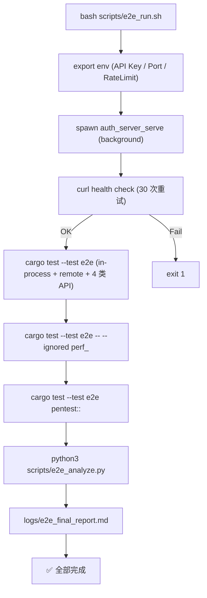

# 开发规范

本文件描述 Bulwark 项目的开发环境搭建、项目结构、TDD 工作流、代码规范与调试技巧。所有贡献者在提交代码前必须阅读本文档。

- 仓库：<https://github.com/Kirky-X/bulwark>
- License：Apache-2.0
- 作者：Kirky.X
- MSRV：Rust 1.85+
- 设计参考：13 特性域领域建模

> 贡献流程详见 [CONTRIBUTING.md](./CONTRIBUTING.md)；架构设计详见 [architecture.md](./ARCHITECTURE.md)。

---

## 目录

- [1. 开发环境搭建](#1-开发环境搭建)
- [2. 项目结构说明](#2-项目结构说明)
- [3. TDD 工作流](#3-tdd-工作流)
- [4. 测试编写规范](#4-测试编写规范)
- [5. 代码风格](#5-代码风格)
- [6. Git 工作流](#6-git-工作流)
- [7. 调试技巧](#7-调试技巧)
- [8. 常用命令清单](#8-常用命令清单)
- [E2E / 性能 / 渗透测试](#e2e--性能--渗透测试)

---

## 1. 开发环境搭建

### 1.1 Rust 工具链

Bulwark 最低支持 Rust 1.85（部分依赖如 `inventory 0.3` 要求 `edition2024`，需 Rust 1.85+）。推荐使用 rustup 安装 stable 工具链：

```bash
# 安装 rustup（若尚未安装）
curl --proto '=https' --tlsv1.2 -sSf https://sh.rustup.rs | sh

# 安装 stable 工具链
rustup install stable
rustup default stable

# 验证版本（需 >= 1.85）
rustc --version
cargo --version
```

项目根目录已配置 `rust-toolchain.toml` 锁定工具链版本，`rustup` 会自动安装所需版本。

### 1.2 系统依赖

以下系统依赖用于 `cargo-tarpaulin` 覆盖率工具与构建链：

```bash
# Debian / Ubuntu
sudo apt update
sudo apt install -y libssl-dev pkg-config

# 验证
pkg-config --exists openssl && echo "openssl OK"
```

### 1.3 克隆仓库与本地依赖

Bulwark 使用 crates.io 发布的 `oxcache 0.3`（支持 per-entry TTL + `ttl_sync()` 查询）与 `dbnexus 0.4`（SQLite / PostgreSQL / MySQL 多后端），无需额外克隆本地依赖：

```bash
# 1. 克隆 Bulwark
git clone https://github.com/Kirky-X/bulwark.git
cd bulwark

# 2. 验证编译（启用全部 feature）
cargo build --features full
```

### 1.4 验证

```bash
# 全量编译
cargo build --features full

# 全量测试（3776+ 个 lib 测试 + 65 E2E 应全部通过）
cargo test --features full

# Lint（零警告）
cargo clippy --features full -- -D warnings

# 格式化检查
cargo fmt --all -- --check
```

---

## 2. 项目结构说明

```text
bulwark/
├── src/                      # 源码
│   ├── core/                 # 核心层：token / permission / auth
│   │   ├── token/mod.rs
│   │   ├── permission/mod.rs
│   │   └── auth/mod.rs
│   ├── stp/                  # StpUtil 风格门面（v0.5.3 拆分为多文件）
│   │   ├── mod.rs            # re-exports
│   │   ├── core.rs           # BulwarkCore trait
│   │   ├── session.rs        # SessionLogic trait
│   │   ├── permission.rs     # PermissionLogic trait
│   │   ├── token.rs          # TokenLogic trait
│   │   ├── mfa.rs            # MfaLogic trait
│   │   ├── password.rs       # PasswordLogic trait
│   │   ├── interface.rs      # BulwarkInterface trait
│   │   ├── util.rs           # BulwarkUtil 静态门面
│   │   ├── parameter.rs      # ParameterQuery
│   │   └── tests.rs          # 集成测试
│   ├── session/mod.rs        # 会话管理（BulwarkSession + SessionExpiryListener）
│   ├── account/              # 账号安全引擎（v0.6.0 新增）
│   │   ├── credential/       # Credential SPI + PasswordCredential + TotpCredential
│   │   ├── policy/           # PasswordPolicyEngine + 12+ 规则
│   │   ├── lockout/          # UserLockoutStrategy
│   │   ├── disable/          # 账号禁用 / DisableRepository（v0.7.0 新增）
│   │   ├── authflow/         # AuthenticationFlow DSL
│   │   └── metrics.rs        # AccountMetrics Prometheus 指标
│   ├── protocol/             # 协议层（feature 门控）
│   │   ├── jwt/mod.rs
│   │   ├── oauth2/mod.rs
│   │   ├── sso/              # SSO 单点登录 + SAML 2.0 + OIDC RP
│   │   │   ├── mod.rs
│   │   │   ├── server.rs     # SsoServer trait + CenterIdConverter + SsoChannel
│   │   │   ├── saml.rs       # SAML 2.0 骨架（v0.6.0 新增）
│   │   │   ├── oidc.rs       # OIDC RP 骨架（v0.6.0 新增）
│   │   │   └── channel.rs    # RedisPubSubSsoChannel（v0.6.0 新增）
│   │   ├── sign/mod.rs
│   │   ├── apikey/mod.rs
│   │   └── temp/mod.rs
│   ├── secure/               # 安全层（feature 门控）
│   │   ├── totp/mod.rs
│   │   ├── sign/mod.rs
│   │   ├── httpbasic/mod.rs
│   │   └── httpdigest/mod.rs
│   ├── dao/                  # 数据访问层
│   │   ├── mod.rs            # BulwarkDao trait + RedisDeploymentMode + RedisConfig
│   │   ├── oxcache_impl.rs   # oxcache 实现
│   │   ├── dbnexus_impl.rs   # dbnexus 初始化 + BulwarkMigration
│   │   └── repository/       # Repository 层（9 trait + Sqlite/Mysql/Postgres Repository）
│   ├── context/              # 请求上下文抽象
│   │   ├── mod.rs
│   │   ├── axum_adapter.rs   # axum 适配器
│   │   ├── actix_adapter.rs  # actix-web 适配器（v0.4.2 新增）
│   │   ├── warp_adapter.rs   # warp 适配器（v0.4.2 新增）
│   │   └── tenant.rs         # 租户解析器（v0.5.0 新增）
│   ├── config/mod.rs         # 配置系统（BulwarkConfig + ConfigLoader + remember_me）
│   ├── annotation/mod.rs     # 注解系统（含 CheckAccessToken/CheckClientToken）
│   ├── router/mod.rs         # 路由权限（BulwarkRouter + group()）
│   ├── strategy/             # 策略模式 + 注册表
│   │   ├── mod.rs
│   │   └── registry.rs       # Strategy 注册表（6 个策略 trait）
│   ├── exception/mod.rs      # 异常系统
│   ├── listener/mod.rs       # 事件监听（feature 门控，15 个事件变体）
│   ├── plugin/mod.rs         # 插件系统
│   ├── manager/mod.rs        # BulwarkManager 全局管理器
│   ├── json/mod.rs           # JSON 模板
│   ├── i18n.rs               # 国际化（fluent-rs）
│   ├── error.rs              # 错误类型定义
│   ├── prelude.rs            # 预导出
│   ├── bin/                  # 二进制入口
│   │   └── auth_server.rs    # BulwarkAuthServer 独立运行入口（v0.7.0 新增，需 auth-server feature）
│   └── lib.rs                # crate 入口
├── tests/                    # 集成测试
├── examples/                 # 示例代码（独立 workspace member）
├── migrations/               # 数据库迁移脚本
│   ├── sqlite/core/          # SQLite 迁移
│   ├── mysql/core/           # MySQL 兼容迁移（v0.5.3 新增）
│   └── postgres/core/        # PostgreSQL 迁移（v0.7.0 新增）
├── benches/                  # 基准测试（criterion）
├── bulwark-macros/           # 过程宏 crate（#[check_login] 等）
├── locales/                  # i18n 资源文件（zh.ftl / en.ftl）
├── docs/                     # 文档
├── Cargo.toml
├── rust-toolchain.toml       # 锁定工具链
├── rustfmt.toml              # 格式化配置
└── README.md
```

### 源码分层说明

| 层 | 目录 | 职责 |
|----|------|------|
| 核心层 | `src/core/` | token 生成校验、权限校验、登录鉴权 |
| 门面层 | `src/stp/` | `BulwarkLogic` trait + `BulwarkUtil` 静态门面 |
| 协议层 | `src/protocol/` | OAuth2 / SSO / JWT / 签名 / API Key / 临时凭证 |
| 安全层 | `src/secure/` | TOTP / 签名 / HTTP Basic / HTTP Digest |
| 辅助层 | `src/dao/` `src/context/` `src/config/` 等 | 数据访问、上下文、配置、注解、路由、异常 |

---

## 3. TDD 工作流

Bulwark 强制采用测试驱动开发（TDD）。每个任务必须严格按以下 5 步执行，不得跳步：

### 3.1 五步流程

1. **定义接口** — 编写 `trait` 与 `struct` 签名（方法签名 + 类型），不写实现，含 `///` 文档注释
2. **编写测试** — 覆盖三类场景：
   - 正常路径（happy path）
   - 错误路径（error path）
   - 边界条件（boundary cases）
3. **实现代码** — 编写满足测试的最小实现
4. **运行测试通过** — `cargo test --features full` 必须全部通过
5. **格式化与 Lint** — `cargo fmt` + `cargo clippy --features full -- -D warnings`，然后 `git commit`

> 不得先写实现再补测试。覆盖率门槛 95%+，新增代码需保持同等水准。

### 3.2 测试驱动示例

```rust
// 步骤 1：定义接口
/// 校验当前会话是否已登录。
pub async fn check_login() -> BulwarkResult<bool>;

// 步骤 2：编写测试
#[cfg(test)]
mod tests {
    use super::*;

    #[tokio::test]
    async fn check_login_returns_true_when_session_valid() {
        // 正常路径
    }

    #[tokio::test]
    async fn check_login_returns_false_when_session_expired() {
        // 错误路径
    }

    #[tokio::test]
    async fn check_login_returns_false_when_token_empty() {
        // 边界条件
    }
}

// 步骤 3：实现
pub async fn check_login() -> BulwarkResult<bool> {
    // 最小实现使测试通过
}
```

---

## 4. 测试编写规范

### 4.1 测试串行化（#[serial_test::serial]）

修改全局单例（如 `BulwarkManager`）或环境变量（`std::env::set_var`）的测试必须标注 `#[serial_test::serial]`，避免多线程并发污染：

```rust
#[cfg(test)]
mod tests {
    use serial_test::serial;

    #[tokio::test]
    #[serial]
    async fn test_manager_init() {
        // 修改全局单例，必须串行
        BulwarkManager::init(dao, config, interface).unwrap();
        assert!(BulwarkManager::is_initialized());
    }

    #[test]
    #[serial]
    fn test_env_var_override() {
        std::env::set_var("BULWARK_TIMEOUT", "3600");
        // ...
        std::env::remove_var("BULWARK_TIMEOUT");
    }
}
```

> **经验法则**：只要测试中调用 `BulwarkManager::init()`、`std::env::set_var()`、或修改 `once_cell` 全局变量，就必须加 `#[serial]`。

### 4.2 测试命名规范

测试函数命名采用 `snake_case`，建议遵循 `<被测方法>_<条件>_<期望结果>` 模式：

```rust
#[test]
fn validate_rejects_invalid_token_style() { ... }

#[test]
fn toml_overrides_multiple_fields() { ... }

#[test]
fn env_overrides_toml() { ... }
```

### 4.3 覆盖率要求

Bulwark 要求测试覆盖率 **≥ 95%**（当前 95%+）：

| 模块类型 | 覆盖率要求 |
|---------|----------|
| 核心模块（core/stp/session/config/context/manager） | ≥ 95% |
| 协议/安全插件 | ≥ 90% |
| Web 适配层 | 集成测试覆盖主要中间件路径即可 |

- 3841+ 个测试通过（3776 lib + 65 E2E）+ doc-tests
- 不追求 100% 覆盖率，但每个分支必须有对应测试用例
- 禁止通过「不写测试」来提高覆盖率的行为

---

## 5. 代码风格

### 5.1 命名约定

| 类型 | 风格 | 示例 |
|------|------|------|
| 函数 / 变量 | `snake_case` | `check_login`、`user_id` |
| 类型 / Struct / Enum / Trait | `CamelCase` | `BulwarkManager`、`BulwarkLogic` |
| 常量 / 静态变量 | `SCREAMING_SNAKE_CASE` | `DEFAULT_TIMEOUT`、`TOKEN_HEADER` |

### 5.2 文档注释

所有 `pub` 项（函数、结构体、枚举、trait、常量）必须配有 `///` 文档注释：

```rust
/// 校验当前会话是否已登录。
///
/// 通过 task_local 上下文读取当前 token，并查询会话有效性。
///
/// # 返回
/// - `Ok(true)`：已登录且会话未过期
/// - `Ok(false)`：未登录或会话已失效（当 `throw_on_not_login = false` 时）
/// - `Err(BulwarkError::NotLogin)`：未登录且 `throw_on_not_login = true` 时抛出
pub async fn check_login() -> BulwarkResult<bool> {
    // ...
}
```

### 5.3 错误处理

- 所有可能失败的操作返回 `BulwarkResult<T>`（即 `Result<T, BulwarkError>`）
- **禁止**在非测试代码中使用 `unwrap()` / `expect()`
- 使用 `?` 运算符传播错误
- 自定义错误类型实现 `thiserror::Error`

### 5.4 异步约定

trait 方法使用 `async_trait::async_trait` 宏声明：

```rust
#[async_trait]
pub trait BulwarkLogic: Send + Sync {
    async fn get_permission_list(&self, user_id: &str) -> BulwarkResult<Vec<String>>;
}
```

### 5.5 clippy 与 rustfmt

```bash
# clippy 零警告（CI 标准）
cargo clippy --features full --lib --tests -- -D warnings

# 格式化检查
cargo fmt --all -- --check

# 文档零警告
cargo doc --no-deps --features full
```

> 禁止使用 `#[allow(...)]` 抑制 clippy 警告（除非有充分理由并在 PR 中说明）。

---

## 6. Git 工作流

### 6.1 分支策略

| 分支 | 用途 | 命名规范 |
|------|------|---------|
| `main` | 主干，始终可发布 | - |
| 特性分支 | 新功能开发 | `feat/<scope>-<short-desc>` |
| 修复分支 | bug 修复 | `fix/<scope>-<short-desc>` |
| 文档分支 | 文档更新 | `docs/<short-desc>` |

### 6.2 Commit 规范

采用 [Conventional Commits](https://www.conventionalcommits.org/zh-hans/v1.0.0/)：

```text
<type>(<scope>): <subject>
```

| type | 说明 |
|------|------|
| `feat` | 新功能 |
| `fix` | bug 修复 |
| `docs` | 文档变更 |
| `refactor` | 重构（不改变行为） |
| `test` | 测试新增/修改 |
| `chore` | 构建/工具/依赖 |

scope 常用值：`protocol-jwt`、`secure-totp`、`cache-memory`、`db-sqlite`、`web-axum`、`core`、`stp`、`session`、`config` 等。

详细提交规范与 PR 流程见 [CONTRIBUTING.md](./CONTRIBUTING.md)。

---

## 7. 调试技巧

### 7.1 cargo test

```bash
# 运行全部测试
cargo test --features full

# 运行单个测试
cargo test --features full test_name

# 运行并显示 println! 输出
cargo test --features full -- --nocapture

# 只运行集成测试
cargo test --features full --test axum_integration
```

### 7.2 cargo clippy

```bash
# 零警告检查
cargo clippy --features full --lib --tests -- -D warnings

# 查看具体建议
cargo clippy --features full --lib --tests
```

### 7.3 RUST_LOG 日志

通过 `RUST_LOG` 环境变量控制日志级别：

```bash
# 仅 Bulwark 模块 debug 级别
RUST_LOG=bulwark=debug ./your-server

# 全局 debug + Bulwark trace
RUST_LOG=debug,bulwark=trace ./your-server

# 仅特定模块
RUST_LOG=bulwark::core::auth=trace,bulwark::session=debug ./your-server
```

### 7.4 打印完整堆栈

发生 panic 时打印完整调用栈：

```bash
RUST_BACKTRACE=1 ./your-server

# 完整 backtrace（含依赖库栈帧）
RUST_BACKTRACE=full ./your-server
```

### 7.5 查看文档

生成并查看 crate 文档（包含全部 feature 的 API 文档）：

```bash
cargo doc --no-deps --features full --open
```

---

## 8. 常用命令清单

| 任务 | 命令 |
|------|------|
| 全量编译 | `cargo build --features full` |
| 仅默认特性编译 | `cargo build` |
| 运行全部测试 | `cargo test --features full` |
| 运行单个测试 | `cargo test --features full test_name` |
| Clippy 检查（零警告） | `cargo clippy --features full --lib --tests -- -D warnings` |
| 格式化 | `cargo fmt --all` |
| 格式化检查 | `cargo fmt --all -- --check` |
| 覆盖率测试 | `cargo tarpaulin --features "default,db-sqlite" --lib --out Lcov --output-dir coverage` |
| 生成文档 | `cargo doc --no-deps --features full --open` |
| 生产构建 | `cargo build --release --features production` |
| 检查依赖更新 | `cargo update --dry-run` |
| 查看展开后的宏 | `cargo expand --features full --lib` |
| 查看依赖树 | `cargo tree --features full` |
| 查看特性启用情况 | `cargo tree --features full -e features` |

### Feature 速查

| Feature | 说明 |
|---------|------|
| `default` | `backend-embedded`（仅启用进程内认证后端，作为最小可启动配置） |
| `all-defaults` | 等价于 `cache-memory + db-sqlite + web-axum` |
| `full` | 启用全部特性（开发首选） |
| `production` | 生产推荐组合（cache-redis + db-postgres + web-axum + 协议/安全子集 + 可观测性 + 多租户隔离 + auth-server + abac + firewall-waf + 三层缓存等，详见 Cargo.toml `[features]` production 段） |
| `development` | 开发推荐组合（cache-memory + db-sqlite + web-axum） |

> 常见问题排查详见 [troubleshooting.md](./TROUBLESHOOTING.md)。

---

## E2E / 性能 / 渗透测试

Bulwark 在 `tests/e2e/` 下提供完整的端到端（E2E）测试矩阵，覆盖 API 接口测试、性能基线测试、渗透测试三大维度。所有 E2E 测试基于 `RecordingClient` 抓包 + `RemoteContext` 远程模式 + in-process 模式双轨架构，可重复、可观测、可分析。

### 整体架构



### 一键执行：`scripts/e2e_run.sh`

`scripts/e2e_run.sh` 是 E2E 测试入口，自动完成：启动 `auth_server_serve` 后台进程 → 等待 health check 就绪 → 依次执行 E2E / 性能 / 渗透测试 → 聚合生成 Markdown 综合报告。

```bash
# 默认配置一键执行
bash scripts/e2e_run.sh

# 或自定义 env 覆盖默认值
EXAMPLE_INTERNAL_API_KEY=my-key \
BULWARK_EXTERNAL_PORT=9090 \
BULWARK_INTERNAL_PORT=9091 \
BULWARK_RATE_LIMIT=100000 \
bash scripts/e2e_run.sh
```

> 脚本通过 `set -euo pipefail` 严格模式执行，任何子步骤失败都会立即退出并返回非 0 退出码。`trap cleanup EXIT INT TERM` 在退出时杀掉后台 `auth_server_serve` 进程，避免残留僵尸进程。

### 环境变量

| 变量名 | 默认值 | 说明 |
|--------|--------|------|
| `EXAMPLE_INTERNAL_API_KEY` | `e2e-test-key-12345` | 内网 API Key（必须设置，否则 `serve()` fail-closed 退出） |
| `BULWARK_EXTERNAL_PORT` | `8080` | 外网端口（登录 / 刷新 / 登出端点） |
| `BULWARK_INTERNAL_PORT` | `8081` | 内网端口（check-login / check-permission / check-role 端点，需 `x-api-key`） |
| `BULWARK_RATE_LIMIT` | `100000` | 限速阈值（性能测试需 RPS≥1000/5000，必须远高于默认 100） |

> 远程模式（CI 已运行 server 时）使用 `BULWARK_E2E_EXTERNAL_URL` / `BULWARK_E2E_INTERNAL_URL` / `BULWARK_E2E_API_KEY` 三个 env 直连，跳过 `spawn_child` 步骤。

### 输出文件（`logs/`）

| 文件 | 格式 | 写入者 | 内容 |
|------|------|--------|------|
| `logs/e2e_http.jsonl` | JSONL（每行 1 个 JSON） | `RecordingClient::send()` | 所有 HTTP 交互（请求/响应/耗时） |
| `logs/perf.jsonl` | JSONL（每行 1 个 LoadReport） | `perf.rs::append_perf_report` | 性能基线测试报告（P50/P95/P99/RPS） |
| `logs/pentest_report.json` | JSONL（每行 1 个 PentestFinding） | `pentest::write_finding` | 渗透测试发现（攻击类型/payload/严重级别） |
| `logs/e2e_summary.json` | JSON | `log_analyzer::analyze_http_log` | HTTP 交互统计聚合（状态码分布/百分位/异常列表） |
| `logs/e2e_final_report.md` | Markdown | `scripts/e2e_analyze.py` | 综合报告（4 节：HTTP 统计 / 性能基线 / 渗透矩阵 / 异常列表） |

### 性能基线测试（`tests/e2e/perf.rs`）

性能测试使用自实现的 `LoadRunner`（约 100 行 Rust，无外部依赖），覆盖 3 个端点：

| 测试名 | Endpoint | 基线 P99 | 基线 RPS | 基线错误率 | 默认 ignore |
|--------|----------|---------|---------|-----------|------------|
| `perf_login_p99_under_200ms_1000rps` | `/api/v1/auth/login` | < 200ms | ≥ 1000 | < 0.1% | `#[ignore]` |
| `perf_check_login_p99_under_50ms_5000rps` | `/api/v1/auth/check-login` | < 50ms | ≥ 5000 | < 0.1% | `#[ignore]` |
| `perf_check_permission_p99_under_50ms_5000rps` | `/api/v1/auth/check-permission` | < 50ms | ≥ 5000 | < 0.1% | `#[ignore]` |

#### 触发性能测试

性能测试默认 `#[ignore]`（避免拖慢常规 CI），需显式 `--ignored` 触发：

```bash
# 单独跑性能测试（建议 release 模式）
cargo test --test e2e --features "full testing" --release -- --ignored perf_ --test-threads=1 --nocapture

# 或通过 e2e_run.sh 一键执行（debug 模式可能不达标，仅记录数据）
bash scripts/e2e_run.sh
```

> **Debug vs Release 差异**：debug 模式下 P99/RPS 可能不达标（审计日志同步 stderr 写入 + 无优化 + 子进程开销）。性能基线建议在 `--release` 模式下验证。spec 已预判此偏差：性能测试失败时记录实际数值并分析瓶颈，但不阻塞任务完成。

### 渗透测试 7 类覆盖（`tests/e2e/pentest/`）

渗透测试覆盖 OWASP Top 10 主要攻击向量，7 类攻击 × N payload 矩阵：

| 攻击类型 | 子模块 | Payload 数 | 说明 |
|---------|--------|-----------|------|
| SQL 注入 | `sql_injection.rs` | 8 | 布尔盲注 / 报错注入 / 数据破坏 / 命令执行 / 时间盲注 |
| XSS 跨站脚本 | `xss.rs` | 10 | `<script>` / onerror / onload / `javascript:` 伪协议 / `data:` URI |
| CSRF 跨站请求伪造 | `csrf.rs` | 2 | Origin/Referer 校验（API 模式天然免疫 Cookie CSRF） |
| 认证绕过 | `auth_bypass.rs` | 10 | 空值 / `"null"` / `"admin"` / JWT alg:none / Bearer 混淆 |
| 权限提升 | `privilege_escalation.rs` | 2 | 跨租户隔离 + 越权访问（`admin:*`） |
| 会话劫持 | `session_hijack.rs` | 1 | 并发登录互踢（`is_concurrent=false`） |
| 暴力破解 | `brute_force.rs` | 13 | 100 次同 login_id 锁定 + 100 字典 login_id 攻击 |

每条攻击 payload 执行后调用 `pentest::write_finding` 记录 finding（含 `attack_type` / `payload` / `endpoint` / `status` / `bypassed` / `severity` / `recommendation`），即使断言通过（未发现漏洞）也写入 `logs/pentest_report.json` 便于事后审计与回归基线对比。

#### 触发渗透测试

```bash
# 单独跑渗透测试
cargo test --test e2e --features "full testing" pentest:: -- --nocapture --test-threads=1
```

### E2E 测试矩阵（`tests/e2e/api_*.rs`）

API 接口测试覆盖 4 类边界：

| 类别 | 文件 | 测试数 | 覆盖场景 |
|------|------|--------|---------|
| Happy path | `api_happy.rs` | 5 | login/logout/refresh/check-permission/check-role/switch-to/kickout |
| Errors | `api_errors.rs` | 3 | 8 种无效 token + 6 种坏 body + oversized field |
| Boundary | `api_boundary.rs` | 3 | login_id 长度边界 + 并发 refresh + 50 次 refresh 链 |
| Authz boundary | `api_authz_boundary.rs` | 7 | 401 / kickout / 跨租户 / refresh 后旧 token / 角色不足 / disabled token / 匿名 token |

### 日志分析与报告生成

#### Rust 端：`tests/e2e/log_analyzer.rs`

`analyze_http_log(input, output)` 逐行读取 `logs/e2e_http.jsonl`，聚合统计后写入 `logs/e2e_summary.json`：

```rust
pub fn analyze_http_log(input: &Path, output: &Path) -> std::io::Result<Summary>
```

`Summary` 字段：`total` / `status_distribution` / `avg_latency_ms` / `p95_latency_ms` / `p99_latency_ms` / `failed_requests` / `oversized_responses`。

#### Python 端：`scripts/e2e_analyze.py`

```bash
# 默认扫描 logs/ 目录
python3 scripts/e2e_analyze.py

# 自定义日志目录
python3 scripts/e2e_analyze.py --log-dir /path/to/logs
```

生成 `logs/e2e_final_report.md` 含 4 节：

1. **HTTP 交互统计**：总请求数 / 状态码分布 / P50/P95/P99 / 平均延迟
2. **性能基线对照表**：实际 P99/RPS/错误率 vs 目标基线，✅ 达标 / ❌ 不达标标记
3. **渗透测试矩阵**：7 类攻击 × N payload 表格 + 详细 finding 列表（payload / endpoint / status / bypassed / severity / snippet）
4. **异常请求列表**：5xx 请求 / 超时请求（≥5s）/ 响应体 >4KB 警告

### 手动触发各类测试

```bash
# 1. 全量 E2E 测试（含 in-process + remote + 4 类 API + 渗透，不含 #[ignore] 性能）
cargo test --test e2e --features "full testing" -- --nocapture

# 2. 仅运行 log_analyzer 单元测试
cargo test --test e2e --features "full testing" log_analyzer:: -- --nocapture

# 3. 仅运行性能测试（#[ignore]）
cargo test --test e2e --features "full testing" -- --ignored perf_ --test-threads=1 --nocapture

# 4. 仅运行渗透测试
cargo test --test e2e --features "full testing" pentest:: -- --nocapture --test-threads=1

# 5. 仅生成 Markdown 综合报告（不跑测试，基于已有 logs/）
python3 scripts/e2e_analyze.py --log-dir logs
```

> 更多 specmark 变更说明详见 `specmark/changes/e2e-pentest-observability/`。
