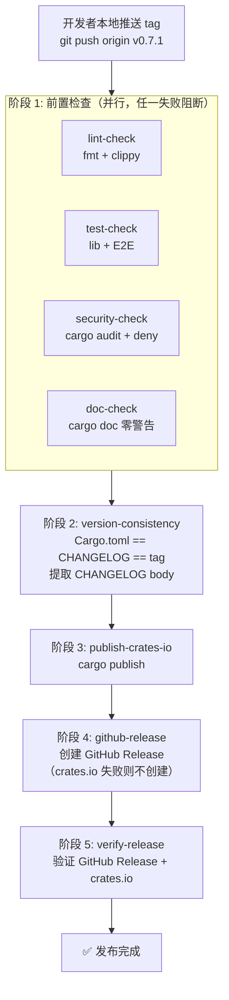

# Release 工作流

本文档描述 Garrison 项目的发布流程，遵循规则 18/19/21 + project_memory 安全/质量门禁要求。

## 发布流程图



> **注意**：tag 由开发者本地推送触发，CI 不创建 tag。`workflow_dispatch` 输入的 `version` 通过环境变量传递（防 shell 注入）。

## 版本规范

- **Git tag 格式**：`v{Major}.{Minor}.{Patch}`（如 `v0.7.1`），符合 semver
- **Cargo.toml `[package].version` 字段**：`{Major}.{Minor}.{Patch}`（如 `0.7.1`）
- **CHANGELOG.md**：每次发布新增 `## [{version}] - {YYYY-MM-DD}` 章节
- **规则 29 例外**：Cargo.toml 的 `[dependencies]` 版本用 `x.x` 格式（无 patch 段），但 `[package].version` 仍用 `x.x.x`（与 crates.io / git tag 一致）
- **Workspace 成员**：`bump-version` 子命令只更新主包 `Cargo.toml`。如需同步 `garrison-macros` / `examples` 版本，需手动修改对应 `Cargo.toml`

## 发布前检查清单

发布前必须完成以下检查（任何一项失败都阻断发布）：

| 检查项 | 命令 | 通过标准 | 规则依据 |
|--------|------|---------|---------|
| 格式化 | `cargo fmt --all -- --check` | 无差异 | 规则 18 |
| Clippy | `cargo clippy --features full --lib --tests -- -D warnings` | 0 warnings | 规则 18 |
| Lib 测试 | `cargo test --features full --lib` | 0 failed | project_memory |
| E2E 测试 | `cargo test --features full --test '*'` | 0 failed | project_memory |
| 文档构建 | `cargo doc --features full --no-deps` | 0 warnings | project_memory |
| 安全审计 | `cargo audit` | 0 CRITICAL | 规则 19 |
| 依赖审计 | `cargo deny check` | 0 failures | 规则 18 |
| 版本一致性 | `scripts/release.sh check-version` | Cargo.toml == CHANGELOG，tag 不存在 | 规则 21 |

## 本地预检查

在打 tag 前运行本地预检查脚本：

```bash
# 完整预检查（所有检查项）
./scripts/release.sh precheck

# 仅检查版本一致性
./scripts/release.sh check-version 0.7.1

# 生成 changelog 段落（从 git log 提取，可指定版本号）
./scripts/release.sh gen-changelog v0.7.0..HEAD 0.7.1
```

## 发布步骤

### 1. 更新版本号

使用脚本或手动编辑 `Cargo.toml`：

```bash
./scripts/release.sh bump-version 0.7.1
```

或手动编辑：

```toml
[package]
version = "0.7.1"  # 旧值 0.7.0 → 新值 0.7.1
```

### 2. 更新 CHANGELOG.md

在 `## [Unreleased]` 之后新增版本章节：

```markdown
## [0.7.1] - 2026-07-20

### Security
- 修复 XXX 漏洞（CVE-XXXX-XXXXX）

### Added
- 新增 XXX 功能

### Changed
- XXX 行为变更

### Fixed
- 修复 XXX bug
```

可使用 `./scripts/release.sh gen-changelog v0.7.0..HEAD 0.7.1` 自动生成 oneline 草稿，再人工分类到上述章节。

### 3. 运行本地预检查

```bash
./scripts/release.sh precheck
```

所有检查通过后进入下一步。

### 4. 提交版本变更

```bash
git add Cargo.toml CHANGELOG.md
git commit -m "chore(release): bump version to 0.7.1"
```

### 5. 打 tag

```bash
git tag -a v0.7.1 -m "Release v0.7.1"
git push origin v0.7.1
```

### 6. 触发 CI 发布工作流

tag push 会自动触发 `.github/workflows/release.yml`，包含 5 个阶段 8 个 job：

1. **lint-check**（阶段 1 并行）：fmt + clippy
2. **test-check**（阶段 1 并行）：lib + E2E 测试
3. **security-check**（阶段 1 并行）：cargo audit + cargo deny
4. **doc-check**（阶段 1 并行）：cargo doc 零警告
5. **version-consistency**（阶段 2）：Cargo.toml == CHANGELOG == tag，提取 CHANGELOG body
6. **publish-crates-io**（阶段 3）：`cargo publish` 发布到 crates.io
7. **github-release**（阶段 4）：从 CHANGELOG 提取 body 创建 GitHub Release（依赖 crates.io 成功，避免半发布）
8. **verify-release**（阶段 5）：验证 GitHub Release + crates.io 索引传播

阶段 3 失败则阶段 4 不执行（避免 GitHub Release 已创建但 crates.io 未发布的半发布状态）。`concurrency` 控制块防止并发发布。

### 7. 验证发布

verify-release job 自动执行双重验证：

- GitHub Release：`gh release view v{version}`
- crates.io：`curl https://crates.io/api/v1/crates/garrison`（重试 6 次共 60 秒等待索引传播）

也可手动验证：

```bash
gh release view v0.7.1
cargo search garrison
```

### 8. 完成

- 通知用户/团队
- 如发布后需修正，参考下方"回滚"章节

## 回滚

如果发布后发现严重问题：

1. **crates.io 无法撤回已发布版本**，只能 yank（`cargo yank --vers 0.7.1`）
2. **删除 GitHub Release**：`gh release delete v0.7.1`
3. **删除 tag**：`git tag -d v0.7.1 && git push origin :refs/tags/v0.7.1`
4. **发布修复版本**：bump 到 0.7.2，重新走完整流程

## 紧急修复（patch release）

紧急修复流程：

1. 从最新 tag 创建 hotfix 分支：`git checkout -b hotfix/0.7.2 v0.7.1`
2. 修复 bug + 更新 CHANGELOG
3. 运行 `./scripts/release.sh precheck`
4. 提交 + 打 tag `v0.7.2`
5. 合并 hotfix 分支回 main：`git checkout main && git merge hotfix/0.7.2`

## 规则依据

- **规则 12**：失败必须显性化（不用 `continue-on-error`，cargo-audit/deny 未安装时 fail 而非 warn）
- **规则 18**：禁止 `--no-verify` 跳过 pre-commit / 安全审查
- **规则 19**：发布前强制 tiangang SAST + diting 代码审查（本地预检查等价）
- **规则 21**：文档与代码同步（CHANGELOG + 版本一致性检查）
- **规则 26**：commit 前并行派遣 3 个 subagent（安全/架构/性能）审查
- **project_memory**：cargo doc 零警告、所有测试通过、CHANGELOG 更新
