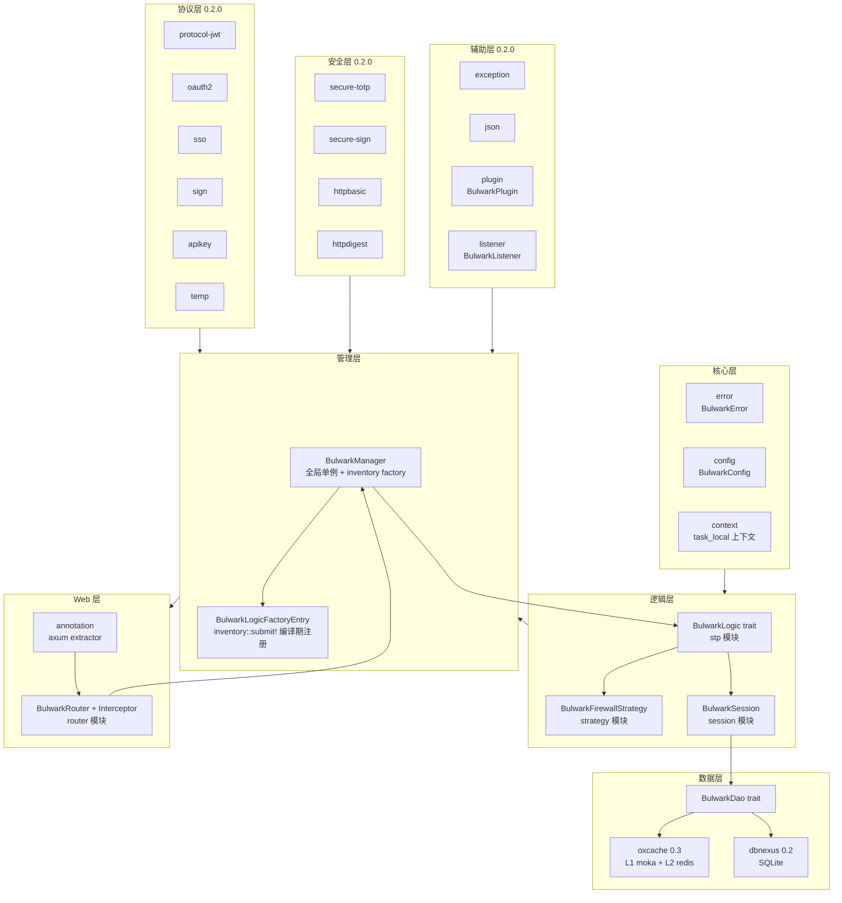
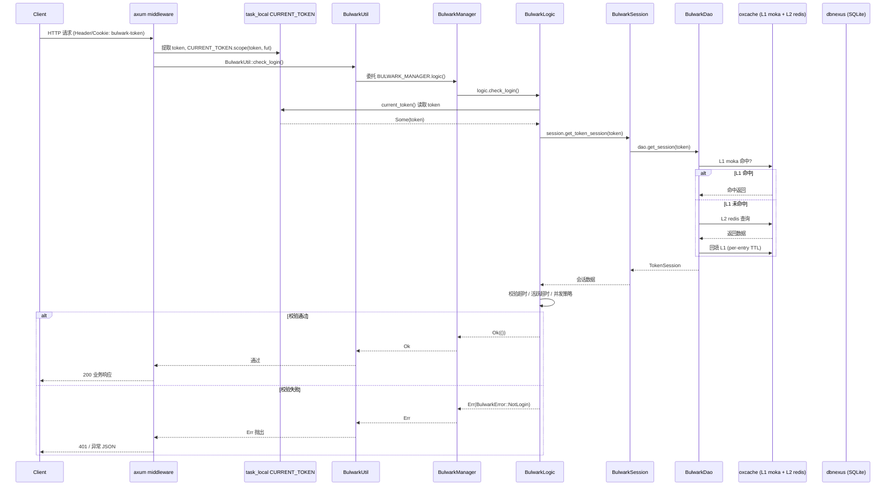
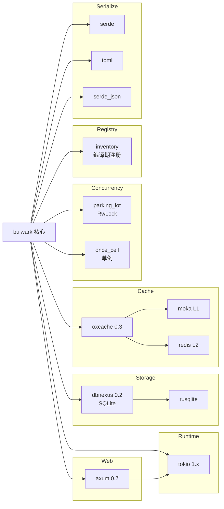

# Bulwark 架构设计文档

> Bulwark 是一个 Rust 认证/授权框架，参照 Sa-Token v1.45.0 设计，目标是在 Rust 生态中提供对等能力的权限中间件平台。
>
> - 版本：0.1.x（核心基线）/ 0.2.0（协议与安全扩展）
> - 运行时：tokio 1.x
> - Web 适配：axum 0.7
> - 存储：dbnexus 0.2（SQLite，待 0.3+ PostgreSQL/MySQL）
> - 缓存：oxcache 0.3（L1 moka + L2 redis，per-entry TTL）

---

## 一、架构概览

Bulwark 采用 **双抽象层 + 全局单例** 架构：

1. **双抽象层**
   - **DAO 抽象层**：`BulwarkDao` trait 屏蔽存储后端差异，业务代码只面向 trait 编程，切换 SQLite / PostgreSQL / MySQL 时无需改动上层。
   - **缓存抽象层**：`oxcache` 提供 L1（moka 进程内）+ L2（redis 分布式）两级缓存，per-entry TTL 精细化过期控制，对上层呈现统一 `get / set / remove` 语义。

2. **全局单例**
   - `BulwarkManager` 通过 `parking_lot::RwLock` 持有 `Arc<dyn BulwarkLogic>`，启动时一次性 `init` 注入。
   - `BulwarkUtil` 暴露静态方法，内部全部委托 `BULWARK_MANAGER` 单例，业务侧零状态调用，类似 `StpUtil` 的使用体验。

3. **协议与安全扩展（0.2.0）**
   - 协议层（protocol-jwt / oauth2 / sso / sign / apikey / temp）
   - 安全层（secure-totp / sign / httpbasic / httpdigest）
   - 辅助层（exception / json / plugin / listener）

---

## 二、模块划分图



---

## 三、核心设计决策

### 1. 双抽象层（DAO 抽象 + 缓存抽象）

**问题**：存储后端多样（SQLite/PostgreSQL/MySQL/Redis），缓存策略多变，业务代码不应感知具体后端。

**方案**：
- `BulwarkDao` trait 定义统一接口（`get_session` / `set_session` / `delete_token` 等），底层由 dbnexus + oxcache 实现。
- `oxcache` 作为缓存抽象，L1 为 moka 进程内 LRU，L2 为 redis 分布式，per-entry TTL 精细控制。
- 业务代码只依赖 trait，切换存储后端时仅替换 `BulwarkLogicFactoryEntry` 的实现，**上层零改动**。

### 2. 全局单例（BulwarkManager）

**问题**：每次鉴权都要构造 `Arc<dyn BulwarkLogic>`，调用链冗长，使用体验差。

**方案**：
- 进程启动时调用 `BulwarkManager::init(logic)`，内部以 `parking_lot::RwLock<Arc<dyn BulwarkLogic>>` 持有。
- `BULWARK_MANAGER` 全局 `once_cell` 单例。
- `BulwarkUtil` 全部静态方法直接委托单例：`BulwarkUtil::check_login()` 内部等价于 `BULWARK_MANAGER.logic().check_login()`。
- 优点：使用方一行调用，编译期单态化后零运行时开销。

### 3. inventory 编译期注册

**问题**：Rust 无反射，无法在运行时枚举 trait 实现并自动选择。

**方案**：
- 使用 `inventory::submit!` 宏在编译期把 `BulwarkLogicFactoryEntry` 注册到全局 link list。
- `BulwarkManager::init_with_default()` 启动时遍历 `inventory::iter::<BulwarkLogicFactoryEntry>()`，按 `name` 选定默认实现。
- 优点：**无反射、无运行时开销、跨 crate 注册**，与 feature flag 配合实现按需启用。

### 4. task_local 上下文

**问题**：async 请求级 token 在 `Arc<dyn BulwarkLogic>` 中无法通过参数传递（trait 方法签名固定）。

**方案**：
- `context` 模块定义 `CURRENT_TOKEN: tokio::task_local`。
- axum middleware 在请求入口提取 token 后 `CURRENT_TOKEN.scope(token, fut)` 设置。
- `BulwarkUtil::current_token()` 通过 `CURRENT_TOKEN.get()` 取值，自动落到当前请求作用域。
- 优点：无锁、无穿透、跨 `.await` 安全。

### 5. 双模会话（Account-Session + Token-Session）

**问题**：单一会话模型无法兼顾“账号维度数据”（角色、权限、用户画像）与“token 维度数据”（设备、登录时间、临时授权）。

**方案**：
- **Account-Session**：以 `login_id` 为 key，存储账号级长生命周期数据。
- **Token-Session**：以 `token` 为 key，存储该次登录的临时数据。
- `BulwarkSession` 统一对外暴露 `get_account_session(login_id)` / `get_token_session(token)`，底层落到 `BulwarkDao`。
- `is_share` / `is_concurrent` 配置控制多端共享与并发登录策略。

### 6. Feature 门控

**问题**：协议/安全/辅助层并非所有项目都需要，强行全量编译会带来依赖膨胀。

**方案**：
- 13 个 feature 域独立编译：
  - 默认开启：`cache-memory` + `db-sqlite` + `web-axum`
  - 可选：`cache-redis`、`db-postgres`、`db-mysql`、`protocol-jwt`、`protocol-oauth2`、`protocol-sso`、`protocol-sign`、`secure-totp`、`secure-httpbasic`、`secure-httpdigest` 等
- 通过 `#[cfg(feature = "...")]` 在编译期裁剪，未启用模块不进入产物。

---

## 四、数据流图



---

## 五、扩展点

### 1. 自定义 BulwarkDao 实现

替换存储后端（如 PostgreSQL / MongoDB / 自研存储）：

```rust
impl BulwarkDao for MyDao {
    async fn get_session(&self, key: &str) -> Result<Option<SessionData>, BulwarkError> {
        // 自定义查询逻辑
    }
    // ...
}
```

通过 `BulwarkManager::init_with_dao(dao)` 注入即可，上层业务代码零改动。

### 2. 自定义 BulwarkLogicFactoryEntry

替换核心逻辑（如自定义 token 生成规则、自定义登录策略）：

```rust
inventory::submit! {
    BulwarkLogicFactoryEntry {
        name: "my-logic",
        factory: || Arc::new(MyLogic) as Arc<dyn BulwarkLogic>,
    }
}

BulwarkManager::init_with_default("my-logic").await;
```

### 3. 自定义 BulwarkFirewallStrategy

替换权限策略（如基于 ABAC、基于外部策略引擎）：

```rust
#[async_trait]
impl BulwarkFirewallStrategy for MyStrategy {
    async fn check_permission(&self, login_id: &str, permission: &str) -> bool {
        // 自定义权限判定
    }
}
```

### 4. 自定义 BulwarkPlugin / BulwarkListener（0.2.0）

扩展事件钩子（登录前/后、登出前/后、鉴权失败等）：

```rust
#[async_trait]
impl BulwarkListener for MyListener {
    async fn on_login(&self, login_id: &str, token: &str) {
        // 登录埋点 / 审计
    }
}

BulwarkManager::register_listener(Arc::new(MyListener)).await;
```

---

## 六、依赖关系图



---

## 七、版本演进路线

| 版本 | 范围 | 关键模块 |
|------|------|----------|
| 0.1.0 | 核心基线 | error / config / context / dao / session / stp / strategy / manager / annotation / router |
| 0.1.1 | 代码加固 | 异常处理完善、配置校验补全 |
| 0.2.0 | 协议与安全扩展 | protocol-jwt / oauth2 / sso / sign / apikey / temp；secure-totp / sign / httpbasic / httpdigest；core-auth / permission / token；exception / json / plugin / listener |

---

## 八、参考

- Sa-Token v1.45.0 设计原型
- OpenSpec specs：`openspec/specs/*`
- 配置规范：见 [configuration.md](./configuration.md)
