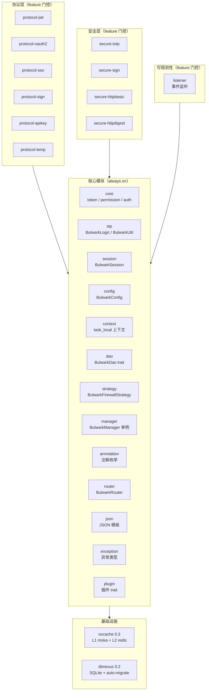
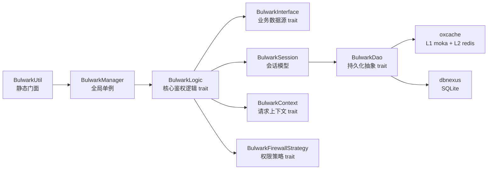
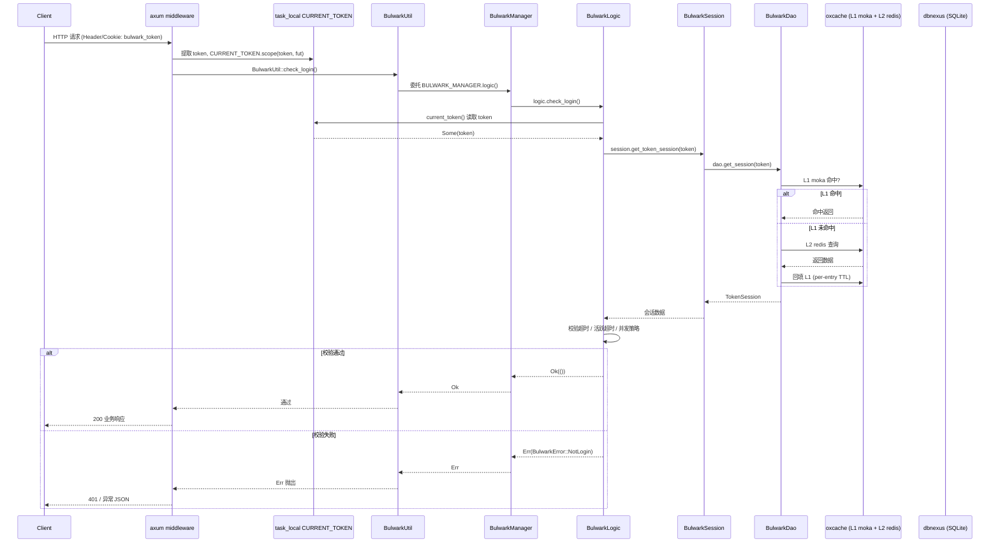

# Bulwark 架构设计文档

> Bulwark 是面向 Rust 生态的身份认证鉴权框架，借鉴 Sa-Token v1.45.0 设计理念。
>
> - 版本：0.1.0（核心基础设施已完成）/ 0.2.0（协议与安全层，规划中）
> - 运行时：tokio 1.x
> - Web 适配：axum 0.8
> - 存储：dbnexus 0.2（SQLite，PostgreSQL/MySQL 待 0.3+）
> - 缓存：oxcache 0.3（L1 moka + L2 redis，per-entry TTL）
> - License：Apache-2.0

> 配置相关字段说明详见 [configuration.md](./configuration.md)；开发规范详见 [development.md](./development.md)。

---

## 一、架构概览

Bulwark 采用 **双抽象层 + 全局单例** 架构，核心设计目标：

1. 业务代码只面向 trait 编程，存储后端可平滑替换；
2. 启动时一次性注入依赖，运行期零状态调用，使用体验对标 Sa-Token 的 `StpUtil`。

### 1.1 双抽象层

- **DAO 抽象层**：`BulwarkDao` trait 屏蔽存储后端差异，底层由 `dbnexus`（数据库）+ `oxcache`（缓存）实现，切换 SQLite / PostgreSQL / MySQL 时上层无需改动。
- **缓存抽象层**：`oxcache` 0.3 提供 L1（moka 进程内）+ L2（redis 分布式）两级缓存，支持 per-entry TTL 精细化过期控制，对上层呈现统一 `get / set / remove` 语义。

### 1.2 全局单例

- `BulwarkManager` 通过 `parking_lot::RwLock` 持有 `Arc<dyn BulwarkLogic>`，启动时调用 `BulwarkManager::init()` 一次性注入 dao / config / interface。
- `BulwarkLogicFactoryEntry` 通过 `inventory::submit!` 在编译期注册，运行时由 `inventory::iter` 选取默认实现。
- `BulwarkUtil` 暴露静态方法（`login` / `check_login` / `logout` 等），内部全部委托 `BULWARK_MANAGER` 单例，业务侧零状态调用。

### 1.3 双模会话

Bulwark 同时维护两种会话维度：

- **Account-Session**：以 `login_id` 为 key，存储账号级长生命周期数据（角色、权限、用户画像）。
- **Token-Session**：以 `token` 为 key，存储该次登录的临时数据（设备、登录时间、临时授权）。

由 `is_share` / `is_concurrent` 配置控制多端共享与并发登录策略。

---

## 二、模块划分

Bulwark 分为四层模块，由 feature flag 控制编译裁剪：



### 2.1 核心模块（always on，无 feature flag）

| 模块 | 职责 |
|------|------|
| `core/` | 核心层：`core/token`（Token 生成校验）、`core/permission`（权限校验）、`core/auth`（登录鉴权） |
| `stp/` | `BulwarkLogic` trait + `BulwarkInterface` trait + `BulwarkUtil` 静态门面 |
| `session/` | `BulwarkSession` 会话模型（Account + Token 双模） |
| `config/` | `BulwarkConfig` 全局配置 + `ConfigLoader` trait + 热更新 |
| `context/` | `BulwarkContext` 请求上下文抽象 + axum 适配器 + task_local |
| `dao/` | `BulwarkDao` trait + dbnexus 实现 |
| `strategy/` | `BulwarkFirewallStrategy` 权限策略 |
| `manager/` | `BulwarkManager` 全局单例 + inventory 编译期注册 |
| `annotation/` | 鉴权注解枚举 |
| `router/` | `BulwarkRouter` + Interceptor 路由拦截 |
| `json/` | JSON 模板与序列化抽象 |
| `exception/` | 框架异常类型 |
| `plugin/` | `BulwarkPlugin` trait 与编译期注册 |

### 2.2 协议层（feature 门控，默认关闭）

| 模块 | Feature | 说明 |
|------|---------|------|
| `protocol/jwt` | `protocol-jwt` | JWT 签发与验证 |
| `protocol/oauth2` | `protocol-oauth2` | OAuth2 第三方授权 |
| `protocol/sso` | `protocol-sso` | SSO 单点登录 ticket |
| `protocol/sign` | `protocol-sign` | API 签名 + nonce 防重放 |
| `protocol/apikey` | `protocol-apikey` | API Key 认证 |
| `protocol/temp` | `protocol-temp` | 临时凭证 |

### 2.3 安全层（feature 门控，默认关闭）

| 模块 | Feature | 说明 |
|------|---------|------|
| `secure/totp` | `secure-totp` | TOTP 动态验证码（RFC 6238） |
| `secure/sign` | `secure-sign` | HMAC 签名工具 |
| `secure/httpbasic` | `secure-httpbasic` | HTTP Basic 认证 |
| `secure/httpdigest` | `secure-httpdigest` | HTTP Digest 认证 |

---

## 三、关键 trait 关系图

Bulwark 的核心抽象通过 trait 解耦，业务方实现 trait 即可接入：



### trait 职责说明

| trait | 职责 | 默认实现 |
|-------|------|---------|
| `BulwarkLogic` | 核心鉴权逻辑：登录、登出、校验、权限查询 | 框架提供默认实现，可被 `BulwarkLogicFactoryEntry` 覆盖 |
| `BulwarkInterface` | 业务数据源接入点：查询用户权限、角色等 | 业务方必须实现 |
| `BulwarkDao` | 持久化抽象：session CRUD、token 映射 | dbnexus + oxcache 实现 |
| `BulwarkContext` | 请求上下文：读取当前 token、请求头、Cookie | axum adapter 实现 |
| `BulwarkFirewallStrategy` | 权限策略：`check_permission` 判定 | 框架提供默认实现 |

> 所有 trait 采用 **trait + Default 模式**：框架提供默认实现，业务方可覆盖。任何组件都可被替换为自定义实现，框架默认实现仅在未被覆盖时生效。

---

## 四、数据流：请求处理链路

以 axum 集成为例，一个受保护请求的完整处理链路：



---

## 五、设计决策

### 1. 为什么用 inventory 编译期注册？

**问题**：Rust 无反射，无法在运行时枚举 trait 实现并自动选择。若用运行时注册，需要全局可变状态与锁，增加启动复杂度。

**方案**：
- 使用 `inventory::submit!` 宏在编译期把 `BulwarkLogicFactoryEntry` 注册到全局 link list。
- `BulwarkManager::init()` 启动时遍历 `inventory::iter::<BulwarkLogicFactoryEntry>()`，按 `name` 选定默认实现。
- 优点：**无反射、无运行时开销、跨 crate 注册**，与 feature flag 配合实现按需启用。

### 2. 为什么用 task_local 上下文？

**问题**：async 请求级 token 在 `Arc<dyn BulwarkLogic>` 中无法通过参数传递（trait 方法签名固定），若用 thread_local 则跨 `.await` 不安全。

**方案**：
- `context` 模块定义 `CURRENT_TOKEN: tokio::task_local`。
- axum middleware 在请求入口提取 token 后 `CURRENT_TOKEN.scope(token, fut)` 设置。
- `BulwarkUtil::current_token()` 通过 `CURRENT_TOKEN.get()` 取值，自动落到当前请求作用域。
- 优点：无锁、无穿透、跨 `.await` 安全。

### 3. 为什么用 trait + Default 模式？

**问题**：框架需要提供「开箱即用」的默认行为，同时允许业务方按需替换任一组件。

**方案**：
- 所有核心抽象（`BulwarkLogic` / `BulwarkDao` / `BulwarkContext` / `BulwarkFirewallStrategy` / `BulwarkListener`）均以 trait 定义。
- 框架提供默认实现，业务方实现 trait 后通过 `BulwarkManager::init()` 注入即可覆盖。
- 优点：扩展点清晰，符合 Rust 的零成本抽象哲学。

### 4. 为什么用双抽象层（DAO + 缓存）？

**问题**：存储后端多样（SQLite/PostgreSQL/MySQL/Redis），缓存策略多变，业务代码不应感知具体后端。

**方案**：
- `BulwarkDao` trait 定义统一接口（`get_session` / `set_session` / `delete_token` 等），底层由 dbnexus + oxcache 实现。
- `oxcache` 作为缓存抽象，L1 为 moka 进程内 LRU，L2 为 redis 分布式，per-entry TTL 精细控制。
- 切换存储后端时仅替换 `BulwarkLogicFactoryEntry` 的实现，**上层零改动**。

### 5. 为什么用 feature 门控？

**问题**：协议/安全/可观测层并非所有项目都需要，强行全量编译会带来依赖膨胀。

**方案**：
- 13 个特性域独立编译，通过 `#[cfg(feature = "...")]` 在编译期裁剪。
- 默认 `default = []`（空），仅核心模块总是编译。
- 聚合特性 `full` / `production` / `development` 一键启用一组特性。

---

## 六、扩展点

### 1. 自定义 BulwarkDao 实现

替换存储后端（如 PostgreSQL / MongoDB / 自研存储）：

```rust
#[async_trait]
impl BulwarkDao for MyDao {
    async fn get_session(&self, key: &str) -> BulwarkResult<Option<SessionData>> {
        // 自定义查询逻辑
    }
    // ...
}
```

通过 `BulwarkManager::init()` 注入即可，上层业务代码零改动。

### 2. 自定义 BulwarkLogicFactoryEntry

替换核心逻辑（如自定义 token 生成规则、自定义登录策略）：

```rust
inventory::submit! {
    BulwarkLogicFactoryEntry {
        name: "my-logic",
        factory: || Arc::new(MyLogic) as Arc<dyn BulwarkLogic>,
    }
}
```

### 3. 自定义 BulwarkFirewallStrategy

替换权限策略（如基于 ABAC、基于外部策略引擎）：

```rust
#[async_trait]
impl BulwarkFirewallStrategy for MyStrategy {
    async fn check_permission(&self, login_id: &str, permission: &str) -> bool {
        // 自定义权限判定
    }
}
```

---

## 七、参考

- 配置字段说明：[configuration.md](./configuration.md)
- 开发规范与 TDD 工作流：[development.md](./development.md)
- 版本演进规划：[roadmap.md](./roadmap.md)
- 部署指南：[deployment.md](./deployment.md)
- Sa-Token v1.45.0 设计原型
- OpenSpec specs：`openspec/specs/*`
